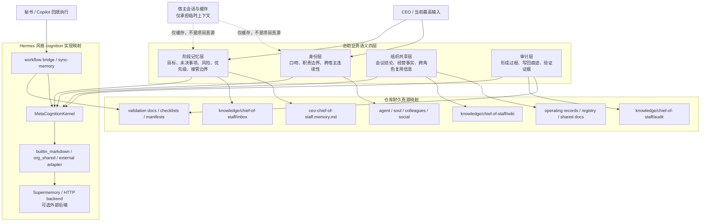
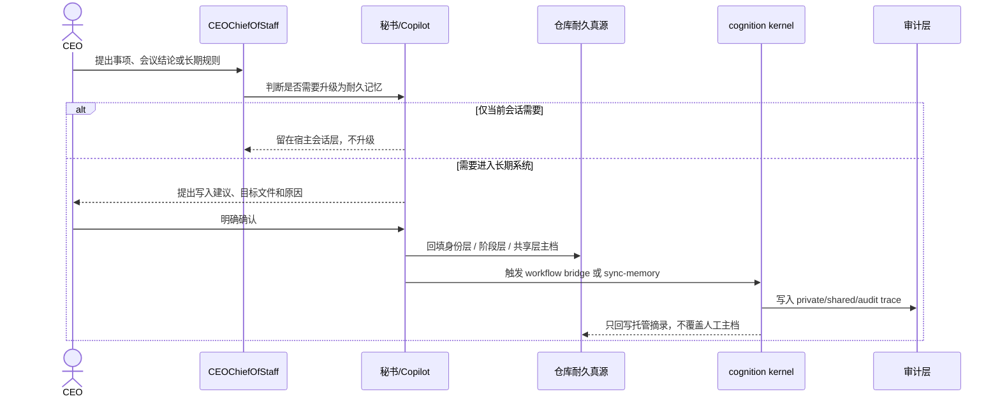

# 虚拟公司四层记忆协同系统

版本：V0.3
日期：2026-04-20
状态：已按总助确认口径重写为业务语义四层，并补充 LLM wiki 第一优先级任务映射

## 文档同步元信息

- sourceOfTruth: TriCompany/docs/engineering/virtual-company-four-layer-memory-collaboration-system.md
- publishedFrom: TriCompany/docs/engineering/virtual-company-four-layer-memory-collaboration-system.md
- syncMode: published-copy
- publishTier: on-demand-published-copy
- supportPublishedCopy: TriCompany-copilot-host-assets/docs/engineering/virtual-company-four-layer-memory-collaboration-system.md
- supportSyncRule: 仅在成批发布或当前宿主重新显式依赖时追平 support 副本
- lastSyncedAt: 2026-04-28

## 1. 文档定位

本文把当前虚拟公司的记忆架构与记忆工作流程正式命名为“虚拟公司四层记忆协同系统”，可以简称“四层记忆系统”。

这里的“四层”以总助履职语义为主，不再把技术实现层、宿主缓存层或仓库真源层直接当作四层本身。

也就是说：

- 四层描述的是“总助记忆在业务上怎么分层”。
- 仓库文档、runtime/cognition、宿主缓存只是这些层的实现载体和执行平面。

本文描述的是当前阶段已经形成的协同口径，不表示已经完成生产级 Hermes 集成，也不表示已经完成 `TriMC` 正式宿主切换。

当前本文已回写到 `TriCompany/docs/engineering/` 作为工程真源；文中仍显式引用 `TriMetaverse/.github` 与 `TriCompany-copilot-host-assets/` 的地方，代表当前 live 宿主入口和 support root 仍在那里，不代表相关资产已经全部回迁到 TriCompany 源仓。

## 2. 核心判断

- 当前虚拟公司的记忆不是单一数据库，也不是单一会话 memory，而是由四层共同协同。
- 这四层应当是：身份层、阶段记忆层、组织共享层、审计层。
- 跨宿主延续的总助主记忆，应优先归入身份层，而不是宿主缓存层。
- 当前阶段的长期真源仍以仓库文档为主；runtime/cognition 和宿主 memory 只承担托管、同步摘录、召回和临时缓存，不替代项目真源。

## 3. 业务语义四层

### 3.1 身份层

身份层承接“我是谁、我怎样说话、我的职责边界是什么、跨宿主后我是否还是同一个总助”。

这一层主要保证：

- 总助口吻和人格连续性
- 岗位职责与非职责边界
- 与 CEO 的稳定工作身份
- 跨宿主迁移后的主记忆连续性

当前主要锚点包括：

- `TriMetaverse/.github/agents/ceo-chief-of-staff.agent.md`
- `TriCompany/.github/source-agents/ceo-chief-of-staff/ceo-chief-of-staff.soul.md`
- `TriCompany/.github/source-agents/ceo-chief-of-staff/ceo-chief-of-staff.colleagues.md`
- `TriCompany/.github/source-agents/ceo-chief-of-staff/ceo-chief-of-staff.social.md`
- `TriCompany-copilot-host-assets/knowledge/employees/ceo-chief-of-staff/wiki/employee-consumption-records.md`

判断标准：

- 如果一条记忆改变的是“总助是谁”和“总助如何履职”，它更接近身份层。
- 如果一条内容要求跨宿主继续保留总助连续性，它应优先落在身份层锚点，而不是只留在宿主缓存。

### 3.2 阶段记忆层

阶段记忆层承接“当前这一个阶段到底在做什么、哪些还没解决、风险和优先级如何排序”。

这一层主要承接：

- 当前阶段目标
- 未决事项
- 风险和冻结项
- 优先级与四象限任务
- 当前接管边界与阶段性判断

当前主要锚点包括：

- `TriCompany/.github/source-agents/ceo-chief-of-staff/ceo-chief-of-staff.memory.md`
- `TriMetaverse/docs/workflow/operating-records/**/*`
- `docs/engineering/ROADMAP.md`
- `docs/workflow/chief-of-staff-rd-orchestration.md`
- `TriCompany-copilot-host-assets/knowledge/chief-of-staff/inbox/`
- `TriCompany-copilot-host-assets/knowledge/employees/ceo-chief-of-staff/wiki/employee-consumption-records.md`

其中 `TriCompany-copilot-host-assets/knowledge/chief-of-staff/inbox/` 属于当前宿主对象锚点，用来说明阶段记忆层的实际落盘位置；判断 owner、manifest 或发布纪律时，应回看 chief-of-staff object spec 与治理页，而不是把这里当 docs published-copy 目标。

判断标准：

- 如果内容只在当前阶段成立，或者主要用于阶段推进与风险管理，它更接近阶段记忆层。

### 3.3 组织共享层

组织共享层承接“已经形成的会议结论、经营事实和跨角色可以复用的信息”。

这一层主要承接：

- 正式会议结论
- 经营事实与项目事实
- 跨角色复用的资料
- registry 快照与共享规则

当前主要锚点包括：

- `TriMetaverse/docs/workflow/operating-records/**/*`
- `TriMetaverse/docs/registry/*.md`
- `docs/**/*`
- `runtime/cognition` 中的 `org_shared` provider
- `TriCompany-copilot-host-assets/knowledge/chief-of-staff/wiki/`

判断标准：

- 如果内容不是只属于总助私域，而是 CPO、CTO 或未来 COO、CFO 等也需要复用，它更接近组织共享层。

### 3.4 审计层

审计层承接“这条结论是怎么形成的、谁写回了什么、哪些验证已经做过、哪些仍待补证”。

这一层主要承接：

- workflow 写回痕迹
- recall / sync / consolidate 的执行证据
- validation 结果
- checklist、manifest、补证记录和审计元数据

当前主要锚点包括：

- `runtime/cognition` 的 audit namespace
- `TriCompany-copilot-host-assets/docs/execution/**/*`
- `TriCompany-copilot-host-assets/runtime/cognition/*validation.py`
- workflow bridge 相关写回与同步证据
- `TriCompany-copilot-host-assets/knowledge/chief-of-staff/audit/`

判断标准：

- 如果内容回答的是“结论如何形成、何时写入、证据在哪里”，它更接近审计层。

## 4. 四层与实现载体的映射

上面的四层是业务语义层。下面这些才是实现载体：

- 仓库耐久真源：负责长期可回看、可交接、可签发的正式落档。
- runtime/cognition：负责 recall、workflow 写回、同步摘录和验证。
- 宿主会话与缓存：负责当前会话、用户偏好和临时上下文。

因此，之前把“项目真源层、岗位记忆层、runtime 层、宿主缓存层”直接并列写成四层，并不准确。

更准确的理解应当是：

- 身份层、阶段记忆层、组织共享层、审计层 = 业务语义四层
- 仓库、runtime、宿主 = 这些四层的不同实现平面

## 5. 当前软件架构图

## 6. 当前工作流程图

## 7. Hermes 关系与 LLM Wiki 状态

### 7.1 当前已经吸收的 Hermes 主干

根据现有技术文档与 runtime/cognition 验证结果，当前已经吸收的是 Hermes 风格的 memory / metacognition 主干，而不是 Hermes 全量产品面。

当前已实现或已验证的部分包括：

- 统一的 `MetaCognitionKernel`
- 员工私域、组织共享、审计空间三类命名空间约束
- repo-backed durable assets bridge
- 开始会议 / 结束会议 / 日常收口的 workflow 写回桥
- TriCompany 源侧 `ceo-chief-of-staff.memory.md` 契约优先、support employee workspace 与 runtime cognition state 承载具体运行摘录
- external adapter、HTTP backend、Supermemory schema 与 SDK seam 验证

### 7.2 当前尚未实现的部分

当前没有证据支持以下说法：

- 已完成完整的 LLM wiki 产品面
- 已完成可直接对人开放的 wiki 编辑 / 浏览 / 知识维护工作台
- 已完成自动技能提炼、自动命中复用和通用 schedule / cron 闭环
- 已完成 production 级 Hermes 集成

当前更准确的表述是：

- 我们已经做出 Hermes 风格的 cognition substrate。
- 这个 substrate 具备承接 LLM wiki 式长期知识积累的潜力。
- 但当前还没有把它做成完整的 LLM wiki 产品能力。

### 7.3 当前关于 LLM Wiki 的明确结论

- 如果把 “LLM wiki” 理解为“支持长期知识沉淀、检索、共享和回看的一套记忆底座”，当前实现已经有一部分底座能力。
- 如果把 “LLM wiki” 理解为“完整可运营的知识系统产品面”，当前实现还没有做到。
- 因此，当前可以写成“已具备 Hermes 风格 cognition / wiki 底座雏形”，不能写成“LLM wiki 已完整实现”。

### 7.4 当前第一优先级实现任务

当前已把“总助专属 LLM wiki”提升为第一优先级实现任务。

当前目标不是一步做成完整知识产品，而是先把下面这条链跑通：

- 在 `knowledge/chief-of-staff/inbox/` 堆放零散资料
- 对资料做主题归类和标准化
- 把结果整理成 `knowledge/chief-of-staff/wiki/` 下的 wiki 页面
- 把来源与编译痕迹写入 `knowledge/chief-of-staff/audit/`

相关任务主档位于：

- `docs/engineering/chief-of-staff-llm-wiki-priority-plan.md`

## 8. 当前写入规则

### 8.1 信息进入时如何判断写到哪层

- 改变总助身份、口吻、职责边界或跨宿主连续性的，优先进入身份层。
- 改变当前阶段目标、风险、优先级、未决事项或阶段边界的，优先进入阶段记忆层。
- 对多个角色都可复用的会议结论、经营事实和稳定规则，优先进入组织共享层。
- 用于说明形成过程、验证结果、写回痕迹和补证链路的，优先进入审计层。

### 8.2 当前确认的升级规则

- 未来凡是要写入项目耐久真源或岗位耐久记忆的新内容，先由总助或秘书提出“建议写入什么、写到哪里、为什么要写”。
- 由 CEO 明确确认后，再回填到对应仓库文件。
- 没有确认时，不把临时讨论自动升级成长期记忆。

## 9. 当前阶段治理边界

- `TriCompany` 当前是 TriMetaverse 的核心模块之一，但不是中央模块本身。
- 当前 Copilot-host 负责本地正式接管阶段的宿主资产验证，不等于 `TriMC` 已完成正式宿主切换。
- 生产级 Hermes 集成是否成立，留待 CPO 与 CTO 正式上岗后共同判断。
- 正式宿主是否切换、何时切换、切到哪里，由 CEO、总助、CPO、CTO 共同决策，不由当前单一会议直接宣布。

## 10. 当前对总助岗位的意义

- 总助专属 LLM wiki 已被提升为当前第一优先级实现任务。
- 总助的第一职责不是继续扩写工具，而是先与 CEO 在 TriMetaverse 的整体理解与后续工作上形成稳定对齐。
- 在此基础上，总助需要继续推进可持续 cognition 验证、最小 schedule / cron / automation 试运行路线，以及后续多负责人分诊路径设计。
- 当这些前置条件稳定后，再讨论正式任职签发与更大范围岗位扩张。

## 11. 回看入口

- `docs/engineering/metacognition-architecture.md`
- `docs/engineering/hermes-memory-subsystem-comparison.md`
- `docs/engineering/chief-of-staff-llm-wiki-priority-plan.md`
- `runtime/cognition/README.md`
- `docs/workflow/chief-of-staff-rd-orchestration.md`
- `TriCompany-copilot-host-assets/docs/execution/hermes-copilot-host/phase-1/CHIEF-OF-STAFF-FORMAL-APPOINTMENT-PREREQUISITES.md`
- `TriCompany-copilot-host-assets/knowledge/chief-of-staff/README.md`
- `TriCompany/.github/source-agents/ceo-chief-of-staff/ceo-chief-of-staff.memory.md`
- `TriCompany-copilot-host-assets/knowledge/employees/ceo-chief-of-staff/wiki/employee-consumption-records.md`
- `TriMetaverse/docs/workflow/operating-records/2026-W17/meeting-2026-04-20-ceo-chief-of-staff-capability-and-alignment.md`

这组引用里，`TriCompany-copilot-host-assets/knowledge/chief-of-staff/README.md` 属对象规范 / 宿主对象说明引用，`CHIEF-OF-STAFF-FORMAL-APPOINTMENT-PREREQUISITES.md` 与 operating record 属证据 / 治理引用；它们不应混写成同一类发布资产。

