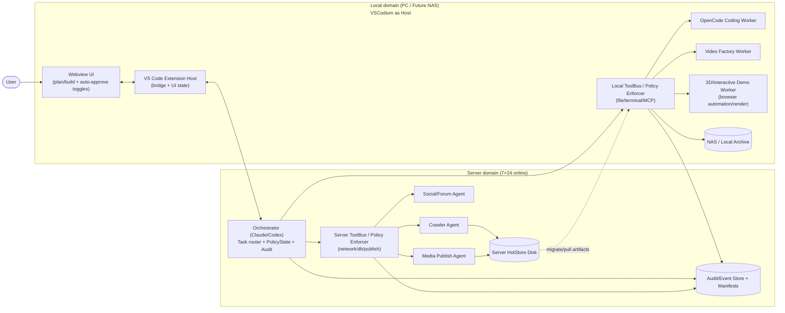
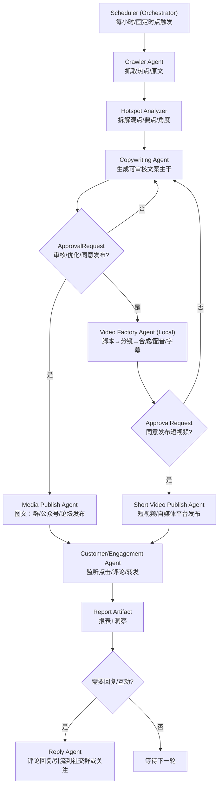
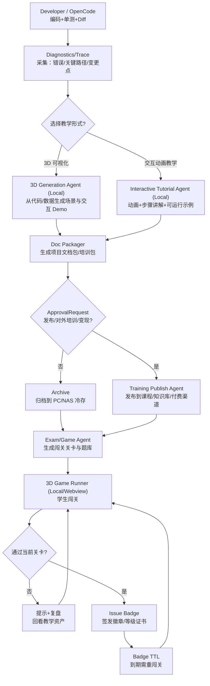

# 总体架构（VSCodium 载体 + Server/Local domains）

## 概述

这一套系统按“控制面 / 执行面 / 展示面”拆分，并按执行位置分为两个域：

- **Server domain（7×24 在线）**：主控 Orchestrator 常驻运行，负责任务编排与路由、策略档位与授权状态（例如 plan/build、capability lease、ApprovalRequest 的批准结果、auto-approve 开关等）、审计与工件编目；服务器侧 ToolBus 是服务器执行面的强制入口，负责网络/数据库/发布/服务器磁盘读写等工具调用与落审计。
- **Local domain（PC / 未来 NAS）**：以 VSCodium 为载体，Webview 提供交互 UI（查看计划、diff、审批与运行状态）；Extension Host 负责与 Server Orchestrator/本地工具桥接；本地 ToolBus 是本地执行面的强制入口，负责对“有副作用”的本地操作进行拦截与执行（写代码/改文件、构建、渲染、录屏、浏览器自动化、3D/视频生产等），并把结果与证据写入审计。

主控通过策略把任务分发给不同 Worker：

- **服务器侧（Server domain workers）**：Crawler / Social / Publisher 等执行体（负责抓取、互动、发布、服务器侧 I/O）。
- **本地侧（Local domain workers）**：OpenCode（编码执行体）、视频工厂、3D/交互展示等执行体（负责文件编辑/构建/渲染/录屏/浏览器自动化等）。

关于 Agent/Worker 的定位（避免混淆）：

- **Agent（角色）**：在 Orchestrator 视角里，“爬虫/发布/考试/视频工厂/OpenCode/3D 教学”等都是可被编排的能力角色（agent）。
- **Worker（执行体）**：在执行视角里，任何 agent 的具体落地都必须是某个域里的可执行体（worker/进程/服务），并且其所有副作用工具调用都必须经由该域的 ToolBus 强制拦截与审计。
- **域决定执行位置**：
  - Server domain：更适合网络/DB/发布/服务器磁盘等 server-side 工具与 I/O。
  - Local domain：更适合改文件、构建、渲染、录屏、浏览器自动化、3D/视频生产等 heavy 本地工具。
- **OpenCode 作为例子**：OpenCode 可以被称为“agent”（能力/产品形态），但默认落地点是 **Local domain 的一个 coding worker**，由 Orchestrator 远程编排、由 Local ToolBus 强制约束执行。
- **可选的 server-side headless 执行**：只有当你要做“远程 CI 编译池/多机渲染池/无桌面环境批量执行”时，才建议在 Server domain 额外部署 headless worker（可以是 OpenCode 或同类 coding/build worker）；它仍然只是 server-side worker，而不是必须存在的“OpenCode server”，并必须受 Server ToolBus 约束与全量审计。

OpenCode 生命周期（VS Code 托管 vs 独立常驻）：

- **模式 A：VS Code 托管（会话内子进程）**
  - 形态：由 Extension Host 在需要时拉起 OpenCode 进程；VS Code 退出则进程结束。
  - 优点：实现简单、资源回收自然、与当前工作区/终端环境一致。
  - 缺点：不利于长任务与断线重连；VS Code 重启会中断执行（除非额外做 checkpoint/replay）。
- **模式 B：独立常驻（本地 daemon/服务）**（本项目采用）
  - 形态：OpenCode 作为本机长期驻留进程运行；Extension Host/Webview 通过 IPC（socket/pipe/stdio）连接；UI 可断开重连。
  - 优点：更贴合“7×24 主控 + UI 断线重连”的 split-plane；适合长编译/长渲染/批量任务；便于做队列、并发与限流。
  - 风控要求：daemon 仍必须把所有副作用动作走 Local ToolBus（或自身内置同等强制层），并可被 Force Stop 撤销 lease 后立刻拒绝工具调用。

决定：Local domain 采用 **模式 B（独立常驻）**。模式 A 可保留为调试/应急回退路径，但不作为主形态。

模式 B 最小契约（实现要点，供落地对齐）：

- **连接/重连**：IPC 连接建立后先交换 `clientId`/`sessionId`；Webview 可断开重连，重连后通过 `GetStatus(sessionId)` 拉取当前队列与在跑任务。
- **心跳与可观测**：daemon 周期性上报心跳与资源摘要（CPU/内存/队列长度/当前任务），便于 Orchestrator 做超时与卡死检测。
- **任务模型**：所有执行以 `jobId` 为粒度（例如 build/test/apply patch/生成报告），支持 `StartJob`、`CancelJob`、`GetJobStatus`、日志/产物流式回传。
- **权限与 lease 强制**：每个有副作用的动作必须携带当前有效的 `capabilityLeaseId`（或等价 token）；一旦 Orchestrator 触发 Force Stop 撤销 lease，daemon/Local ToolBus 必须立即拒绝后续工具调用，并将拒绝写入审计。
- **停止语义对齐**：
  - Safe Stop：daemon 停止接新 job，并让可收敛 job 进入 checkpoint/可恢复点。
  - Force Stop：daemon 立即中断正在执行的工具调用（在可行范围内），并将 job 标记为 `ABORTED`，等待 Orchestrator reconcile。

存储采用“服务器热存 → 发布 → 迁移到 PC/NAS 冷存 → 服务器软删/硬删”的生命周期，审计事件与 manifest 永久保存，大对象可删。

## 术语表（最小）

- **Orchestrator**：控制面主控，负责计划/路由/策略与授权状态（plan/build、lease、审批结果等）、以及审计与工件编目；自身不直接越权执行副作用工具，所有执行必须经 ToolBus。
- **ToolBus（Server/Local）**：执行面强制入口与策略执行者；负责真正调用工具（网络/DB/发布/磁盘/文件/终端/渲染等）、拦截越权、落审计。
- **Agent（角色）**：一类能力/职责的抽象（例如爬虫、发布、考试、视频工厂）。
- **Worker（执行体）**：Agent 的运行实例/进程/服务，在某个域里实际干活（可被调度、可停可重启、可审计）。例如“Video Factory Worker（Local）”。
- **Subagent（编排内分工）**：Orchestrator 为并行思考/分解任务而启动的子智能体/子会话；主要产出计划、拆解、文本与决策，不等同于长期驻留的执行进程。
- **Capability lease**：对某类工具能力的限时授权（带范围/TTL/约束），用于低风险任务自动运行；高风险动作仍应触发审批。
- **ApprovalRequest**：越权/高影响动作的人工审批对象，可扇出到 Webview 与外部 App，小处批准即可继续（first-wins），并必须写入审计。

## 架构图



## 审批通知（双通道）与“一处批准即可继续”

当 Worker 发生**越权请求**（即命中 `Ask` 或策略升级）时，Orchestrator 生成一条 **ApprovalRequest** 并做“通知扇出 + 首个批准生效”的聚合：

- **通知扇出**：同一条审批同时推送到
  - VS Code Webview（主工作台，细粒度展示 diff/命令/影响面）
  - 外部渠道（小程序/独立 App；也可以把“通知”转发到社交账号，但不建议在社交私信里直接完成批准）
- （可选但推荐）**Server Admin Console（CLI/简易 TUI）**：当本地 VS Code 不在线、或需要 7×24 值守时，服务器侧也应允许随时接入查看运行状态与审批队列，并完成批准/拒绝。
- **首个批准生效（first-wins）**：任一通道完成批准后，审批进入 `APPROVED`，其余通道自动变为 `RESOLVED`（幂等）。

实现要点（MVP 级别）：

- **唯一审批 ID + 幂等**：`approvalId` 全局唯一；`approve/deny` 接口必须幂等；状态机只允许 `PENDING -> APPROVED|DENIED|EXPIRED`。
- **短 TTL**：审批请求设置过期时间（例如 5~30 分钟），过期后需要重新发起。
- **签名回执**：外部 App 的批准回执必须携带签名（例如 JWT/nonce + HMAC），并做重放保护。
- **最小披露**：外部渠道默认只展示“操作摘要 + 风险等级 + 需要的权限范围”，详细 diff/日志仍以 Webview 为主。
- **可追溯**：审批的发起、批准者、批准通道、批准时间、被批准的具体工具调用（含参数摘要）必须写入 `AuditEvent`。

三端同步的推荐做法（不改变 first-wins，只是让“随时接入”更可靠）：

- **Orchestrator 作为单一真相源（source of truth）**：ApprovalRequest 的状态仅在 Orchestrator 中流转；Webview/App/CLI 都是“观察 + 提交决策”的客户端，不各自维护独立状态。
- **事件流/状态拉取**：
  - 在线：客户端通过 WebSocket/SSE 订阅“运行状态 + 审批队列”事件流。
  - 断线重连：客户端使用 `since=cursor` 或定期 `ListApprovals/GetStatus` 拉取补齐。
- **通道一致性**：所有通道走同一个 `Approve/Deny` 接口（或同一个 ToolBus/HTTP 路由），确保幂等与审计一致。
- **服务器侧 CLI 的最低能力**：`status`（查看任务/worker/心跳）、`approvals list`（列队列）、`approvals show <id>`（显示摘要）、`approvals approve|deny <id>`（提交决定）。
- **服务器侧 CLI 的额外风控**（建议）：强身份认证（mTLS/SSH 证书/短期 token）、最小权限（只授予审批与只读状态）、命令行回显/历史敏感信息处理（避免把 diff/密钥落到 shell history）。

推荐的交互（更安全也更顺畅）：

- 社交账号/IM：只发“你有一条待审批操作”的通知 + 深链接到小程序/App
- 小程序/App：完成身份认证后展示审批详情与“一键批准/拒绝”

## 7×24 主控的“安全停止”与“强制停止”（建议保留两种）

结论：**需要两种**。因为 7×24 系统会遇到升级、故障隔离、账号风控、磁盘/配额告警等场景，单一停止语义要么不够安全，要么不够及时。

### 安全停止（Safe Stop / Drain）

目的：不破坏一致性，尽量让任务收敛到可恢复点。

- 停止接收新任务（仅允许查询/审计/查看状态）
- 允许“无副作用的读操作”继续（例如状态查询）
- 对正在执行的步骤：
  - 能结束的尽快结束（例如爬虫本轮抓取完成后停）
  - 不能结束的进入“受控暂停”（写入 checkpoint/最后进度）
- 刷新并落盘：`AuditEvent`、manifest、队列偏移量、worker 心跳最后状态

适用：计划发布窗口、灰度升级、例行维护、成本/配额接近阈值。

### 强制停止（Force Stop / Kill）

目的：在风险或故障扩大前立刻止血。

- 立即撤销所有 capability lease（让 Server/Local ToolBus 拒绝后续工具调用）
- 对本地/服务器 Worker 下发 kill（或断开连接）
- 将相关任务标记为 `ABORTED` 并记录原因
- 重启后由 Orchestrator 执行 reconcile：
  - 检测“可能半完成”的步骤（例如写到一半的 artifact）
  - 需要人工介入的直接转 `NEEDS_REVIEW`

适用：疑似账号泄露、提示注入导致的异常操作、磁盘即将写满、无限重试/死循环。

## Orchestrator 高可用（主备切换 / Active-Standby）

你提的“主 Orchestrator 挂了就自动启动备份进程接管；原主恢复后降级为备，并重新创建新的备”是合理的，关键在于两点：

1) **状态必须可恢复**（单一真相源在持久化存储，而不是进程内存）
2) **必须防脑裂（split-brain）**（任何时候只允许一个 leader 对 ToolBus 发出“有效的副作用指令”）

推荐方案（MVP 可落地）：**1 主 1 备 + Leader 租约（lease）+ leaderEpoch + ToolBus fencing**。

### 目标与边界

- **目标**：主进程故障后，备进程在秒级~分钟级接管；外部三端（Webview/App/CLI）无需切换入口或只做轻量重连；审计/审批/队列不丢。
- **边界**：不追求“零重复执行”，追求“可审计 + 幂等 + 可 reconcile”。所有副作用必须通过 ToolBus 落审计并可回放。

### 组件与单一真相源

- **Event/Audit Store + Manifests**：作为任务状态、审批状态、工件编目、lease 信息的持久化来源（source of truth）。
- **Active Orchestrator（Leader）**：唯一允许下发副作用指令的主控实例。
- **Standby Orchestrator（Follower）**：持续同步状态（订阅事件流/轮询），不下发副作用指令，仅在 leader 失效时尝试接管。

### Leader 选举：租约 + leaderEpoch

- 采用“抢占式租约”：leader 必须周期性续租；超过 TTL 未续租即视为 leader 失效。
- 每次成为 leader 都会生成递增的 `leaderEpoch`（单调递增的世代号），用于 fencing。

最小数据结构（示意）：

```json
{
  "type": "OrchestratorLeadershipLease",
  "clusterId": "orch_cluster_01",
  "leaderId": "orch_a",
  "leaderEpoch": 42,
  "leasedAt": "2026-02-25T03:00:00Z",
  "leaseExpiresAt": "2026-02-25T03:00:10Z",
  "renewEveryMs": 3000
}
```

### 基于 Postgres 的 lease 落地（推荐）

因为你选 Postgres，可以把“租约 + epoch”的单一真相源直接落在 DB 里，并用 DB 时间 `now()` 作为统一时钟（避免多机时间漂移带来的误判）。核心是：

- **Acquire（竞争成为 leader）**：用 `SELECT ... FOR UPDATE` 把同一行锁住，然后做“过期则抢占、未过期则放弃”。
- **Renew（续租）**：仅允许当前 leader 续租（带 `leader_id` 条件），续租失败则视为已失去领导权。

最小表结构（示意，cluster 维度一行）：

```sql
CREATE TABLE IF NOT EXISTS orchestrator_leases (
  cluster_id TEXT PRIMARY KEY,
  leader_id TEXT NOT NULL,
  leader_epoch BIGINT NOT NULL,
  lease_expires_at TIMESTAMPTZ NOT NULL,
  updated_at TIMESTAMPTZ NOT NULL DEFAULT now()
);

-- 初始化（第一次部署时执行一次）
INSERT INTO orchestrator_leases (cluster_id, leader_id, leader_epoch, lease_expires_at)
VALUES ('orch_cluster_01', 'bootstrap', 0, now())
ON CONFLICT (cluster_id) DO NOTHING;
```

Acquire（尝试成为 leader，CAS 语义）：

```sql
BEGIN;

-- 锁行，确保同一时刻只有一个候选者能做判断与更新
SELECT leader_id, leader_epoch, lease_expires_at
FROM orchestrator_leases
WHERE cluster_id = $1
FOR UPDATE;

-- 只有在租约过期时才允许抢占；抢占时 epoch + 1
UPDATE orchestrator_leases
SET
  leader_id = $2,
  leader_epoch = leader_epoch + 1,
  lease_expires_at = now() + ($3::interval),
  updated_at = now()
WHERE cluster_id = $1
  AND lease_expires_at <= now()
RETURNING leader_epoch, lease_expires_at;

COMMIT;
```

Renew（续租，仅 leader 本人可续；成功则延长过期时间，不增加 epoch）：

```sql
UPDATE orchestrator_leases
SET
  lease_expires_at = now() + ($3::interval),
  updated_at = now()
WHERE cluster_id = $1
  AND leader_id = $2
  AND lease_expires_at > now()
RETURNING leader_epoch, lease_expires_at;
```

实现建议（让行为更稳定）：

- **TTL 与续租间隔**：例如 `ttl=10s`，`renewEvery=3s`，并加入抖动（jitter），避免惊群。
- **Acquire 失败策略**：若 `UPDATE ... RETURNING` 无返回行，表示租约未过期（已有 leader），进程保持 follower 并继续订阅状态。
- **工具侧读取**：ToolBus 在执行副作用前读取 `leader_id + leader_epoch`（来自同一表），用来做 fencing 校验；拒绝必须落审计。
- **一致性提醒**：`now()` 在 Postgres 中是“事务开始时间”，这里的用法是安全的（Acquire/renew 都是单条更新）；不建议用客户端时间做过期判定。

### 防脑裂（关键）：ToolBus fencing

无论是 Server ToolBus 还是 Local ToolBus，都必须做“只认当前 leader”的硬约束：

- **所有 Orchestrator → ToolBus 的有副作用调用**都携带 `leaderId + leaderEpoch`（或等价的签名 token）。
- **ToolBus 在执行前校验**：调用中的 `(leaderId, leaderEpoch)` 必须匹配当前 store 中的 lease；不匹配则拒绝执行，并写入 `AuditEvent`（action 可记为 `FENCED_REJECT` 或在 `result.details` 标注）。
- **Capability lease 绑定 epoch**（建议）：发给 worker 的 `capabilityLeaseId` 内部也绑定 `leaderEpoch`，这样即使旧 leader 留下的 token 泄漏，epoch 不匹配也会被拒绝。

这一步能保证：即便发生网络抖动导致“两个 Orchestrator 都以为自己是 leader”，也只有拿到最新 lease/epoch 的那个能真正驱动副作用。

### 故障切换流程（主挂 → 备接管）

- Follower 发现 leader 心跳/续租超时（或 lease 过期）后，尝试原子方式写入新 lease（CAS/compare-and-swap）。
- 抢到 lease 的实例成为新 leader，`leaderEpoch += 1`。
- 新 leader 启动 reconcile：
  - 读取未完成 job/worker 心跳状态
  - 对“可能半完成”的步骤标记 `NEEDS_REVIEW` 或发起重试（必须幂等）
  - 重新挂载事件流，继续对外提供状态与审批

### 原主恢复后的行为（恢复 → 降级为备）

- 原主恢复后首先读取当前 lease：
  - 若发现 `leaderId != self` 或 `leaderEpoch` 已推进，则**立即降级为 follower**，停止任何副作用调度，仅做状态同步。
  - 只有在未来再次竞争到 lease 才能恢复为 leader。

### 幂等与审计（让切换“可控”）

- 所有高影响动作都应具备 `operationId`（或 `jobId + stepId`）并在 ToolBus 侧做幂等去重；重复调用要么无副作用、要么返回“已执行”。
- 审批同样幂等（你已有 `approvalId` + first-wins），切换不应改变审批语义。
- 切换本身必须落审计（例如 `LEADER_ELECTED` / `LEADER_STEPPED_DOWN`），便于回放与故障复盘。

## 应用闭环示例：热点抓取 → 文案生成 → 审核发布 → 反馈与互动引流

下面给出一个端到端闭环示例，用来验证“Server 7×24 主控 + Server/Local ToolBus + 多 Agent 协作 + 审批扇出 + 存储迁移”的整体可用性。

运行方式（建议）：

- Orchestrator 以 **Service/Background** 形态 7×24 常驻，不要求每次启动都选择 plan/build。
- 对“后台低风险任务”（如爬虫抓取与热点分析）发放长期 capability lease（严格 allowlist），自动执行。
- 对“高影响动作”（发布、删除、账号相关动作、扩大抓取域名/频率等）触发 `ApprovalRequest`，并扇出到 VS Code Webview + 外部 App/小程序，任一处批准即可继续（first-wins）。

流程（每小时或固定时点触发）：



产出与审计（最小闭环）：

- **抓取与分析产物**：热点列表、原文快照、要点拆解（artifact + manifest），落到 Server HotStore，并写入 `AuditEvent`。
- **文案产物**：可审核的文章主干/标题候选/配图建议（artifact + manifest），落到 Server HotStore；若后续需要本地视频/3D 展示，可由 Orchestrator 分发给 Local domain worker 产出补充工件。
- **视频产物（可选分支）**：短视频脚本、分镜/镜头清单、工程文件、成片（artifact + manifest），由 Local domain 的 Video Factory 产出；发布前后分别记录审批与发布结果到 `AuditEvent`，并与同一 `artifactId` / `campaignId` 关联。
- **发布记录**：发布渠道/账号/链接/时间戳（publish record），写入 `AuditEvent`，并关联 `artifactId`。
- **反馈报表**：点击/评论/转发等指标的周期性报表（artifact + manifest），写入 `AuditEvent`；必要时触发 `ApprovalRequest` 允许自动回复或批量互动。

与“热存→迁移→删除”的衔接：

- 发布成功后，触发回迁任务：Server HotStore 中的大对象（原文快照/素材/最终文案版本/报表等）可按策略迁移到 PC/NAS 冷存。
- 若走视频分支：视频工程与成片属于“大对象”优先迁移对象；建议在 `ArtifactManifest` 中区分 `kind=video_project|video_render` 以便制定不同保留期与迁移策略。
- 仅当 Local 回执 `MIGRATED_LOCAL_OK` 后，Server 才进入软删/硬删。

## 应用闭环示例：编码 → 3D/交互教学生成 → 理解债清零 → 考试闯关徽章

目标：在**写代码的同时**同步产出“可视化 + 可交互 + 可回放”的讲解与演示，让团队成员在设计/实施阶段就消解理解债与学习债；沉淀为项目文档与培训资产，并可扩展为考试闯关与徽章体系。

关键原则：

- 代码仍由本地 `OpenCode Coding Worker` 执行（可审计、可 diff 审阅）。
- 3D 生成与交互式动画教学属于“重工具”，优先在 Local domain 执行（渲染/浏览器自动化/录屏/合成）。
- 所有“教学/考试资产”均作为 artifacts 纳入 manifest 与审计链路，并进入同一套热存→迁移→删除生命周期。

流程（开发过程中按需触发或在 PR/Checkpoint 时触发）：



产出与审计（最小闭环）：

- **工程产物**：代码 diff、测试结果、诊断报告（artifact + manifest），写入 `AuditEvent`；必要时可把“关键设计决策”抽取为结构化小文档（便于检索）。
- **3D/交互教学资产**（二选一或同时）：
  - 3D 场景文件/素材/交互脚本/可运行 Demo（建议 `kind=demo_scene|demo_asset`）
  - 交互动画教学包：步骤、讲解、可运行示例、录屏片段（建议 `kind=tutorial_package|tutorial_asset`）
- **文档/培训包**：可发布的知识库条目、课程结构、讲义与示例仓库引用（建议 `kind=training_bundle`）。
- **考试/闯关资产**：关卡定义、题库、3D 游戏构建产物（建议 `kind=exam_level_set|exam_game_build`）。
- **徽章/证书**：签发记录、等级、有效期（建议 `kind=badge_certificate`），必须写入 `AuditEvent`（包含颁发依据/分数摘要/版本号/过期时间）。

NFT 徽章（可选实现：自改以太坊公链）：

- **核心思路**：链上只存“可验证的引用与状态”，不把隐私/大对象直接上链；链下以 `ArtifactManifest` / `AuditEvent` 为事实来源，链上 NFT 作为可公开验证的“徽章凭证”。
- **最小链上字段（写入 manifest + 审计）**：
  - `chainId=333333333`（EIP-155 风格，确保钱包/工具不串链）
  - `contractAddress`、`tokenId`（ERC-721/1155 二选一）
  - `mintTxHash`（必要时追加 `revokeTxHash/burnTxHash`）
  - `tokenURI` 指向“徽章元数据”（建议包含 `badgeManifestHash` 或 `artifactId` 的哈希承诺，而不是明文个人信息）
- **过期/重闯关语义**：更推荐“链下有效期 + 链上引用不变/可追加状态”，即：
  - 链下 `BadgeManifest.validUntil` 到期即视为过期（需要重闯关）
  - 重闯关通过后签发新徽章（新 token）或对同 token 做“升级/续期”（取决于合约是否支持）；无论哪种都要在 `AuditEvent` 中记录从旧结果到新结果的关联。
- **吊销/作废**：若需要风控吊销（作弊、账号风险），链上可 burn 或写入 revoke 状态；链下必须保留吊销原因摘要与审批链路（`ApprovalRequest` + `AuditEvent`）。
- **密钥与审批**：铸造/吊销属于高影响动作，建议：
  - 走 `ApprovalRequest`（至少对“批量铸造/批量吊销/合约升级”强制 Ask）
  - 发行者私钥隔离（HSM/专用 signer 服务），并在 `AuditEvent` 记录 signer 身份与签名策略版本
  - 所有链上交易哈希写入审计，便于离线对账与追溯

审批点建议（与权限/风控对齐）：

- 对外发布培训/变现：必须 `ApprovalRequest`。
- 自动生成并发布“可交互 Demo”（若涉及公网托管/第三方平台）：必须 `ApprovalRequest`。
- 徽章签发可默认自动化，但需固定策略（阈值、题库版本、作弊检测摘要）并落审计；策略升级或大规模批量颁发需 `ApprovalRequest`。

与“热存→迁移→删除”的衔接：

- 3D 资产、教程包、游戏构建产物通常体积大，建议优先迁移到 PC/NAS，并在 `ArtifactManifest.kind` 上做细分以配置不同保留期。
- 徽章/证书与审计事件属于小数据，建议永久保留；其引用的大对象（视频/场景/构建产物）可按策略删除。

# Server 热存 → 发布 → 迁移到本地（PC/NAS）方案（MVP 协议草案）

目标：
- Server domain 7×24 在线，负责抓取/发帖/协调/审计与热存（服务器本地磁盘）。
- Local domain（PC / 未来 NAS）负责长期归档（冷存）。
- 发布完成后自动触发“回迁”，本地确认完整落盘后，服务器再删除热存（先软删后硬删）。

## 1. 核心原则

- **执行侧 ToolBus 强制**：Server 的磁盘写入/读取/删除由 Server ToolBus 执行并审计；PC/NAS 的落盘由 Local ToolBus 执行并审计。
- **两阶段提交（2PC）式删除**：Server 只有在收到 `MIGRATED_LOCAL_OK` 回执后，才允许进入删除阶段。
- **小数据永存，大对象可删**：审计事件与 manifest 永久保存；大对象（blob）可按策略删除。
- **内容寻址（建议）**：以 `sha256` 作为 blob id，天然去重、便于校验与断点续传。

## 2. 数据结构（最小集合）

### 2.1 ArtifactManifest

> 服务器必须保存（小数据），用于审计/回放/定位。

```json
{
  "artifactId": "art_01J...",
  "kind": "crawl_snapshot|post_source|article_md|video_asset|render_output|log_bundle",
  "createdAt": "2026-02-24T12:34:56Z",
  "createdBy": {
    "actorType": "worker|orchestrator|user",
    "actorId": "opencode|social-agent|..."
  },
  "workspace": {
    "projectId": "proj_x",
    "localWorkspaceHint": "d:/repo",
    "serverWorkspaceHint": "/srv/work/proj_x"
  },
  "blobs": [
    {
      "blobId": "sha256:...",
      "path": "posts/2026-02-24/draft.md",
      "size": 12345,
      "mime": "text/markdown",
      "checksum": "sha256:..."
    }
  ],
  "relations": {
    "derivedFrom": ["art_..."],
    "publishedAs": ["pub_..."]
  },
  "lifecycle": {
    "state": "CAPTURED|READY_TO_PUBLISH|PUBLISHED|MIGRATION_REQUESTED|MIGRATED_LOCAL_OK|SERVER_SOFT_DELETED|SERVER_HARD_DELETED",
    "serverStorage": {
      "root": "/srv/hotstore",
      "location": "/srv/hotstore/blobs/sha256/...",
      "retentionDays": 14
    },
    "localStorage": {
      "target": "pc|nas",
      "location": "file:///D:/archive/...",
      "verifiedAt": null
    }
  }
}
```

### 2.2 AuditEvent（追加写入）

> 任何工具调用、审批、迁移、删除都要写入。

```json
{
  "eventId": "evt_01J...",
  "ts": "2026-02-24T12:35:00Z",
  "actor": {"type": "user|orchestrator|worker|toolbus", "id": "..."},
  "action": "PUT_ARTIFACT|PUBLISH|REQUEST_MIGRATION|CONFIRM_MIGRATION|SOFT_DELETE|HARD_DELETE|ISSUE_BADGE|EXPIRE_BADGE|REVOKE_BADGE|MINT_BADGE_NFT|BURN_BADGE_NFT",
  "artifactId": "art_01J...",
  "decision": {"mode": "plan|build", "autoApprove": {"edits": false, "bash": false, "web": false}},
  "result": {"status": "ok|error", "message": "...", "details": {}}
}
```

### 2.3 BadgeManifest（徽章/证书，小数据永存）

> 用于“闯关徽章”的最小事实记录。链上 NFT（如果启用）只是公开可验证的凭证；**事实来源仍以 manifest + 审计事件为准**。

设计约束（建议）：

- manifest 中尽量避免写入可识别个人信息；`subject` 建议使用项目内的匿名化/可撤销标识。
- 若使用 NFT，上链只写入哈希承诺/引用，不把隐私和大对象直接上链。

```json
{
  "badgeId": "bdg_01J...",
  "issuedAt": "2026-02-25T02:00:00Z",
  "validUntil": "2026-05-25T02:00:00Z",
  "subject": {
    "subjectType": "student|user|member",
    "subjectId": "subj_anon_..."
  },
  "issuer": {
    "actorType": "orchestrator|worker|user",
    "actorId": "exam-agent|..."
  },
  "level": {"track": "typescript|algorithms|...", "rank": "L3", "label": "Intermediate"},
  "evidence": {
    "examArtifactId": "art_01J...",
    "levelSetArtifactId": "art_01J...",
    "gradeSummary": {"score": 82, "pass": true},
    "auditEventIds": ["evt_01J...", "evt_01J..."]
  },
  "policy": {"policyId": "bpol_01J...", "version": 3},
  "nft": {
    "enabled": true,
    "chainId": 333333333,
    "standard": "erc721|erc1155",
    "contractAddress": "0x...",
    "tokenId": "1234",
    "mintTxHash": "0x...",
    "tokenURI": "ipfs://...",
    "badgeManifestHash": "sha256:..."
  },
  "status": "ISSUED|EXPIRED|REVOKED"
}
```

### 2.4 BadgePolicy（规则版本化）

> 把“通过标准、有效期、是否上链、签发方式”等规则版本化，确保未来复盘/仲裁时可追溯。

```json
{
  "policyId": "bpol_01J...",
  "version": 3,
  "track": "typescript|algorithms|...",
  "level": "L3",
  "passing": {"scoreMin": 80, "mustPassAllGates": true},
  "ttl": {"days": 90, "renewal": "new_token|renew_existing"},
  "antiCheat": {"required": true, "summary": "..."},
  "onChain": {
    "enabled": true,
    "chainId": 333333333,
    "standard": "erc721|erc1155",
    "contractAddress": "0x...",
    "tokenUriMode": "hash_commitment_only"
  },
  "approvals": {
    "mint": "ask",
    "burnOrRevoke": "ask",
    "bulkMint": "ask"
  },
  "signer": {"signerId": "signer_01J...", "keyPolicy": "hsm_or_remote_signer"}
}
```

## 3. 状态机（Lifecycle）

- `CAPTURED`：抓取/生成完成，Server 热存已落盘，manifest 已写入。
- `READY_TO_PUBLISH`：审批通过，满足发布前置条件。
- `PUBLISHED`：发布成功，具备发布记录（链接/时间/渠道/账号）。
- `MIGRATION_REQUESTED`：Server 触发回迁任务，等待本地上线执行。
- `MIGRATED_LOCAL_OK`：Local 完整落盘 + 校验通过 + 回执。
- `SERVER_SOFT_DELETED`：Server 进入回收站/软删目录（保留 N 天）。
- `SERVER_HARD_DELETED`：Server 彻底删除。

失败态（可重试）：
- `PUBLISH_FAILED`
- `MIGRATION_FAILED`
- `VERIFY_FAILED`

## 4. 最小 API / 消息（4 个）

> 这里把“API”当成 Orchestrator 与执行侧（Server/Local ToolBus）的协议消息；可以走 HTTP、WebSocket、JSON-RPC、ACP/MCP 的自定义 tool 调用，均可。

### 4.1 PutArtifact

**用途**：把 worker 产出的内容写入 Server 热存，并生成/更新 manifest。

请求：
```json
{
  "type": "PutArtifact",
  "kind": "article_md",
  "source": {"workerId": "social-agent"},
  "files": [
    {"relativePath": "posts/2026-02-24/draft.md", "content": "..."}
  ],
  "metadata": {"title": "..."}
}
```

响应：
```json
{ "artifactId": "art_01J...", "manifest": {"...": "..."} }
```

### 4.2 Publish

**用途**：对指定 artifact 执行发布（Server side worker 或 Local side worker）。

请求：
```json
{
  "type": "Publish",
  "artifactId": "art_01J...",
  "channel": {"platform": "forum|weibo|...", "account": "acc_x"},
  "mode": "build"
}
```

响应：
```json
{ "publishId": "pub_01J...", "url": "https://...", "status": "ok" }
```

### 4.3 RequestMigration

**用途**：发布后触发回迁任务（Server → Local）。

请求：
```json
{
  "type": "RequestMigration",
  "artifactId": "art_01J...",
  "target": "pc|nas",
  "policy": {
    "requireHash": true,
    "softDeleteTtlDays": 7
  }
}
```

响应：
```json
{ "migrationId": "mig_01J...", "status": "queued" }
```

### 4.4 ConfirmMigration

**用途**：Local 落盘并校验后回执（Local → Server）。

请求：
```json
{
  "type": "ConfirmMigration",
  "migrationId": "mig_01J...",
  "artifactId": "art_01J...",
  "localUri": "file:///D:/archive/proj_x/art_01J.../",
  "verification": {
    "method": "sha256",
    "passed": true,
    "checked": ["sha256:..."]
  }
}
```

响应：
```json
{ "status": "ok", "serverDeletion": "scheduled_soft_delete" }
```

## 5. 删除策略（强制规则）

- **禁止**：在没有 `MIGRATED_LOCAL_OK` 前进行任何硬删。
- **建议**：先软删（移动到回收站目录）并保留 `softDeleteTtlDays`，再硬删。
- **必须审计**：软删/硬删都写 `AuditEvent`。

## 6. 断点续传与校验（实现建议）

- 传输：优先 HTTP Range + 分块；或 rsync/scp（取决于环境）。
- 校验：至少 `size + sha256`；大文件可边下边 hash。
- 去重：blobId 为内容 hash（相同 blob 不重复存）。

## 7. 与 plan/build + auto-approve 的关系（落到权限）

- `plan`：允许生成 manifest、允许读、禁止写入热存/禁止发布/禁止删除。
- `build`：允许写入热存、允许发布、允许发起迁移。
- `build + autoApprove(edits)`：可自动批准 `PutArtifact` / 写入热存；仍建议发布与删除保持 `ask`。
- 删除（soft/hard）建议永远走 `ask` 或 require policy flag + 双人确认（后续增强）。

## 8. 并入：Tripilot 统一内核迁移（执行基线）

并入来源：`Tripilot/docs/tripilot-unified-kernel-migration.md`。

### 8.1 当前并入结论（用于后续总迁移）

- `Tripilot` 已完成 Phase 1 收口，Phase 2 进行中；主路径以 `opencode-acp` 为先。
- ToolBus 收口与 alias 门禁已形成稳定基线，可作为后续架构调整的“最小可运行面”。
- 当前迁移策略由“持续追加语义等价 wrapper”转为“封顶 + 架构调整 + 最小回归”。

### 8.2 并入后的硬门禁（沿用）

- 编译门禁：`npx tsc --noEmit` 必须通过。
- alias 门禁：`MISSING=0` 且 `BAD_ALIAS_TARGETS=0`。
- 自动化门禁：`scripts/acceptance/daily-smoke.ps1` 能输出文本/JSON 证据。
- 主路径门禁：`opencode-acp` 完成端到端会话验证。

### 8.3 对总架构的约束

- Local domain 的编码执行体以 Tripilot + ToolBus 为主入口。
- Provider 扩展（`codex` / `claude-code` / `tristaciss-agent`）必须遵循统一事件模型与工具执行收口规则。
- 后续“Server/Local 双域编排”接入时，不得破坏上述四项硬门禁。

## 9. 并入：GitHub App + Copilot 协同落地（仓库治理基线）

并入来源：`TriMetaverse/github-app-copilot-rollout-v1.md`。

### 9.1 仓库治理定案

- `TriMetaverse` 作为元仓库（工作区编排、架构文档、reference 索引、submodule 指针）。
- `Tripilot` / `Tristaciss` / `Avatar-react` / `Opentride` / `vscodium` 保持独立仓库演进。
- reference 统一收敛到 `TriMetaverse/reference/`，按 submodule 管理来源与版本。
- `Opentride` 目录治理约束（待执行）：将核心代码统一下沉到 `opencode-dev/` 子目录，作为多编程 agent 运行时并行承载位（`opencode` / `codex` / `claude-code` 等），避免后续并行演进时目录冲突与职责混杂。
- 执行手册：见 [opentride-opencode-dev-migration-runbook.md](opentride-opencode-dev-migration-runbook.md)。

### 9.2 协同能力边界（并入后统一口径）

- 可在 GitHub App 同步：Copilot coding agent 进度、PR 评论/审批、`@copilot` 迭代。
- 不可在 GitHub App 远程批准：VS Code 本地 Copilot 的本地工具权限弹窗。
- 执行分流：
  - 需远程审批/消息同步的任务：走 GitHub 侧 agent + PR。
  - 本地快速改动与调试：走 VS Code 本地会话。

### 9.3 安装与权限策略（最小可用）

- GitHub App 推荐组织级安装并授权全仓。
- 分支保护统一：禁止直推主分支，至少 1 次人工 Review。
- Actions/环境审批建议 Web 端优先，移动端作为辅助。

## 10. 仓库调整完成后的总迁移顺序（统一执行）

### Phase A：仓库与参考源码收口

执行手册：见 [phase-a-repo-adjustment-runbook.md](phase-a-repo-adjustment-runbook.md)。

1. 完成 `TriMetaverse` 元仓库初始化与远端绑定。
2. 完成 `Tripilot/reference` 迁移到 `TriMetaverse/reference`。
3. 将 `vscode-copilot-chat` 规范为 submodule，并建立 `reference/REGISTRY.md`。

### Phase B：协同工作流打通

执行手册：见 [phase-b-github-app-sync-runbook.md](phase-b-github-app-sync-runbook.md)。
执行记录：见 [phase-b-pilot-record-2026-02-26.md](phase-b-pilot-record-2026-02-26.md)。
快速补齐清单（B2/B3）：见 [phase-b-b2-b3-5min-checklist.md](phase-b-b2-b3-5min-checklist.md)。
完成结论：Phase B 已于 2026-02-27 完成（B1/B2/B3/B4 全部通过）。

1. 在组织层完成 GitHub App 授权范围配置。
2. 用一个跨仓任务试跑 “Issue/Agent → PR → GitHub App 审批 → 合并”。
3. 固化 A/B 任务分流（远程审批类 vs 本地快速改动类）。

### Phase C：架构迁移与验证

本周最小启动清单：见 [phase-c-minimal-startup-checklist-2026-02-27.md](phase-c-minimal-startup-checklist-2026-02-27.md)。

1. 以第 8 章硬门禁为前置，推进 Tripilot 架构调整。
2. 将本架构文档中的 Server/Local 生命周期协议接入实际流水线。
3. 每次调整执行“编译 + alias + smoke + 主路径”四重回归。

## 11. 联合验收（仓库调整后）

满足以下条目，视为“仓库治理并入完成，可进入架构主迁移”：

- R1：TriMetaverse 工作区可一键拉起并访问全量仓库与 reference。
- R2：GitHub App 可查看并审批跨仓 PR，且可通过 `@copilot` 继续迭代。
- R3：团队明确并遵守“本地权限弹窗不在移动端审批”的边界。
- R4：Tripilot 四项硬门禁连续通过（至少一次完整证据留存）。
- R5：至少 1 条“需求→Agent 改码→审批→合并→回归记录”闭环可复盘。
