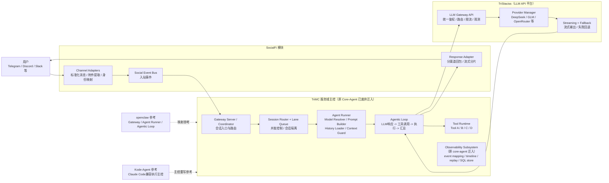

# 目标重构架构图（SocialFi / TriMC / TriStaciss）

## 文档同步元信息

- sourceOfTruth: TriMetaverse/docs/architecture-socialfi-core-agent-tristaciss.md
- publishedFrom: 当前文件（source）
- syncMode: source-only
- publishTier: source-only
- lastSyncedAt: 2026-07-03

当前文件是 TriMetaverse 局部目标架构图的本地真源，用于维护 `SocialFi / TriMC / TriStaciss` 三层职责讲解；其中原 `Core-Agent` 已废弃，其 observability 子系统已迁入 `TriMC/src/observability/`（迁移清单见 `docs/core-agent-to-trimc-migration-checklist.md`）。本文不是 TriCompany 公司级 workflow 或产品真源。

> 本图是“模块视图（局部视图）”。整体框架以 [docs/architecture-overall-unified.mmd](docs/architecture-overall-unified.mmd) 为唯一真源（Single Source of Truth）。

## 说明

- 解释、评审与实施时，优先以 [docs/architecture-overall-unified.mmd](docs/architecture-overall-unified.mmd) 为总框架；本文件用于三层职责讲解。
- `SocialFi` 只负责渠道接入与响应适配，不承载模型调度逻辑。
- `Core-Agent` 负责会话编排、工具执行和代理循环，是 24x7 主控核心。
- `TriStaciss` 是唯一 LLM 出口，统一模型接入、策略与可观测能力。
- 引入统一 3D 观测层：`VibeCraft-inspired` 负责运维观测（会话/工具/回放），`AgentSims-inspired` 负责任务仿真训练与评测（Tick/评估/实验）；两者在同一模块内以不同模式呈现，避免双系统分裂。
