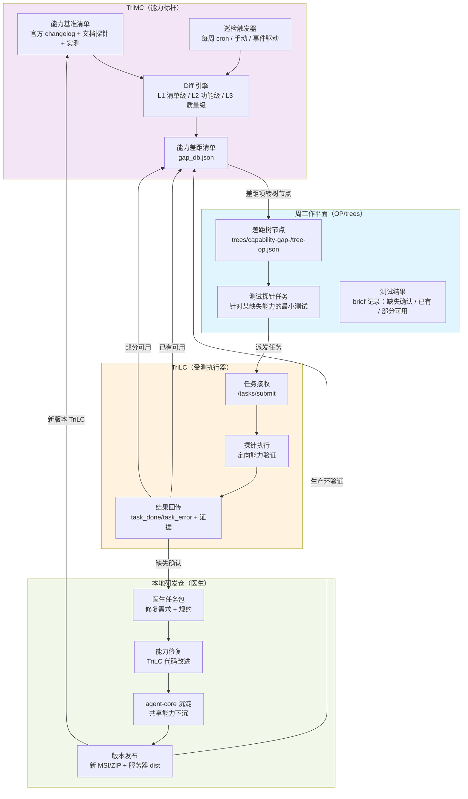
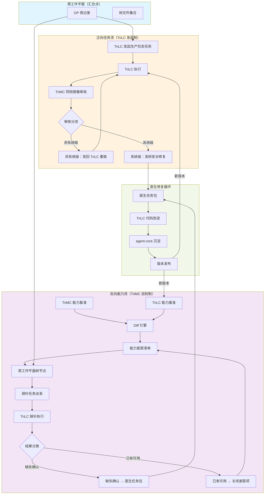
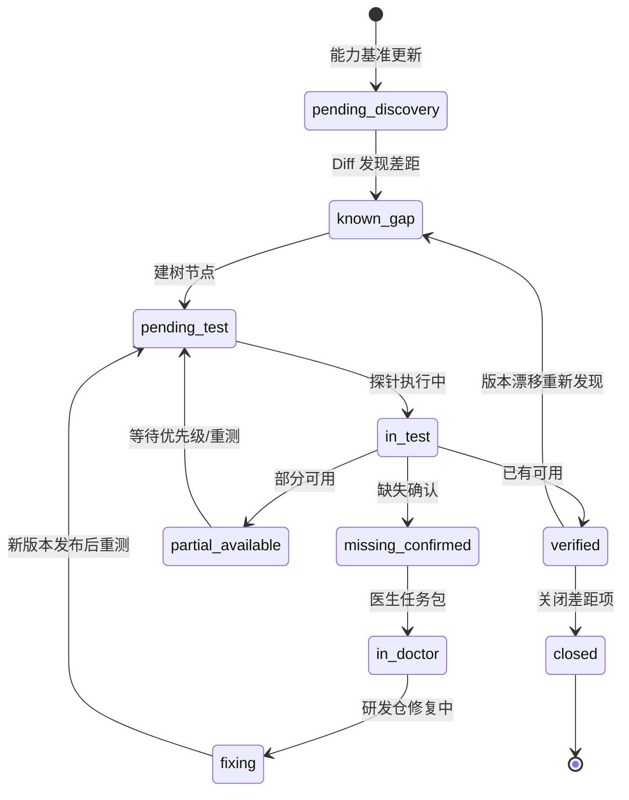

# 能力差距发现机制设计（Capability Gap Discovery Design）

## 文档同步元信息

- sourceOfTruth: TriMetaverse/docs/execution/capability-gap-discovery-design.md
- syncMode: source-only
- lastSyncedAt: 2026-08-16
- status: drafting
- owner: 小狄（CTO）

> **版本**：v1.0
> **日期**：2026-08-16
> **背景**：CEO 发现训练流程 v2.1 的盲区漏洞并提出解法方向

## 零、问题本质与解法方向

### 0.1 能力盲区三不通

**核心问题**：训练流程 v2.1 存在能力盲区，导致缺失能力永远无法被发现。

| 维度 | 现象 | 后果 |
|------|------|------|
| **TriLC 端** | 无某能力（如 Linux 多 session 自由对话） → 想不到发起相关任务 | 缺陷永久隐蔽 |
| **TriMC 端** | 有此能力（套壳 claude code） → 收不到这类任务（任务是 TriLC 发起的） | 审核面无法触发 |
| **研发仓端** | 收不到修复需求 | 医生无法治疗 |

**漏洞根因**：正向任务流（TriLC 发起 → TriMC 审核）只能覆盖"TriLC 已知自己要做的事"。**未知的能力差距永远不会被发现**。

### 0.2 CEO 解法方向

TriMC（套壳先进 harness）**能力基准 diff TriLC 能力** → 反向下发测试任务（可挂周工作平面）→ 定向测试 → 缺失确认 → 医生任务包 → 修复 → 沉淀 agent-core。

**关键洞察**：训练期的 TriMC 不仅是审核者，更是**能力标杆持有者**。主动对比能力差，才能把未知漏洞变成可验证任务。

---

## 一、能力基准建设

### 1.1 能力面定义

**能力面**：一个运行时可执行的功能集合，可被测试验证的最小语义单元。

| 分类 | TriMC（套壳 claude code） | TriLC（自研） |
|------|---------------------------|---------------|
| **会话管理** | start/resume/fork/--bg/--agents | start/resume（有）/fork（部分）/--bg（无） |
| **跨会话协作** | SendMessage/teammate/mailbox | localbus（跨 daemon 不可用） |
| **权限系统** | 6 种模式 + 规则 + -p 非交互 | ✅ 已对标 |
| **MCP 接入** | add/remove/list/status | ✅ 已对标 |
| **模型路由** | 多 provider/fallback/degraded | ✅ 已对标 |
| **TUI/交互** | Ink/termio/光标/IME | 有（兼容性待验） |
| **记忆注入** | CLAUDE.md/memory-injector | 薄层 neutral-local-context |
| **远程控制** | Remote Control/--channels | 无 |
| **Hook 系统** | PreToolUse/PostToolUse/Stop | 无（仅 TUI React hooks） |

### 1.2 能力基准来源

**TriMC 侧能力面清单**（套壳 harness 标杆）：

| 来源 | 机制 | 更新频率 |
|------|------|----------|
| **官方 changelog** | 解析官方版本发布说明（`claude --version` + API changelog） | 每次官方更新后 |
| **文档探针** | 官方文档结构化解析（工具列表、API 规约） | 每周 |
| **实测探针** | 自动化探测（`--help`、功能调用、API 暴露） | 每周 |
| **人工补充** | 手动发现新特性后补录 | 按需 |

**TriLC 侧能力面清单**：

| 来源 | 机制 | 现状 |
|------|------|------|
| **checklist 扩展** | trilc-capability-checklist.md §二 1-6 域 25/25 + C 层 C1-C17 | 已覆盖执行域 + CC 特性对标层 |
| **代码扫描** | 解析 `src/` 目录结构、导出符号、工具注册表 | 可自动化 |
| **实测验证** | 每项能力对应测试用例（如 C1 69/69 测试场景） | 部分有（C1/C8/C9/C10/C12/C13/C15） |

### 1.3 Diff 机制

**三级 diff 策略**：

| 级别 | 机制 | 频率 | 自动化 |
|------|------|------|--------|
| **L1：清单级** | 结构化能力面 JSON 对比 | 每周 | ✅ 脚本 |
| **L2：功能级** | 针对"有/无"差异设计探针测试 | 每周 | 半自动 |
| **L3：质量级** | 针对"部分/兼容性"差异设计深度测试 | 每月 | 人工为主 |

**清单级 diff 示例**：

```json
{
  "capabilityMatrix": {
    "session_fork": {
      "trimc": "full",
      "trilc": "partial",
      "gap": "数据层未闭环（复制会话上下文为新会话）",
      "status": "known_gap",
      "priority": "stage_2"
    },
    "bg_sessions": {
      "trimc": "full",
      "trilc": "none",
      "gap": "daemon 仅守护服务，无会话粒度后台化",
      "status": "known_gap",
      "priority": "stage_2"
    },
    "permission_modes": {
      "trimc": "full",
      "trilc": "full",
      "gap": null,
      "status": "verified",
      "evidence": "M2 第二轮验收（C8/C9）"
    }
  }
}
```

---

## 二、反向任务流设计

### 2.1 完整流程图



### 2.2 巡检触发机制

| 触发方式 | 条件 | 频率 | 责任方 |
|----------|------|------|--------|
| **周期巡检** | TriMC scheduler cron（周度） | 每周 | TriMC 编排层 |
| **事件驱动** | 官方 claude 发布新版本 | 按需 | TriMC 观测层 |
| **手动触发** | CEO / 小贾主动发起 | 按需 | 任意方 |
| **验证后触发** | 医生修复完成 → 新版本发布 | 每版发布后 | TriMC 编排层 |

**周期巡检流程**：

1. TriMC scheduler cron 触发（与周平面迁移同频）
2. Diff 引擎执行 L1 清单级 diff
3. 生成/更新 `gap_db.json`
4. 小贾审核差距清单 → 决定哪些项转树节点
5. 建树（可独立树 `capability-gap-N` 或挂现有树节点）
6. 派发探针任务到 TriLC

### 2.3 探针式测试设计

**原则**：针对某缺失能力的最小可测试单元，而非完整功能实现。

**示例**：

| 差距项 | 探针测试 | 预期结果 | 测试方法 |
|--------|----------|----------|----------|
| `session_fork` | 创建会话 → fork → 两会话独立状态验证 | 两会话状态独立、互不影响 | TriLC 执行 fork 调用 + 状态校验 |
| `bg_sessions` | `trilc --bg` 启动后台会话 → 枚举验证 | 后台会话可枚举、可停止 | TriLC CLI 调用 + 列表查询 |
| `cross_daemon_message` | 两 daemon 实例 → SendMessage 跨实例 | 消息可达、响应正确 | 双实例部署 + 消息收发测试 |
| `hook_system` | 注册 PreToolUse hook → 工具调用验证 | Hook 正确触发、可拦截/修改 | Hook 注册 + 工具调用测试 |

**探针任务载体**：

```json
{
  "treeId": "capability-gap-1",
  "nodeId": "probe-session-fork",
  "capabilityGap": "session_fork",
  "testSpec": {
    "precondition": "会话已创建",
    "action": "执行 fork 操作",
    "assertions": [
      "两会话 session_id 不同",
      "两会话上下文独立",
      "原会话状态不受影响"
    ],
    "expectedOutcome": "两会话状态独立验证通过"
  },
  "evidenceRequirements": [
    "fork 操作日志",
    "两会话 session_id",
    "状态独立校验结果"
  ]
}
```

### 2.4 测试结果分类与路由

| 测试结果 | 定义 | 后续路由 |
|----------|------|----------|
| **缺失确认** | TriLC 完全无法执行探针或所有断言失败 | 生成医生任务包 → 研发仓修复 |
| **部分可用** | 部分断言通过、核心功能存在但质量不足 | 标注差距细节 → 挂队列等待优先级 |
| **已有可用** | 所有断言通过，能力已存在 | 关闭差距项 → 更新 checklist 状态 |
| **无法判定** | 探针执行失败、证据不足、环境问题 | 标记待重测 → 下一轮巡检 |

---

## 三、与三角循环融合

### 3.1 双流完整循环图



### 3.2 两流在周平面的呈现

**OP 周记录扩展字段**：

```json
{
  "capabilityGapDiscovery": {
    "lastScanAt": "2026-08-16T00:00:00Z",
    "gapCount": 8,
    "gapsByPriority": {
      "stage_1": 3,
      "stage_2": 4,
      "stage_3": 1
    },
    "activeProbeTrees": [
      "capability-gap-1",
      "capability-gap-2"
    ],
    "closedThisWeek": 2,
    "newThisWeek": 1
  }
}
```

**树文件分类**：

| 树类型 | 用途 | 树Id 命名 |
|--------|------|----------|
| **差距树** | 单一能力差距的探针验证 | `capability-gap-<id>` |
| **综合树** | 多差距项批量验证 | `capability-batch-<id>` |
| **挂载节点** | 差距验证挂现有树 | 现有 tree 新增节点 |

### 3.3 双流协同规则

| 规则 | 说明 |
|------|------|
| **正向优先** | 生产形态任务（正向流）优先于能力巡检（反向流） |
| **反向不阻塞** | 差距探针任务不阻塞生产任务执行 |
| **证据共享** | 正向任务执行证据可用于反向能力验证（如正向任务中用了 fork 可作 fork 能力证据） |
| **状态同步** | 差距清单状态与 checklist 状态双向同步 |

---

## 四、能力差距看板

### 4.1 给 CEO 的呈现

**最小形态（OP 登记条目）**：

```json
{
  "gaps": [
    {
      "id": "gap_session_fork",
      "capability": "会话 fork",
      "status": "known_gap",
      "priority": "stage_2",
      "businessValue": "团队协作必备",
      "lastTestedAt": "2026-08-15T10:00:00Z",
      "treeId": "capability-gap-1",
      "nodeId": "probe-session-fork"
    },
    {
      "id": "gap_bg_sessions",
      "capability": "后台会话生命周期",
      "status": "pending_test",
      "priority": "stage_2",
      "businessValue": "生产体验必备",
      "lastTestedAt": null,
      "treeId": null
    }
  ]
}
```

**完整形态（dashboard）**：未来可构建可视化看板（Web UI 或 Artifact），包含：

| 维度 | 呈现内容 |
|------|----------|
| **差距总览** | 总数、按状态分组（known_gap/pending_test/verified/closed）、按优先级分组 |
| **差距列表** | 能力项/状态/优先级/商业价值/最后测试时间/关联树节点 |
| **趋势图** | 历周差距项数量变化、关闭速率 |
| **商业价值关联** | 按商业价值维度（团队协作/生产体验/替换必备）分组 |
| **进度追踪** | 与 C 层消化清单的映射关系 |

### 4.2 优先级口径（与小乔产品接口点）

| 优先级 | 定义 | 商业价值映射 | 与生产级开发期阶段对应 |
|--------|------|--------------|------------------------|
| **stage_1** | 生产安全必备（影响稳定性/可靠性） | 核心生产质量 | 阶段一全量把关期 |
| **stage_2** | 用户体验必备（影响可用性/效率） | 生产体验面 | 阶段二抽检过渡期 |
| **stage_3** | M4 替换必备（源码替换前提） | 战略替换目标 | 阶段四资格认定期 |
| **stage_4** | 增强型能力（锦上添花） | 未来扩展 | 低优先级 |

**优先级定义权**：由小乔（CPO）基于商业价值判定，技术评估提供可行性支撑。

### 4.3 差距状态机



---

## 五、实施分期

### 5.1 最小可行（手动周期盘点 + 手建探针任务）

| 步骤 | 动作 | 责任方 | 产出 |
|------|------|--------|------|
| 1 | 手动梳理 TriMC 能力面（官方文档 + 实测） | 小狄 | `trimc-capability-catalog.md` |
| 2 | 扩展 trilc-capability-checklist.md 为全能力面 | 小狄 | checklist 扩展版 |
| 3 | 手动 diff 生成差距清单 | 小狄 + 小贾 | `gap_db.json`（手写） |
| 4 | 手动建树节点、派探针任务 | 小贾 | 树文件 + 任务派发 |
| 5 | TriLC 执行探针 → 结果登记 | TriLC 执行层 | brief 记录 |
| 6 | 小贾审核结果 → 医生任务包（如需） | 小贾 + 小狄 | 医生任务清单 |
| 7 | 医生修复 → 版本发布 | 医生（研发仓） | 新版本 |
| 8 | 更新差距状态 | 小狄 | `gap_db.json` 更新 |

**时间线**：2-3 周（可挂 W34/W35 周平面）

### 5.2 半自动（清单 diff 脚本 + 任务模板）

| 步骤 | 自动化 | 手动介入 | 责任方 |
|------|--------|----------|--------|
| 1 | 官方 changelog 解析脚本 | - | 小狄 |
| 2 | 结构化能力面 JSON 生成 | - | 小狄 |
| 3 | Diff 脚本（清单级） | 人工审核差距有效性 | 小狄 + 小贾 |
| 4 | 树节点生成脚本 | 小贾审核建树决策 | 小贾 |
| 5 | 探针任务模板填充 | 探针设计需人工 | 小狄 |
| 6 | TriLC 执行探针 | - | TriLC 执行层 |
| 7 | 结果解析脚本 | 小贾审核结果分类 | 小狄 + 小贾 |
| 8 | 医生任务包生成 | - | 小狄 |

**时间线**：4-6 周（W36-W38）

### 5.3 自动（巡检 cron + 差距看板）

| 步骤 | 自动化 | 手动介入 |
|------|--------|----------|
| 1 | TriMC scheduler cron 周度触发 | - |
| 2 | 全链路自动化（changelog 解析 → diff → 建树 → 派任务） | 小贾仅审核差距优先级 |
| 3 | 探针执行自动路由结果 | - |
| 4 | 医生任务包自动生成 | 医生执行需人工 |
| 5 | Dashboard 自动更新 | - |
| 6 | 差距项自动关闭（验证通过） | - |

**时间线**：8-12 周（W39-W44）

### 5.4 分期里程碑

| 里程碑 | 标准 | 验收方式 |
|--------|------|----------|
| **M1：手动版投产** | 第一轮手动巡检完成 → 差距清单 → 至少 1 个探针任务执行 | OP 登记 + brief 记录 |
| **M2：半自动版投产** | Diff 脚本可用 → 任务模板可用 → 自动化覆盖 50% 流程 | 脚本运行记录 + 树节点自动生成 |
| **M3：自动版投产** | Cron 巡检可用 → Dashboard 可用 → 自动化覆盖 80% 流程 | Cron 日志 + Dashboard 访问 |
| **M4：闭环验证** | 至少 3 个差距项完成全链路（发现→探针→修复→关闭） | 差距状态机完整轨迹 |

---

## 六、与既有资产对接

### 6.1 与 checklist 关系

| 维度 | trilc-capability-checklist.md | 能力差距机制 |
|------|-------------------------------|--------------|
| **覆盖面** | 已验证能力（25/25 + C 层部分） | 全能力面（含未知差距） |
| **状态语义** | "通过" = 已验证 | "known_gap" = 已知未通过 / "verified" = 已有可用 |
| **更新触发** | 正向任务验证通过 | 反向探针验证通过 |
| **双向同步** | 差距项关闭 → 更新 checklist 为"通过" | checklist 新增 → 差距排查 |

### 6.2 与生产级开发期阶段对接

| 生产级开发期阶段 | 差距优先级映射 | 消化节奏 |
|------------------|----------------|----------|
| 阶段一（全量把关期） | stage_1 | 全量审核，逐项闭环 |
| 阶段二（抽检过渡期） | stage_1 + stage_2 | 已验证域自主，挂靠项逐项审核 |
| 阶段三（例外管理期） | stage_1 + stage_2 + stage_3 | 高风险/跨仓/发布门禁审核 |
| 阶段四（资格认定期） | 全优先级 | 全链回归 + CEO 认定 |

### 6.3 与 agent-core 沉淀对接

**修复完成后的下沉流程**：

1. 医生修复 TriLC 代码 → 功能实现
2. 小狄审查实现 → 判定是否属共享能力
3. 如属共享 → 提取到 agent-core
4. agent-core 发布 → TriMC / TriLC 双侧升级
5. 差距项关闭 → 更新 checklist 为"通过"

---

## 七、技术风险与缓解

| 风险 | 影响 | 缓解措施 |
|------|------|----------|
| **探针设计不足** | 假阴性（实际缺失但探针通过） | 探针双人审查（小狄 + 小柯）；定期抽查 |
| **能力面漂移** | 官方版本更新后差距清单失效 | 事件驱动巡检（官方更新立即触发） |
| **优先级误判** | 低优先级差距阻塞高价值场景 | 小乔定期审查优先级定义；CEO 仲裁 |
| **医生资源瓶颈** | 差距积压 → 修复跟不上 | 优先级队列；差距冻结机制（超期未修降优先级） |
| **双流冲突** | 正向/反向任务竞争资源 | 正向优先规则；资源占用监控 |

---

## 八、产品接口点（与小乔协作）

### 8.1 小乔负责

| 事项 | 说明 |
|------|------|
| **差距商业价值评估** | 每差距项标注商业价值维度（团队协作/生产体验/替换必备） |
| **优先级定义** | stage_1-4 与商业价值的映射规则 |
| **看板呈现口径** | CEO 可视化看板的 UI/UX、指标定义 |
| **差距项用户影响** | 哪些差距影响用户、影响程度、用户反馈收集 |

### 8.2 小狄负责

| 事项 | 说明 |
|------|------|
| **能力面技术定义** | 差距项的技术规格、测试方法 |
| **探针设计** | 针对差距项的测试用例设计 |
| **可行性评估** | 差距修复的技术难度、工作量估算 |
| **agent-core 下沉判定** | 哪些修复需下沉共享能力 |

### 8.3 协作接口

**差距项登记格式**（小狄提交，小乔审核）：

```json
{
  "gapId": "gap_session_fork",
  "capability": "会话 fork",
  "technicalSpec": {
    "trimcStatus": "full",
    "trilcStatus": "partial",
    "gapDescription": "数据层未闭环（复制会话上下文为新会话）",
    "testMethod": "创建会话 → fork → 两会话独立状态验证"
  },
  "businessValue": {
    "dimension": "团队协作",
    "impact": "多 Agent 并行必备",
    "userImpact": "中等"
  },
  "priorityProposal": "stage_2",
  "estimatedEffort": "2-3 周"
}
```

---

## 九、下一步行动

### 9.1 立即启动（W34）

| 行动 | 责任方 | 产出 |
|------|--------|------|
| 小狄梳理 TriMC 能力面（官方文档 + 实测） | 小狄 | `trimc-capability-catalog.md` |
| 扩展 checklist 为全能力面 | 小狄 | checklist 扩展版 |
| 手动 diff 生成第一版差距清单 | 小狄 + 小贾 | `gap_db.json`（W34 OP 登记） |
| 选 2-3 个高优先差距项建树 | 小贾 | 树文件（挂 W34） |

### 9.2 与 CEO 确认

**需 CEO 决策**：

1. 反向能力流机制是否采纳？
2. 周度巡检频率是否合适？
3. 优先级口径（stage_1-4）是否批准？
4. 看板呈现形态（OP 条目 vs dashboard）倾向？
5. 手动版是否立即启动（W34）？

---

## 十、附录

### 附录 A：changelog 解析脚本示例

```typescript
// scripts/trimc-changelog-parser.ts
interface CapabilityItem {
  id: string;
  name: string;
  category: string;
  version: string;
  source: "changelog" | "docs" | "probe";
}

async function parseChangelog(): Promise<CapabilityItem[]> {
  // 解析官方版本发布说明
  // 输出结构化能力面清单
}
```

### 附录 B：Diff 引擎示例

```typescript
// scripts/capability-diff.ts
interface DiffResult {
  trimcOnly: string[];    // TriMC 独有（差距）
  trilcOnly: string[];    // TriLC 独有（异常）
  verified: string[];     // 双方都有（已验证）
  partial: Record<string, string>; // 部分可用（差距描述）
}

async function diffCapabilities(): Promise<DiffResult> {
  // 读取两边能力面 JSON
  // 执行 L1 清单级 diff
  // 输出差距建议
}
```

### 附录 C：探针任务模板

```json
{
  "template": "probe_task",
  "fields": {
    "capabilityGap": "{{gapId}}",
    "capabilityName": "{{capabilityName}}",
    "precondition": "{{precondition}}",
    "action": "{{action}}",
    "assertions": "{{assertions}}",
    "expectedOutcome": "{{expectedOutcome}}",
    "evidenceRequirements": "{{evidenceRequirements}}"
  }
}
```

---

> **变更记录**：
> - 2026-08-16：初始版本（小狄根据 CEO 命题创建）

## 附录：小乔产品口径（收口版 2026-08-16）

### 看板分级
- 最小（立即可用）：OP 周登记条目 `gap-discovery-<item-id>.md`（字段：能力项/TriMC 与 TriLC 状态/生产依赖度/优先级/探针任务 ID/测试结果）
- 中期（1-2 周）：`docs/execution/capability-gap-list.md` 优先级分级清单
- 远期：自动化 dashboard（生产系统稳定后）

### 优先级口径（三柱模型，以此为准——生产使命 40% + 训练价值 35% + 实现成本 25%）
- **P0 必需**：服务器域 7×24 无法绕过，缺失则训练系统跑不了真实负载（例：Linux 多 session 自由对话）
- **P1 重要**：生产常见场景高频依赖，解锁显著提升训练覆盖面（例：MCP 热重载、长上下文压缩）
- **P2 加分**：特定场景需要但有替代
- **P4 可选**：锦上添花

### 探针验收判据模板
能力项 / 判定标准（条件式：执行 X 预期 Y + 边界 Z）/ 通过门槛 / 失败定义 / 部分通过定义。探针类型：存在性（有无）/ 完整性（好坏）/ 性能（暂不投入）。周平面呈现：`[探针] XX 能力验证` + 关联差距项 + 结果回填。

### 盲区纳入口径
- **A 类**（TriMC 有 TriLC 无）✅ 当前焦点——训练系统核心价值（吸收官方 harness 能力）
- **B 类**（两者都无官方未来会有）⚠️ 暂不纳入（监测成本高收益低，生产系统稳定后复评）

### 差距状态模型（四态）
缺失 / 部分具备 / 已验证待沉淀 / 已沉淀 agent-core

> 本附录为产品口径收口版；正文小狄 stage_1-4 映射作为技术参考，优先级判定以本附录三柱模型为准。
