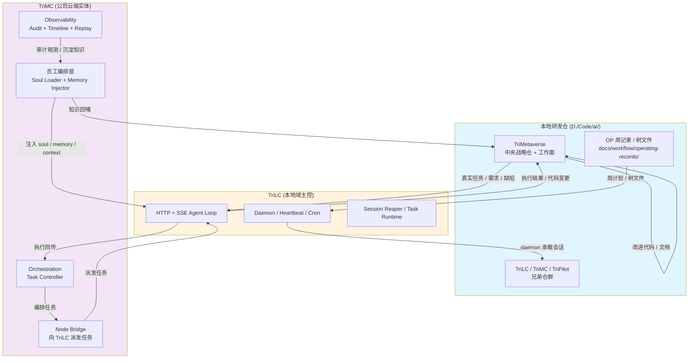

# TriMC + TriLC + 本地研发仓：三角优化循环

## 文档同步元信息

- sourceOfTruth: TriMetaverse/docs/training/trimc-trilc-devrepo-triangle-loop.md
- syncMode: source-only
- lastSyncedAt: 2026-08-15

## 培训判断

**目标读者**：技术研发新人（需要理解 TriMetaverse 三角优化循环的全局架构）

**学习起点**：
- 已了解 TriMetaverse 是多模块 AI 原生开发平台
- 知道 TriLC、TriMC 是什么（从 `三元宇宙架构与模块说明.md` §3/§4 获得）
- 对 Git、研发工作面、daemon 基本概念有认识

**接手目标**：理解如何借助 TriMC 和本地研发仓来训练和改善 TriLC 能力，并能在这个循环中找到自己的参与位置。

---

## 一、先看全图：三角优化循环



**一句话概括**：本地研发仓提供真实任务 → TriLC 执行并产出改进 → TriMC 编排观测并沉淀知识 → 反哺回研发仓 → TriLC 越用越强。

---

## 二、三个顶点：各是什么、真实职责

### 2.1 本地研发仓（`D:/Code/ai/` 兄弟仓群）

**物理布局**：
```
D:/Code/ai/
├── TriMetaverse/    ← 中央战略仓 + 研发工作面
├── TriLC/           ← Local Controller daemon
├── TriPilot/        ← VS Code 扩展
├── TriCode/         ← 共享代码运行时
├── TriMC/           ← Meta Controller
├── TriCompany/      ← 赛博公司运行面
└── ...
```

**真实职责**：
- **TriMetaverse**：中央战略仓 + 研发工作面
  - `docs/workflow/operating-records/` —— 周 OP 记录（`OP-YYYYMM-Wnn-001.json`）
  - `.claude/agents/` —— 13 名 TriCompany 员工运行面
  - `docs/execution/` —— 执行计划、验证方案、能力清单
- **兄弟仓群**：TriLC、TriPilot、TriCode、TriMC 等独立 git 仓

**角色定位**：真实研发场景与语料的来源，也是 TriLC 改进代码的落点。

> 真源：`docs/三元宇宙架构与模块说明.md` §3、`v0.9.x-dual-track-tricompany-plan.md` §4.1

### 2.2 TriLC（本地域主控，`../TriLC/`）

**核心能力**：
- HTTP + SSE Agent Loop（长连接会话）
- Daemon（后台服务）
- Heartbeat（心跳监测）
- Cron（定时任务，支持周平面自动化）
- Session Reaper（会话清理）
- Task Runtime / Planner / ToolBus（任务执行编排）
- MCP Server 接入（工具扩展）
- Mirror / Sync / Update（状态同步）

**源码结构**（示意）：
```
TriLC/src/
├── runtime/          # detached daemon shell
├── daemon/           # daemon 服务
├── heartbeat/        # 心跳监测
├── cron/             # 定时任务引擎
├── session-store/    # 会话持久化
├── task-runtime/     # 任务执行状态
├── planner/          # 规划与重新规划
├── toolbus/          # 本地工具总线
├── mcp/              # MCP server 接入
├── skills/           # 技能封装
├── mirror/           # 状态镜像
├── sync/             # 同步机制
└── update/           # 更新机制
```

**角色定位**：本地人机协作主入口，承载研发会话的运行载体；它跑着研发，同时它自己就是被研发的对象（dogfooding 自举）。

> 真源：`../TriLC/README.md`、`docs/execution/trilc-capability-checklist.md`、`三元宇宙架构与模块说明.md` §4

### 2.3 TriMC（公司云端实体 / Meta Controller，`../TriMC/`）

**核心能力**：
- **员工编排层**（TriMC 自建，高于 Claude Code infra）：
  - Soul Loader —— 员工人格加载
  - Memory Injector —— 记忆注入
  - Tool Gater —— 工具门禁
  - Context Builder —— 上下文构建
- **Orchestration**：
  - Task Controller —— 任务状态机
  - Session Bridge —— 会话桥接
  - TriLC Dispatch Executor —— 向 TriLC 派发任务
  - Employee Scheduler / Registry —— 员工调度与注册表
- **Observability**：
  - Audit Mapping —— 审计映射
  - Timeline Query / Replay —— 时间线查询与回放
  - Postgres Stores —— 持久化存储
- **Node Bridge**：向 TriLC 派发任务的通道

**源码结构**（示意）：
```
TriMC/src/
├── server/                    # HTTP 服务端点
├── task-controller/           # 任务状态机
├── orchestration/             # 编排层
│   ├── session-bridge.ts
│   ├── trilc-executor.ts
│   └── employee-scheduler.ts
├── observability/             # 审计与回溯
│   ├── mapper.ts
│   ├── timelineReplayApi.ts
│   └── postgresClient.ts
├── soul-loader/               # 员工人格加载
├── memory-injector/           # 记忆注入
├── tool-gater/                # 工具门禁
├── context-builder/           # 上下文构建
├── agent-loop/                # Agent 循环引擎
├── heartbeat/                 # 心跳检查（Python）
└── cron/                      # 定时任务（TypeScript）
```

**角色定位**：编排与观测中枢——把公司知识/员工人格注入会话、观测执行、沉淀回知识体系；TriLC 崩溃时的云端 fallback。

**当前状态提醒**：员工编排层部分能力已落地（soul-loader、memory-injector、tool-gater、context-builder 已有源码），完整编排能力仍在建设中。

> 真源：`../TriMC/README.md`、`三元宇宙架构与模块说明.md` §3、`server-fleet-trilc-parity-plan.md`

---

## 三、三条边：数据/控制/反哺怎么流

### 3.1 边 1：研发仓 → TriLC（任务与编排流）

**流动内容**：
- **真实任务**：OP 周计划、树文件（`tree-op.json`）、需求/缺陷
- **工作面**：TriMetaverse 作为统一工作面（`.claude/agents/`、`docs/workflow/`）
- **编排触发**：Cron 定时触发（周度平移、自动化任务）

**流动方式**：
- TriMC 从 `docs/workflow/operating-records/` 读取周计划
- 通过 Task Controller 派发任务到 TriLC
- TriLC Daemon 承载 Agent 会话在仓上执行

> 真源：`v0.9.x-dual-track-tricompany-plan.md` §3.3、`trilc-capability-checklist.md` §2.1/2.2

### 3.2 边 2：TriLC → 研发仓（执行产物流）

**流动内容**：
- **代码变更**：TriLC 自身改进代码（dogfooding 自举）
- **文档更新**：OP 记录、树文件状态更新
- **执行回传**：任务结果、日志、证据

**流动方式**：
- TriLC Agent 通过 Read/Edit/Write 工具修改代码
- 修改后触发 `tsc --noEmit` + `npm test`（工程门禁）
- 通过 Git 提交到研发仓（或通过 TriCode 编排层生成 PR）

> 真源：`self-dev-loop-design.md` §2/§3、`trilc-capability-checklist.md` §3.1/3.2

### 3.3 边 3：TriMC → TriLC（编排与观测流）

**流动内容**：
- **编排**：任务派发、员工调度、会话桥接
- **注入**：Soul（人格）、Memory（记忆）、Context（上下文）
- **观测**：审计事件、时间线记录、回溯数据

**流动方式**：
- TriMC Orchestration 层通过 Node Bridge 派发任务
- Soul Loader / Memory Injector 向会话注入员工能力
- Observability 层记录执行轨迹，支持回溯与审计

> 真源：`三元宇宙架构与模块说明.md` §3、`server-fleet-trilc-parity-plan.md` §二

### 3.4 边 4：研发仓 → TriMC（知识反哺流）

**流动内容**：
- **知识沉淀**：执行经验、改进方案、最佳实践
- **员工成长**：新能力、新技能、新工作流
- **Registry 更新**：产品状态、代码状态、边界变更

**流动方式**：
- TriMC Observability 层观测执行，沉淀到知识体系
- 更新 `docs/registry/`、员工 memory、公司流程
- 反哺下一轮任务编排，提升会话质量

> 真源：`v0.9.x-dual-track-tricompany-plan.md` §3.2（互促闭环）

### 3.5 边 5：TriLC → TriMC（执行回传与反馈流）

**流动内容**：
- **任务结果**：task_done / task_error 语义
- **状态上报**：进度、阻塞、超时、degraded 模式
- **能力验证**：checklist 打勾、证据登记

**流动方式**：
- TriLC 通过 HTTP SSE 回传任务结果
- TriMC Task Controller 更新任务状态
- 审核方（TriMC 舰队）根据结果更新能力清单

> 真源：`trilc-capability-checklist.md` §一、§2.2

---

## 四、循环怎么转起来：用一个真实轮次走一遍

以 **W33 M2-R12 轮次（生产链域验证）** 为例：

### 步骤 1：研发仓产出任务
- 小贾（CEOChiefOfStaff）更新 `docs/workflow/operating-records/2026-W33/OP-202608-W33-001.json`
- 创建树文件 `trees/r12-production-chain/tree-op.json`
- 树节点定义：验证 MSI 构建、安装态 daemon、服务管理、升级回滚

### 步骤 2：TriMC 编排派发
- TriMC Task Controller 读取树文件
- 通过 Node Bridge 派发任务到 TriLC
- Soul Loader 注射小狄（CTO）、小柯（TestEngineer）人格

### 步骤 3：TriLC 执行任务
- TriLC Daemon 承载会话
- 小狄执行 `build-desktop.ps1` 构建 MSI
- 小柯隔离实例安装验证（`/healthz` 200、14/14 agent 可用）
- 执行结果通过 SSE 回传 TriMC

### 步骤 4：产物落盘研发仓
- 构建成功 → `v0.4.3-r12` ZIP 入 `output/`
- 安装态验证通过 → contracts 14 份入包
- 更新 `trilc-capability-checklist.md` §5.1-5.4 状态为"通过"
- Git 提交证据（commit SHA、日志路径）

### 步骤 5：TriMC 审核沉淀
- TriMC 舰队审核结果（构建无残留、安装态验证通过）
- 更新清单状态 + 登记证据
- 沉淀经验到知识体系（如：安装态路径差异清单、打包 contracts 规则）

### 步骤 6：反哺下一轮
- 新知识注入下一轮任务（如 W34 周计划）
- TriLC 能力提升 → 可承担更复杂任务
- 循环继续，TriLC 越用越强

> 真源：`docs/workflow/operating-records/2026-W33/OP-202608-W33-001.json`、`trilc-capability-checklist.md` §5

---

## 五、双轨互促：dev 与 prod 共享工作面

**核心原则**：dev 和 prod 共享同一个 TriMetaverse 工作面，不是两个独立的工作面。

| | 开发侧（dev） | 生产侧（prod） |
| --- | --- | --- |
| 分支 | `dev` | `main` |
| 运行环境 | 源码 + CLI（`claude`） | MSI 安装版（`trilc daemon`） |
| 节奏 | 天级迭代 | 周级 Release |
| 谁在用 | AI C-suite + 人类开发者 | 人类用户 + daemon 自治 |
| 代码修改 | 直接编辑文件 | 通过 TriCode 自研能力（或提 Bug） |
| 工作面对齐 | 推送到 dev → | ← 生产自研提交 PR |

**互促闭环**：
```text
① 需求/缺陷发现（生产轨）→ ② 实验/开发（dev）→ ③ 合入/构建
→ ④ 部署/验证（prod）→ 回到 ①
```

> 真源：`v0.9.x-dual-track-tricompany-plan.md` §3.1/§3.2

---

## 六、自研循环：TriLC 用自己研发自己

**设计核心**：TriLC 作为 agent 执行器，产出代码变更，经过 CI 门禁，合并回 main，TriLC 拉取更新，实现自举。

**链路**：
```text
TriLC（agent 执行）→ TriCode（编排：diff → branch → commit → PR）
→ OpenCode / Claude Code（代码生成，可选）
→ prod/Wxx 分支（暂存）→ main PR（review + CI 门禁）
→ TriCade 生产（拉取 + 热更新）
```

**当前状态**：v1 设计完成（`self-dev-loop-design.md`），代码合入 dev，Runtime 验证阻塞于生产环境。方案 B（纯 TriLC agent 编码能力）测试计划已定。

> 真源：`docs/engineering/self-dev-loop-design.md`、`docs/execution/selfdev-v1-test-plan.md`

---

## 七、新人怎么参与这个循环

### 7.1 理解你的位置

| 角色 | 位置 | 参与方式 |
| --- | --- | --- |
| **研发新人** | 本地研发仓 | 在 `dev` 分支开发，提交 PR，改进代码 |
| **测试工程师** | TriLC 执行层 | 通过 TriLC 会话验证，更新 checklist |
| **培训学习者** | 教程读者 | 阅读本教程，理解循环，找到参与点 |

### 7.2 从哪里开始

1. **先读大图**：理解三角关系和循环流向（本教程 §一/§二）
2. **选一个顶点深入**：
   - 对本地开发感兴趣 → 看 `../TriLC/README.md` + `trilc-capability-checklist.md`
   - 对编排和观测感兴趣 → 看 `../TriMC/README.md` + `server-fleet-trilc-parity-plan.md`
   - 对战略和工作流感兴趣 → 看 `docs/execution/v0.9.x-dual-track-tricompany-plan.md`
3. **跟踪一轮真实执行**：查看 `docs/workflow/operating-records/` 最新一周的 OP 记录和树文件
4. **找个小任务参与**：从文档修复、测试补充、能力验证小项开始

### 7.3 验证你的理解

- 能画出三角循环图吗？
- 能说出每条边流动的是什么吗？
- 能找到最近一周的真实轮次并复述它吗？

---

## 八、当前成熟度与常见误区

### 8.1 已落地 / 建设中

| 组件 | 状态 | 说明 |
| --- | --- | --- |
| TriLC 基础执行 | **已落地** | M2 验收完成，25/25 能力项全勾 |
| TriLC Cron/Heartbeat | **已落地** | 三层已合入 dev；生产链 5.x 自 2026-08-13 起转为每版常设门禁 |
| TriMC 编排层 | **建设中** | Soul/Memory/Context 已有源码，完整编排能力待完善 |
| TriMC Observability | **已落地** | Audit、Timeline、Replay 已实现 |
| 自研循环 v1 | **设计中** | 链路设计完成，生产环境验证阻塞 |
| 双轨互促 | **已落地** | dev ↔ prod 共享工作面机制就绪 |

> 真源：`server-fleet-trilc-parity-plan.md` §四、`v0.9.x-dual-track-tricompany-plan.md` §1.1

### 8.2 常见误区

| 误区 | 正解 |
| --- | --- |
| TriMC 是服务器版 runtime | TriMC 是公司级运行面，编排与观测中枢；TriLC 是本地人机协作主入口 |
| dev 和 prod 是两个工作面 | dev 和 prod 共享同一个 TriMetaverse 工作面，只是运行环境不同 |
| TriLC 只是个工具 | TriLC 是被研发的对象，它跑着研发，同时改进自己（dogfooding） |
| TriMC 员工编排层已完整 | 部分能力已落地（soul-loader、memory-injector），完整编排仍在建设中 |
| 自研循环已投产 | v1 设计完成，代码合入 dev，生产环境验证阻塞 |

---

## 九、真源引用清单

| 主题 | 真源文件 |
| --- | --- |
| 三角架构与模块边界 | `docs/三元宇宙架构与模块说明.md` |
| 双轨互促机制 | `docs/execution/v0.9.x-dual-track-tricompany-plan.md` |
| TriLC 能力清单 | `docs/execution/trilc-capability-checklist.md` |
| 服务器舰队与 TriLC 追平 | `docs/execution/server-fleet-trilc-parity-plan.md` |
| 自研循环设计 | `docs/engineering/self-dev-loop-design.md` |
| 自研循环 v1 测试计划 | `docs/execution/selfdev-v1-test-plan.md` |
| TriLC README | `../TriLC/README.md` |
| TriMC README | `../TriMC/README.md` |
| 培训目录惯例 | `docs/training/README.md` |
| OP 记录示例 | `docs/workflow/operating-records/2026-W33/OP-202608-W33-001.json` |

---

## 十、总结

**三角三顶点各一句**：
- **本地研发仓**：提供真实任务和工作面，是改进代码的落点。
- **TriLC**：本地人机协作主入口，跑着研发的同时改进自己。
- **TriMC**：编排与观测中枢，注入能力、审计执行、沉淀知识。

**循环五步一句话概括**：
研发仓出任务 → TriLC 执行并产出改进 → TriMC 编排观测 → 沉淀知识反哺研发仓 → TriLC 越用越强。

**新人参与路径**：
理解大图 → 选一个顶点深入 → 跟踪一轮真实执行 → 找个小任务参与 → 验证理解。

---

> 本教程维护：RAndDTrainer（小吴）
> 更新触发：当三角架构、循环机制、模块边界有重大变更时，由 CEOChiefOfStaff 同步后更新。
> 下次审查：M4 源码替换启动时。
