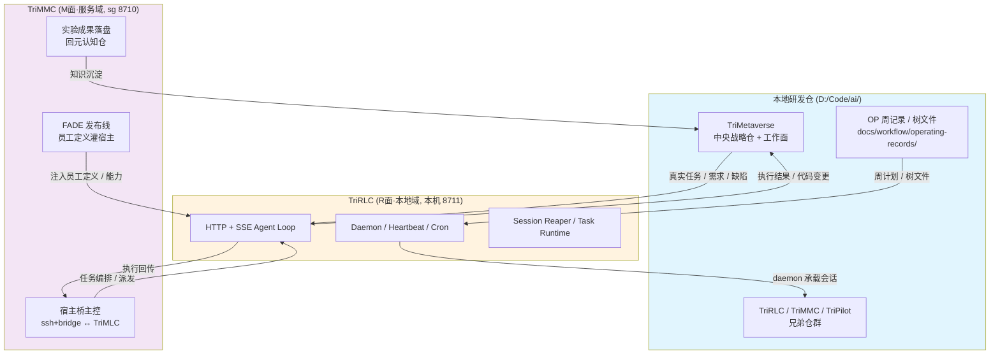

# 三角优化循环：本地研发仓 × TriRLC × TriMMC（四 daemon 矩阵现势版）

## 文档同步元信息

- sourceOfTruth: TriMetaverse/docs/training/trimc-trilc-devrepo-triangle-loop.md
- syncMode: source-only
- 事实基线时点（D-28）：2026-09-18——CEO 四 daemon 矩阵定谳口径；本版为四格拓扑现势重写
- lastSyncedAt: 2026-09-25
- 维护：RAndDTrainer（小吴）

> **版本差注记（2026-09-25 重写）**：本文前身（v2.1，2026-08-15/16 基线）以「TriMC+TriLC」两名讲三角循环。现势已两波超越：①2026-08-21 三元宇宙重定义——`TriLC`→`TriRLC`、`TriMC`→`TriMMC`（历史名保留为兼容路径名，非新旧版本、无退役一说）；②2026-09-18 CEO 四 daemon 矩阵定谳——TriMMC↔TriMLC（M 面，本机 8713）+TriRMC↔TriRLC（R 面，本机 8711）四名四角色。本版正文按现势名与现势定性重写；v2.1 训练循环语义（CEO 2026-08-16 修订）仍有效，全文保留；历史叙事浓缩入 §七（叙事冻结，原文可考 git 历史）。
>
> 静态架构（四格/端口/命名语源）第一站见 [四 daemon 角色矩阵导读](four-daemon-matrix-guide.md)；本文专讲**循环怎么转**。

## 培训判断

**目标读者**：技术研发新人（已读四 daemon 矩阵导读或架构说明 §4，理解 TriRLC/TriMMC 是什么）

**学习起点**：
- 知道 TriMetaverse 是多模块 AI 原生开发平台，认识四 daemon 四格表
- 对 Git、研发工作面、daemon 基本概念有认识

**接手目标**：理解如何借助 TriMMC 和本地研发仓来训练和改善 TriRLC 能力，并能在这个循环中找到自己的参与位置。

---

## 一、先看全图：三角优化循环（现势拓扑）



**一句话概括（v2.1 语义，现势名）**：TriRLC 发起并执行任务 → TriMMC 同岗镜像审核（非系统级发回重做循环至通过）→ 项目系统级问题（含 TriRLC/TriMMC 自身缺陷）走研发仓医生修复（git）→ 能力沉淀 → TriRLC 越练越强。

**三角在四格里的位置**：本循环的执行顶点是 R 面本地域格（TriRLC），编排/灌注顶点是 M 面服务域格（TriMMC）。另外两格——TriMLC（M 面本地域，8713，宿主激活+周平面回流 cron）与 TriRMC（R 面服务域，河源）——是矩阵的另外两格，不直接出现在本三角里；静态拓扑见 [四 daemon 角色矩阵导读](four-daemon-matrix-guide.md)。

---

## 二、三个顶点：各是什么、真实职责（现势定性）

### 2.1 本地研发仓（`D:/Code/ai/` 兄弟仓群）

**物理布局**：
```
D:/Code/ai/
├── TriMetaverse/    ← 中央战略仓 + 研发工作面
├── TriRLC/          ← 现实面本地控制器（原 TriLC，2026-08-31 目录改名）
├── TriPilot/        ← VS Code 扩展
├── TriCode/         ← 共享代码运行时
├── TriMMC/          ← 元虚拟面主控（原 TriMC，2026-09 目录改名）
├── TriCompany/      ← 赛博公司运行面
└── ...
```

**真实职责**：
- **TriMetaverse**：中央战略仓 + 研发工作面
  - `docs/workflow/operating-records/` —— 周 OP 记录
  - `.claude/agents/` —— 13 名 TriCompany 员工运行面
  - `docs/execution/` —— 执行计划、验证方案、能力清单
- **兄弟仓群**：TriRLC、TriPilot、TriCode、TriMMC、TriRMC 等独立 git 仓

**角色定位**：真实研发场景与语料的来源，也是 TriRLC 改进代码的落点——三层模型里的**元认知仓**（唯一无运行时的承重底座）。

> 真源：`docs/三元宇宙架构与模块说明.md` §3/§4、`docs/tmv-whitepaper.md` §3.1

### 2.2 TriRLC（现实面本地控制器，`../TriRLC/`，本机 8711）

**核心能力**：
- HTTP + SSE Agent Loop（长连接会话）
- Daemon（后台服务）/ Heartbeat（心跳监测）
- Cron（定时任务，支持周平面自动化）
- Session Reaper（会话清理）
- Task Runtime / Planner / ToolBus（任务执行编排）
- MCP Server 接入（工具扩展）/ Mirror / Sync / Update（状态同步）

**角色定位**：本地人机协作的本域主入口，与 TriRMC 共用自研内核 **agent-core**（元现实层策略：会话、调度、权限、cron、进程监督、审计全自研，不依赖单一宿主）；它跑着研发，同时它自己就是被研发的对象（dogfooding 自举）。

> 真源：`../TriRLC/README.md`、`docs/execution/trilc-capability-checklist.md`、架构说明 §4

### 2.3 TriMMC（元虚拟面主控，`../TriMMC/`，sg 8710）

**现势定性（勘正旧版「编排观测中枢」口径）**：元虚拟系统最小实现的服务域侧——与 TriMLC 经 ssh+bridge 通信，构成**宿主可整体替换**的成熟虚拟研发环境。元虚拟**不自建会话管理与执行内核**，只负责两件事：
- 把员工定义（合同/五件套）经 **FADE 发布线**灌入宿主
- 把实验成果落盘回元认知仓

**演进注**：TriMMC 早期自研运营资产（cron 周平面/五维同步/observability）规划双跑迁入 TriRMC，迁移后收窄为**宿主桥主控**（架构说明 §4）。

> 真源：`../TriMMC/README.md`、`docs/tmv-whitepaper.md` §3.1、架构说明 §4

---

## 三、循环的边：数据/控制/反哺怎么流

| 边 | 流动内容 | 方式 |
| --- | --- | --- |
| 研发仓 → TriRLC | 真实任务：OP 周计划、树文件、需求/缺陷 | 周计划/树文件挂 `docs/workflow/operating-records/`，cron 触发（本地周平面回流宿主=8713 TriMLC cron） |
| TriRLC → 研发仓 | 代码变更（dogfooding）、文档更新、执行回传 | Agent 工具改码 → 工程门禁（`tsc --noEmit` + `npm test`）→ git 提交 |
| TriMMC → TriRLC | 员工定义/能力注入、任务派发 | FADE 发布线灌宿主；宿主桥派发 |
| 研发仓 → TriMMC | 知识反哺：员工成长、registry 更新 | Observability 沉淀 → 更新 `docs/registry/`、员工 memory |
| TriRLC → TriMMC | 任务结果、状态上报、能力验证 | HTTP SSE 回传；审核方更新能力清单 |

> 真源：`v0.9.x-dual-track-tricompany-plan.md` §3.2/§3.3、`trilc-capability-checklist.md` §2/§3

---

## 四、v2.1 训练循环语义（仍有效的流程规则）

CEO 2026-08-16 修订、经 2026-09-25 复核仍有效的四条流程语义：

1. **任务从 TriRLC 端发起**（训练即生产形态）
2. **TriMMC 审核走岗位一对一镜像互审**（MC 侧小贾审 LC 侧小贾）
3. **审核分流**：项目系统级问题 → 研发仓修复（走 git）；非系统级 → 发回 TriRLC 重做
4. **医生（研发仓）只修项目系统级 bug**——TriRLC/TriMMC 自身的缺陷即属项目系统级（自己没法修自己）；其他项目开发由 TriRLC/TriMMC 直接推进

---

## 五、双轨互促：dev 与 prod 共享工作面

**核心原则**：dev 和 prod 共享同一个 TriMetaverse 工作面，不是两个独立的工作面。

| | 开发侧（dev） | 生产侧（prod） |
| --- | --- | --- |
| 分支 | `dev` | `main` |
| 运行环境 | 源码 + CLI | 安装版（daemon） |
| 节奏 | 天级迭代 | 周级 Release |
| 谁在用 | AI C-suite + 人类开发者 | 人类用户 + daemon 自治 |
| 工作面对齐 | 推送到 dev → | ← 生产自研提交 PR |

**互促闭环**：需求/缺陷发现（生产轨）→ 实验/开发（dev）→ 合入/构建 → 部署/验证（prod）→ 回到起点。

> 真源：`docs/execution/v0.9.x-dual-track-tricompany-plan.md` §3.1/§3.2

---

## 六、自研循环：TriRLC 用自己研发自己

**设计核心**：TriRLC 作为 agent 执行器，产出代码变更，经过 CI 门禁，合并回 main，TriRLC 拉取更新，实现自举。

**状态（D-28 时点标注）**：v1 设计完成（代码合入 dev），生产环境验证阻塞——此为 2026-08 基线读数，现势以 `docs/execution/selfdev-v1-test-plan.md` 与近期 operating-records 为准。

> 真源：`docs/engineering/self-dev-loop-design.md`、`docs/execution/selfdev-v1-test-plan.md`

---

## 七、历史档（叙事冻结，2026-08-15/16 基线）

**v2.1 原始基线**：以「TriMC（公司云端实体）+ TriLC（本地域主控）」两名讲三角循环；当时 TriMC 定性含员工编排层（Soul Loader/Memory Injector/Tool Gater/Context Builder）+ Orchestration + Observability。该定性已被架构说明 §4 现势口径取代（元虚拟不自建内核，见 §2.3）。

**历史轮次示例（W33 M2-R12，生产链域验证，2026-08）**：小贾更新 W33 OP 记录 → 创建树文件 `trees/r12-production-chain/` 验证 MSI 构建/安装态 daemon/服务管理/升级回滚 → TriMC 侧注入小狄（CTO）、小柯（TestEngineer）人格 → 执行侧构建 MSI、隔离实例安装验证（`/healthz` 200、14/14 agent 可用）→ 产物入 `output/`、清单打勾、证据登记 → 同岗镜像审核通过 → 经验沉淀反哺 W34。当时文中名（TriLC/TriMC）按架构说明 §5 别名换算为现名。完整原文见 git 历史（本文件 2026-09-18 注记版）。

---

## 八、新人怎么参与 + 常见误区

### 8.1 参与路径

1. **先读大图**：四 daemon 矩阵导读（静态）→ 本文（循环动态）
2. **选一个顶点深入**：
   - 本地执行面 → `../TriRLC/README.md` + `docs/execution/trilc-capability-checklist.md`
   - 元虚拟/发布面 → `../TriMMC/README.md` + `docs/tmv-whitepaper.md` §3.1
   - 战略与工作流 → `docs/execution/v0.9.x-dual-track-tricompany-plan.md`
3. **跟踪一轮真实执行**：看 `docs/workflow/operating-records/` 最新一周的 OP 记录和树文件
4. **找个小任务参与**：从文档修复、测试补充、能力验证小项开始

### 8.2 验证理解

- 能画出三角循环图并说出每条边流动的是什么吗？
- 能说清三角与四格矩阵的关系（哪两格在循环里、哪两格在外沿）吗？
- 能找到最近一周的真实轮次并复述它吗？

### 8.3 常见误区

| 误区 | 正解 |
| --- | --- |
| 「TriMC 服务器正式版」是独立的服务器 runtime 目标态 | TriMMC 定性是元虚拟主控（FADE 灌宿主+落盘，宿主可整体替换），运营资产规划双跑迁 TriRMC 后收窄宿主桥主控——旧「服务器版 runtime」叙事为历史口径 |
| TriRLC 是个普通工具 | 它是被研发的对象：跑着研发、同时改进自己（dogfooding 自举），且用自研内核 agent-core |
| 训练循环要单独立一套「训练环境」 | 训练即生产形态（v2.1）：任务从 TriRLC 端发起，生产即训练 |
| dev 和 prod 是两个工作面 | 共享同一个 TriMetaverse 工作面，只是运行环境与节奏不同 |

---

## 九、真源引用清单

| 主题 | 真源文件 |
| --- | --- |
| 四 daemon 静态矩阵/命名治理 | `docs/三元宇宙架构与模块说明.md` §4/§5 + 端口部署表；[四 daemon 角色矩阵导读](four-daemon-matrix-guide.md) |
| 三层模型 | `docs/tmv-whitepaper.md` §3.1 |
| 双轨互促机制 | `docs/execution/v0.9.x-dual-track-tricompany-plan.md` |
| TriRLC 能力清单 | `docs/execution/trilc-capability-checklist.md` |
| 服务器舰队与追平计划 | `docs/execution/server-fleet-trilc-parity-plan.md` |
| 自研循环设计/测试计划 | `docs/engineering/self-dev-loop-design.md`、`docs/execution/selfdev-v1-test-plan.md` |
| TriRLC / TriMMC 仓 | `../TriRLC/README.md`、`../TriMMC/README.md` |
| 历史轮次示例 | `docs/workflow/operating-records/2026-W33/OP-202608-W33-001.json` |

---

> 本教程维护：RAndDTrainer（小吴）
> 更新触发：四 daemon 矩阵、循环机制、模块边界有新定谳时，由 CEOChiefOfStaff 同步后更新。
