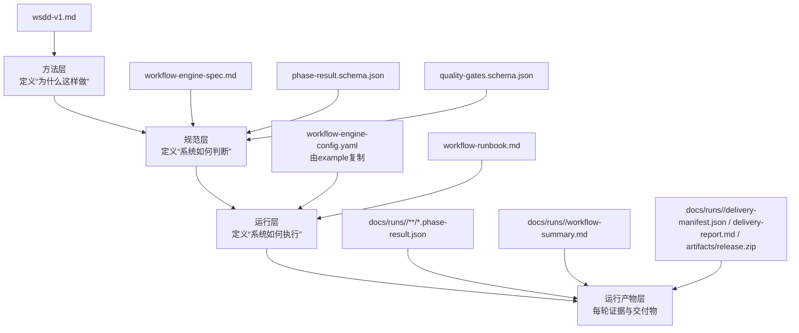

# TMV Workflow 分层与调用关系

## 1. 分层图（按职责）



## 2. 调用关系图（研发工作流执行时）

```mermaid
flowchart LR
  P[project.md<br/>10阶段流程定义] --> S[workflow-engine-spec.md]
  R[workflow/README.md<br/>资产入口] --> S
  R --> C[workflow-engine-config.yaml]
  R --> RB[workflow-runbook.md]

  S --> PRS[phase-result.schema.json]
  S --> QGS[quality-gates.schema.json]

  C --> E[TriMC 研发执行切片<br/>加载配置]
  S --> E
  PRS --> E
  QGS --> E
  RB --> E

  E --> X[按10阶段主线执行]
  X --> Y[在INTELLIGENCE后按PRD分叉]
  Y --> Y1[分支内串行: DESIGNING->CODING->VERIFY-INTEGRATION->REDTEAM->QA->DEPLOYMENT->ASSURANCE]
  Y1 --> Z[生成PhaseResult(branchId/prdId)并做门禁判定]
  Z --> O[输出run产物与交付产物]
```

## 3. 说明

- 本文档用于结构沟通与执行前对齐。
- 可执行逻辑以 `docs/workflow/` 目录内规范与配置文件为准。
