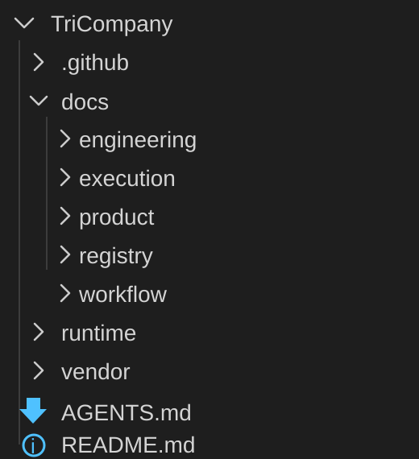

# TriMetaverse 项目级 AI 共学周记（2026-W18）

时间窗口：2026-04-27 至 2026-05-03

维护：秘书处（当前由 `CEOChiefOfStaff` 代管）

状态：本周持续更新中（draft，待周末提交 CEO 确认签发）

版本：draft-2026-W18

对外用途：用于每周向其他使用 AI 做项目的社区成员分享本周在 `TriMetaverse` 推进过程中观察到的大模型能力问题、使用体验和实践经验，供共同学习与讨论。

说明：本文件记录的是当前周的项目实践观察，不自动上升为长期制度、通用理论或模块正式结论；如形成稳定方法论，应另行回写对应真源文档。

## 1. 本周项目背景

本周围绕 `TriMetaverse` 当前项目治理收敛持续推进，重点包括：

- 继续收敛 `TriCompany` 真源、`TriCompany-copilot-host-assets` 支撑包、`TriMetaverse/.github` live 宿主入口与 `TriMetaverse/docs` 中央摘要层之间的边界。
- 继续修正文档中容易让 AI 协作链路混淆的层级表达、owner 表达和 published-copy 口径。
- 把近期在真实协作里暴露出来的大模型能力问题和有效做法整理成可对外讨论的周记，而不是只留在会话上下文里。

## 2. 本周观察到的大模型能力问题与体验

### 2.1 针对清晰的文档结构，模型仍旧会搞错层级内容

- 现象：
  一个清晰的模块结构被描述错乱。

  
- 具体表现：
  面对上图那样清晰层级的模块，GPT-5.4 xhigh 描述成“模块级 product、engineering、workflow、execution、runtime、vendor 和模块内的 .github”这种混层表述。
- 解决方案：
  与模型沟通后，模型承认问题，并把治理文档修改为截图层级对应的稳定表述。
- 问题影响：
  这类混层不是纯文字问题，它会直接影响后续 AI 判断“应该改哪里、不该改哪里”。

当前经验：

- 项目经验：
  针对模型写的文档，还是要仔细审核一遍，尤其是作为真源的文档，力求准确。
- 模型自查：
  文档层级不要靠解释性补丁去纠偏，而要直接写成稳定结构句式。
  一旦结构边界确认，应把它沉淀进正式文档和长期记忆，而不是只在当轮对话里说清楚。

### 2.2 source / published-copy / live / central 四层如果不显式标注，模型会自然滑向“就地修改”

- 现象：
  在长链路 AI 协作中，如果不显式标明哪些是 source、哪些是 published-copy、哪些是 live 入口、哪些只是中央摘要，模型很容易把“当前打开的文件”误判成默认真源。
- 具体表现：
  模型可能直接在 support bundle 或中央摘要页里继续发展模块正文，而不是先回到模块真源、manifest 或治理页判断应该改哪里。
- 解决方案：
  为关键文档补 `sourceOfTruth`、`publishedFrom`、`syncMode`、`lastSyncedAt` 等元信息，并把 source / published-copy / live / central 四层写进治理文档和迁移矩阵。
- 问题影响：
  这种偏差会让 support bundle、中央摘要页和模块真源之间出现回写漂移，时间一长就会形成影子真源。

当前经验：

- 项目经验：
  只要项目里已经出现 source / support / live / central 四层，就不要再依赖“人脑默认知道该改哪”这件事。
- 模型自查：
  在修改多层资产前，先读元信息、manifest 和治理页；如果当前文件不是 source，就不要把它当作默认编辑入口。

### 2.3 用户级 memory 很方便，但项目级真源必须留在仓库主档

- 现象：
  用户级 memory 或会话记忆很适合做宿主侧缓存，但不适合承担项目长期事实真源。
- 具体表现：
  一些边界规则如果只留在当前会话或用户级 memory 里，后续换会话、换 agent、换宿主时，很容易丢失上下文或被重新解释。
- 解决方案：
  只要事项会跨轮、跨人、跨宿主复用，就回到仓库里的正式文档、manifest、registry 或 operating record；memory 只作为索引和提醒层。
- 问题影响：
  如果把项目事实长期留在宿主记忆里，后续协作会出现“模型记得，但项目文件没有证据”的断层。

当前经验：

- 项目经验：
  真正需要长期复用的事实，应尽快回填到仓库真源，再把 memory 当索引或提醒层使用。
- 模型自查：
  如果判断某条信息会影响未来任务，应优先建议落到项目真源；不要把“我记住了”当成项目已经治理完成。

### 2.4 machine-readable 锚点对长链路协作很有价值

- 现象：
  当项目里开始出现固定 report / report-like 输出、support-object-set 或多处 published-copy 时，纯文字说明很容易在多轮协作里失真。
- 具体表现：
  模型后续可能知道“有一些固定锚点”，但不知道哪些路径是 audit-record、哪些是 support-object-set、哪些只是 runtime-state。
- 解决方案：
  为稳定复用的锚点补 machine-readable 索引，明确 exact anchors、pattern anchors 和治理分类。
- 问题影响：
  如果没有可枚举锚点，后续 AI 和人类都更容易漏扫、误删或把运行态输出误收进长期证据链。

当前经验：

- 项目经验：
  只要某组路径已经进入稳定复用，就值得补一个可枚举的 machine-readable 索引。
- 模型自查：
  不要只靠 README 印象判断对象集范围；遇到固定产物、证据链或 published-copy，应优先找 machine-readable 索引或 manifest。

## 3. 本周有效做法

- 先治理 owner、层级和同步方向，再讨论是否搬目录；不要一上来就做物理迁移。
- 把“当前这轮修正”尽量收束成稳定口径，少保留“这是刚修过的解释性痕迹”。
- 对 recurring 文档给出固定目录、固定命名和固定用途，降低后续续写成本。
- 对外分享内容优先写项目里真实踩到的问题和真实有效的方法，不写泛泛的 AI 热门观点。

## 4. 适合发给社区一起讨论的问题

- 当项目进入多仓、多层 source-of-truth 的阶段后，大家是如何降低 AI 把 published-copy 误当 source 的概率？
- 对于长期项目，哪些事实必须回到仓库真源，哪些可以继续留在 agent memory 或工作台缓存里？
- 在你们的项目里，什么场景会触发为 AI 协作补 machine-readable 索引，而不只写 README？

## 5. 下周续写入口

- 补充本周新出现的大模型体验问题、误判案例和修正做法。
- 记录哪些观察适合沉淀成长期方法论，哪些仍只属于阶段性现象。
- 如果本周已完成对外分享，可在此补会后讨论纪要和新增问题。

## 6. 本周维护检查点

- 周开始创建：本文件已创建，当前为 `draft-2026-W18`。
- 周中追加：每次虚拟公司相关对话后，维护者应判断是否有值得沉淀的大模型能力问题、体验或经验，并按第 2 节固定格式追加。
- 周六中午更新：2026-05-02 12:00 前，应至少完成一次分享会前自动或手动更新，供周六 20:00 分享会使用。
- 周末签发：本周结束前，由维护者升级给 CEO 确认；确认后生成正式版本号，并归档到 `docs/workflow/operating-records/项目级 AI 共学周记/`。
- 自动化状态：周开始自动创建、每轮对话自动判断追加、周六中午自动更新和周末签发提醒尚未实现；当前先通过 `项目级 AI 共学周记` prompt 手动执行，自动化实现计划见 `../项目级 AI 共学周记/automation-backlog.md`。
