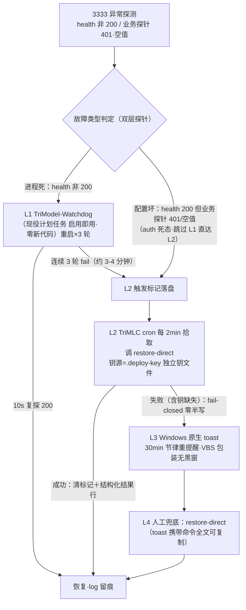

# TASK-TRIMODEL-RECOVERY-LADDER-01 联审设计方案（七问·双签呈批稿）

- sourceOfTruth: 本件（双签方案正身；两独立段 `cpo-view.md`/`cto-independent-review.md` 为合成依据留树不撤）
- syncMode: final（双签闭环：CPO 3d893e02＋CTO counter-sign c130c6c0）
- lastSyncedAt: 2026-09-25T22:2x+0800（元信息翻 final，签区零触）
- 呈批流: COS → CEO 批；**批后立即执行免再请**（任务书四·边界）
- 合成基线: 任务书终态 354ec7fb（七问含 21:44 勘正四象限）＋BOD 联裁预口径四条（硬约束已织入问3）

---

## 大白话摘要（干了什么→结果→候 CEO 决什么）

两位负责人（产品小乔＋技术小狄）各自独立做完方案再合成，结论一致：按您的四层保险架构做，全部现成资产能用就用，不另起炉灶。

- **四层保险**：第一层，现有看门狗程序从停用改为启用，服务进程挂了自动拉起（零新代码）；第二层，重启三轮救不活、或发现密钥配置已损坏时，本地常驻程序自动切回「本地直连」备用线路，密钥取自独立钥匙文件（永不从可能已损坏的配置里取，杜绝上次事故的死循环形态）；第三层，还不行就定期弹窗告知，窗里带可复制的恢复命令；第四层，您或任何人敲一条命令手工恢复——这条命令链零依赖（断网也能跑），永远在。
- **网页配置页**：只做表单式切换（选模板、填密钥），不做自由文本编辑；五道安全门（备份先行、写前校验、改动预览、凭据掩码、写后回读断言失败自动回滚）——上次事故的五个缺陷逐条有锁。
- **服务器部署**：TriModel 配置中枢按您的定调上河源机（R-HY），本机 3333 过渡期并行、终态退役为开发用；本机退役走里程碑制，且退役后「本地直连」应急锚永久保留。
- **候您决定**：本方案是否批准，按您定的五步顺序开工（①网页配置页→②分层恢复结构→③命令族→④全链演练跑通→⑤回头测删除策略）。批后立即执行，不再请示。

---

## 一、总纲：两条铁律

1. **零自依赖铁律**（CPO 立，双席同认）：凡是用来救某个服务的手段，一律不得依赖那个服务本身。兜底在 3333 之外（带外命令＋daemon），密钥不生于密钥要去的那个文件。
2. **防线继承铁律**（BOD 预口径②，硬）：restore-claude-config.ps1 v2 的五防线——空钥 fail-closed／独立钥源序／干跑沙箱／自验 token 非空＋auth 冒烟／活体操作审批门——新命令契约与页面写路径**全量继承，一条不许丢**，STE 复验 25/25 读数为对照验收基线。备份先行是必要非充分（09-25 事故五份备份在手边未用的实证），重心在「写前挡住＋写后验住」。

## 二、分层恢复架构总图

**分层原则（CTO）**：进程死归 watchdog，配置坏归 daemon 命令，两者不混。**判定原则（双席同认）**：探针双层=端口层（/health 200）＋业务层（/v1/config/keys 带值断言）——对齐用户可感知口径，防「探针全绿用户全红」假健康；「键存在≠值面有效」（09-25 教训④转判定条件）。

## 三、七问逐答

### 问1 · UI 直连配置页

**裁决：不新建自由 JSON 编辑器；扩展现役 fb-zone（LG-036 直连兜底区）为「连接配置」页。**（CTO 裁实现位=复用已验证安全骨架零新事故面；CPO 定名与定位）

- **定位（CPO）**：页面正名「**连接配置**」——管理本机 Claude Code 连到哪个后端；日常便利层，**不担兜底**；页头常驻明示文案「TriModel 服务不可用时请用命令恢复（CTO 条款，防误当兜底）」。产品验收：不懂后端的人拿到钥后 **60 秒完成切换**（选模板→贴钥→确认→结果行绿）。
- **只做（结构化，禁自由文本域）**：模板/形态切换（选目的地不是填表格——选模板后只填钥一个必填项，地址/模型名模板自带）；`.deploy-key` 注入按钮（服务端读独立钥回填，**禁从活体读钥回填**）；将写入的 env 子集 diff 预览（只读）；备份清单＋**一键回滚**（CPO：把回滚做成零思考动作——「敢让你改，就敢让你一键回去」）。
- **不做**：env 子集以外任何键；自由 JSON 文本编辑；完整凭据显示/导出/入日志；装软件建 proxy；动 3333/watchdog/daemon 进程。
- **写路径五门**（双席合成，逐条对锁 09-25 五缺陷）：①备份先行＋轮换近 5 份＋哨兵豁免（修-3 同款）＋**幂等短路：无变化不写不备份**（CPO 补：防 5 分钟五连备份的备份风暴淹没回滚锚）；②键名服务端锁定，客户端只传值不传键名；③凭据健康门（PLACEHOLDER/空串/纯空白三态全拒 fail-closed）；④写前整文档 parse＋diff 预览确认＋写后回读断言（非空＋与提交一致＋JSON 合法）失败自动回滚；⑤掩码红线（len-only 日志／GET 回读 masked 尾4／写后输入框清空）＋结构化审计行（who/when/mode/备份路径/断言读数）。
- **与 LG-035 冻结面分界（双席四条同认）**：本页只写 claude settings.json env 子集（客户端连接层）；trimmc-card.json/policies 归 LG-035 服务端路由层（字段零交集）；页面不进 TriMMC 卡、不改 policy/卡/生效值任何状态；视觉沿 v3 token 但独立成页——CEO 走查对 v4 的后续改动不连带本页返工。

### 问2 · 分层监督链拓扑

见总图。要点：**L1=现役 TriModel-Watchdog 计划任务 Disabled→Enabled**（实勘 E1/E2：探活/重拉/复探/日志/D-29 合规全套现成，零新代码）；「重启无效」=连续 3 轮（重启→10s 复探→60s 窗）；**auth 死态跳 L1 直 L2**；L2=TriMLC cron 2min 扫标记文件→调 restore-direct→成功清标记/失败置 L3；钥源=`.deploy-key` 独立钥文件（缺失/空→fail-closed 零半写直跳 L3）；L3=Windows 原生 toast（零第三方依赖）30min 节律、VBS 包装合规 D-29、文案带命令全文。

**L3 toast 文案四要素（CPO，人话纪律）**：①出了什么事②现在什么状态（服务不受影响，走直连）③要你做什么（无需动作/复制命令）④去哪看详情（status 命令）。禁术语禁恐慌体。**L2 降级必须留人话痕迹**（toast＋status 可查＋结果行）——「静默降级」=下次事故没人知道现在是什么形态（诚实 UI 双原则）。

### 问3 · 跨平台命令族（四象限）

**统一命令契约，四绑定实现（CTO）；语法·结果行·输出风格三统一（CPO 产品判据——同一套 core 天然达成）。**

| 命令 | 语义 | 产品判据 |
| --- | --- | --- |
| `restore-direct` | 读模板＋独立钥→健康门→备份→原子写 env 子集→写后断言→失败自动回滚→结构化结果行 | **零参数=安全侧默认**（bigmodel 直连） |
| `config list/get/set` | 模板与现役 env 键形管理（len-only 显示） | set 走与页面同一套五门内核 |
| `status` | 双层探针读数＋现役键形＋备份清单＋L2 标记态 | 零参数只读；**必须答得出「我现在用什么配置」** |

- **四象限绑定**（21:44 勘正版）：trimlc=本机 Win·M 本地域（8713）／trirlc=本机 Win·R 本地域（8711）／trimmc=sg Linux·M 服务域／trirmc=河源 Linux·R 服务域。实现=**共享 TypeScript core 包＋四仓 bin 薄包装**，四族一份纪律防四漂移。
- **正名判据（CPO 立，实勘雷）**：TriMLC 仓 bin 现名=`trilc`（旧名遗留）——一机双族同名即 PATH 冲突；**用户敲的名字、daemon 名、仓名三者一致**为验收判据，正名＋旧名 alias 过渡一版＋弃用标注；全局命令名解析现勘列执行窗首项（CTO）。
- **与 restore-claude-config.ps1 关系（BOD 预口径四条全文落定）**：吸收取代成立（能力并入四族契约，逻辑移植共享 core，f887b27 修复版修-1..6＋STE 25/25 为继承验收基线）；五防线全量继承硬条款；退役节奏=四族落地＋全链跑通（步骤④毕）后才退役，过渡期两套并存以新族为准；退役=TC 单提交＋FROZEN-NOTICE 互链，BOD 验收制。（勘正留痕：脚本非 FROZEN 态，BOD 今晨已解冻 TC 016a05f/2d08d7c。）
- **模板三件套**：`presets/<provider>.json`={base_url, model, key_placeholder}；**钥不进模板**（独立钥文件 per-provider：`.deploy-key.bigmodel`）；bigmodel 第一实现，deepseek 等加文件即插拔（本期只留接口不实测——范围纪律）；占位符未替换=拒写。

### 问4 · 全链演练验收

**沙箱形态（禁真伤活体）**：配置写入全走 `-TargetDir` 沙箱；TriModel 演练副本 `TRIMODEL_PORT=3334`；**真活体 settings.json 全程零接触，演练前后真活体 hash 零变化=总判据**。L1 例外：3333 进程重启=设计行为可真做（进程≠活体配置）。

| # | 故障注入 | 期待层 | 跑通断言 |
| --- | --- | --- | --- |
| F1 | kill 3333 进程 | L1 | ≤70s 探活 fail→拉起→health 200＋log 留痕 |
| F2 | 端口占位使拉起必败×3 轮 | L2 | 标记落盘→cron ≤2min 拾取→restore-direct（沙箱）→结果行 |
| F3 | 沙箱活体置空钥＋副本 3334 | L2 直达 | 业务探针 401/空值→跳 L1 直 L2（auth 死分支） |
| F4 | 移走 .deploy-key | L3 | fail-closed 零半写→toast 触发（截图＋30min 节律断言） |
| F5 | 人工 restore-direct | L4 | 结构化结果行＋沙箱配置恢复＋status 探针全绿 |

**产品面追加验收（CPO）**：①每层 toast/结果行做**人话可读**验收（非工程角色读得懂发生了什么/要做什么）；②F4 的 toast 为**实弹一封到真人桌面**（代码写了≠toast 到过人）；③演练事件链时序留痕（降级链在 status/审计可重建时间线——事故案教训：事件链靠事后取证重组成本高且易缺环）。

### 问5 · R-HY 部署面

**裁决：R-HY=TriModel 配置正身位（服务域集中位，CEO 21:33 架构定调）；本机 3333 过渡期并行，终态退役为开发形态。**两独立段在「M 面真源归属」上的表述差（CPO 初稿曾写「M 面真源在 sg 域」）按 CEO 定调校齐：**全公司配置真源唯一=R-HY 位，machine 四象限分区隔离**——真源唯一＋分域视图两原则同时成立；sg 若存在 TriModel 实例归入并行实例收敛清单候执行窗对表（CTO 实勘项）。

- **形态**：Node 服务 systemd unit（Restart=always）——**systemd 即 R-HY 的 L1**；端口 3333、`TRIMODEL_HOST=0.0.0.0`；数据目录（policies/卡/预设）集中 R-HY 位。R 面 watchdog 候建项不因本单扩容（本单只落 unit 级自愈）。
- **存储与下发通道：拉取制（现成架构零改造）**——两面 daemon key-cache 本为拉取语义，改 `TRIMODEL_API_URL` 指 R-HY 即切；本地缓存最近已知好配置，**拉取失败不阻塞本地运行**（与恢复梯天然同构）；**不做推送**（新通道=新攻击面＋新故障面，违背地基论）。
- **本机退役=里程碑制（双席合成）**：M1=R-HY 部署＋四象限配置迁移＋通路三态验绿；M2=两面 daemon 全改指 R-HY＋观察周（读数：拉取成功率/降级误触发率——CPO 稳定判据）；M3=本机 3333 停用（watchdog 再 Disabled＋启动项撤＋演练副本清理）。**退役≠兜底退役**：退役后本地兜底=.deploy-key＋本地模板副本＋命令族（零服务依赖）——「本地直连=唯一本地恢复锚」红线（CEO 定调，双席背书为永久性）。

### 问6 · 网络与安全面

- **公网鉴权**：现役 Bearer 门在读/写分权（API_TOKEN/ADMIN_TOKEN）基础上加固三件：TLS 终端（Caddy 反代自动证书建议位）；ADMIN 写面独立强 token＋限流；R-HY 安全组最小开位（443/反代口，3333 直口不开公网）。
- **token 生命周期 UX（CPO，产品硬判据）**：生成/轮换/吊销各一条命令或页面一键；全值**只在生成时展示一次**此后掩码；**轮换双 token 并行窗**（新 token 验证生效后再废旧——防轮换自锁把自己锁在配置中枢外）。
- **通路勘验（执行窗首项，活体优先诊断法）**：本机→R-HY、sg→R-HY 双通路 curl 三态（TCP/TLS/带 token 200）实测留痕；D-24 机位断言照守。
- **通路失败用户话术（CPO）**：status/页面必须给人话（「配置中枢不可达，正用本地缓存配置运行，不影响当前使用」），禁转圈禁裸错误码。
- **路由模型**：machine 标识=四象限路由键（`policyPathForMachine` 现成机制扩展四分区命名）；**人不记 URL 不选路由**（CPO）——路由表归 daemon，人看 status 人话结论；人为手改 URL 是 L4 兜底态不是日常态（此定位决定页面/命令的菜单深度：日常动作零配置项）。

### 问7 · 恢复梯立体化

- **两段梯**：服务域梯（R-HY 故障→systemd 重启→无效→**各面 daemon key-cache 拉取连续失败 N 次=远程面故障共同观测位**→各面独立降级本地直连，钥源=各域自己的 .deploy-key→toast→人工）＋本地域梯（问2 拓扑不变，探活对象改指 R-HY 端点）。
- **锚点永在**：本地降级钥源永远=本域 .deploy-key；presets 模板本机留副本（拉取断链时仍可生成完整直连配置）——零自依赖铁律在跨机形态的落点。
- **退役节奏**见问5 里程碑制；「本地直连=唯一本地恢复锚」为永久红线。

## 四、批后执行波次（CEO 五步顺序拆树）

| 波 | 内容 | 依赖与说明 |
| --- | --- | --- |
| ① | 连接配置页（fb-zone 扩展＋五门） | 方案批即开；不动 LG-035 冻结面 |
| ② | 分层恢复结构（watchdog 启用＋双层探针＋L2 标记/cron＋toast） | 与①并行可；L1 零新代码先行 |
| ③ | 命令族（共享 core＋四族绑定＋正名＋模板 bigmodel 首发） | ①②的内核复用；正名解析执行窗首项 |
| ④ | 全链演练跑通（F1-F5＋R-HY 部署 M1 并入） | ①②③毕；R-HY 部署与①②③并行不阻塞本地梯 |
| ⑤ | 回头测删除策略（D1，自走查窗清单移除归此） | ④毕 |

> **勘正注记（BOD 2026-09-26 15:5x 裁决令，枢纽照录）**：「④全链跑通=本地梯四级实弹+25/25 对照（15:4x 达成）；R-HY 部署+服务域段演练=独立部署波候排窗（含技术债⑩部署态对表前置），部署波与 LG-055 收口互不阻塞、双向哨位在册」——LG-053 收口定义=本地梯全通+D1 测毕+CEO 终验收；部署波=另一线候排。〔候核：裁决文所引「LG-055」COS mirror 与本席均无在册（LG-054/055 均无），疑为部署波候授号——号归属候 COS 授号窗勘定，注记原样照录不改动。〕

派工纪律：执行面拆派归 CTO 枢纽（D-15）；活体 settings.json 全程事故案补丁门（测试隔离/值面验证/备份锚）；方案未批三面（页面/daemon/命令）零动工。

## 五、MVP 边界（缩范围清单，双签）

**本期做**：①-⑤ 如上＋bigmodel 模板首发＋R-HY 部署位＋token 门加固。
**明确不做（候批后置）**：自由 JSON 编辑、多用户/权限体系、配置版本历史 UI、跨域配置编排 UI、deepseek 等后续模板实测（只留插拔接口）、本地实例退役执行（只定里程碑不动手）、doctor 独立命令（留位可并入 status）。

## 六、风险与升级

1. **bin 正名执行风险**（trilc 现役名冲突）——执行窗首项勘验，产品判据已立（三名一致）。
2. **防线继承静默降级风险**——五防线移植任何一条丢失=事故复发面；BOD 预口径已定硬条款，落为验收门非备忘录。
3. **R-HY 生产冻结面**——部署动作清单逐项对表「只触 TriModel 部署位」，越位即停；通路勘验涉 sg 走 BOD 通道（D-24）。
4. **token 轮换自锁**——双并行窗为硬判据，违反即 FREEZE。
5. **五面齐头并进风险**——按波次表执行，禁止越波；范围爬爬动议一律回本方案五节对表。

## 七、双签

- **CPO 小乔**：APPROVE（本提交签；产品面七问主场意见已全数合成或明示取舍）
- **CTO 小狄**：APPROVE·counter-sign（2026-09-25 22:1x +0800）。七问逐条对审本席独立段（b5a29bf9+f83d67c0）：实现位/双层探针判定表/命令契约/沙箱矩阵/波次全部与独立段一致；问5 按 CEO 21:33 定调校齐「真源唯一=R-HY＋machine 四象限分区」确认无技术异见（四象限路由现成机制支撑该拓扑，sg 通路勘验列执行窗首项）。一处执行树级签注（非异见）：业务探针执行树可扩第二层 policy effective 合法性断言（两独立段均有提及；keys 值面层已覆盖 auth 死主场景，扩否按执行窗实现成本取舍）。留痕：本席合成期曾另起合成稿（joint-design-proposal.md），与 CPO 合成正身重复，已撤除不入册——**本件为唯一双签正身**。

## 使用依据

任务书终态 354ec7fb；`cpo-view.md`（94c5d273）；`cto-independent-review.md`（b5a29bf9+f83d67c0，实勘 E1-E6）；BOD 联裁预口径四条（22:07 COO 转达）；restore-claude-config.ps1 v2 头注＋FROZEN-NOTICE（解冻态已勘正 TC 016a05f/2d08d7c）；09-25 事故复盘（trees/incident-sde-settings-01/）；LG-035 冻结面四条分界（W37 v3 系＋W39 卡 v4 现势）。
