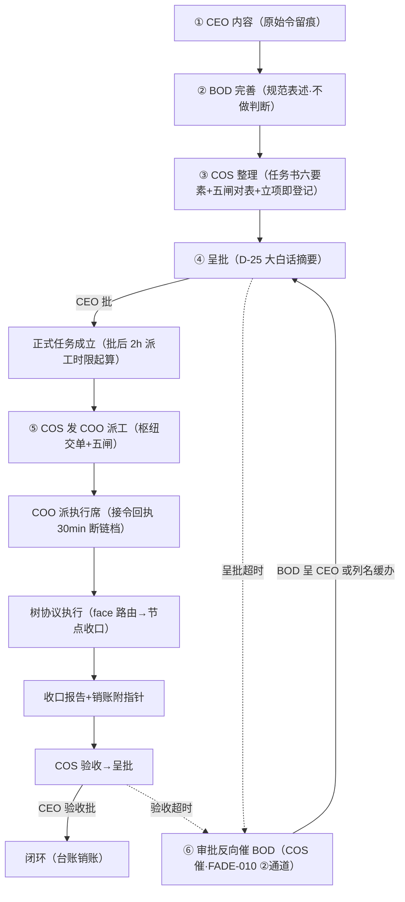

# 铸单主流程图制度件（CAO 主笔草案·候 COS 执行面会签→BOD 呈 CEO）

- sourceOfTruth: 本件（制度件**草案卷**——候 COS 会签+CEO 批，批前不作正式制度援引；零正身改动，全环折算既有正身不新立法）
- syncMode: draft
- lastSyncedAt: 2026-09-30T02:3x+0800（hook 现查 02:33）
- 令源: CEO 23:47 点名流程（BOD 23:55 三批③转达：「铸单主流程图制度件——CEO 23:47 点名流程『CEO 内容→BOD 完善→COS 整理→回 CEO 批成正式任务→COS 发 COO 派工并监督催办→审批反向催 BOD』——你主笔折算三方制度（分权制+树协议六节点+FADE-010）成主流程图制度件，COS 执行面会签，成卷回 BOD 呈 CEO」）；BOD 02:21 恢复令②续做
- 并轨注: 本件与 FADE-010 提窗并轨（BOD 23:55 令原文）——「反向催 BOD」环节激活即 FADE-010 ②（见 §四）

## 一、折算域（三方正身实读锚）

| 正身 | 本件折取 |
| --- | --- |
| 分权制（TriMetaverse CLAUDE.md 宪章节，2026-08-28 CEO 立） | 董事会=接收指令/投递执行/转呈交付；「其余一切任务性工作默认投递常驻中枢执行」；无小任务豁免口诀（产出物的生成过程董事长助理需不需要知道？需要=投递） |
| 树协议六节点+派工枢纽（纪律册 D-27 v2/v4/v6/v7/v9 + 动态任务树协议 V0.7 §8） | 任务书→挂平面→face 路由拾取→树执行→收口报告→销账附指针；枢纽=COS 交单 COO→COO 派执行席→COS 监督 COO；五闸；双层催办（COS 唯一催办枢纽+m-duty-cos 节律面）；BOD 不催办 |
| FADE-010（CTO 卷 §七/§八 在档，575436cd；工程三件=letter-store action 三增+候批信模板+seats.json 补 coo，FSD 窗 10-01 0:00-9:00 主选） | 反向催 BOD 环节的**机器通道承载**——制度件只定「何时催/谁催/催什么」，不发机器实现 |

## 二、主流程六环节（CEO 点名流程 × 正身折算）

| 环节 | 动作 | 正身折算锚 | 产出 | 时限锚 |
| --- | --- | --- | --- | --- |
| ① CEO 内容 | 指令输入（目标/意图/边界） | 分权制：董事会接收指令 | 原始令（原话留痕禁扩写） | —— |
| ② BOD 完善 | 规范表述+完善+查缺 | Board 定位：规范表述、完善、流转经 COS 链；不做判断、不追真源 | 规范化令文（含模糊点标注） | 即时档（D-34 2h 上限） |
| ③ COS 整理 | 中枢整理成任务书形态 | 分权制：一切任务投中枢；树协议：任务书六要素（D-27 条 1）；五闸前置对表（v9） | 任务书草案+挂账登记（立项即登记 v8） | 即时档 |
| ④ 回 CEO 批 | 呈批→CEO 批→**正式任务成立** | D-25 呈批大白话摘要；批准=任务成立时点（D-27 v6 批后 2h 派工时限起算点） | 批准记录+正式任务 | human 段（无机器时限——超时走 §四 反向催） |
| ⑤ COS 发 COO 派工并监督催办 | 交单→派工→监督→催办 | D-27 v4 枢纽（COS 交单 COO→COO 派执行席→COS 监督 COO）+双层催办+v7 接令回执 30min 断链档 | 派工回执+树路径+node-status 流转 | 批后 2h 派工（v6）；执行席 D-34 时限 |
| ⑥ 审批反向催 BOD | 呈批/验收面待办超时→COS 催 BOD | D-27 v4 条 3 既有「COS 催 BOD（呈批/验收面待办）」**显名制度化**；机器通道=FADE-010 ② | 催办留痕（台账）+BOD 处置（呈 CEO 或列名缓办） | 见 §四 触发条件 |

## 三、主流程图（一图收口）

读图注：实线=主链（铸单正向）；虚线=反向催腿（⑥）；⑥是**回环腿不是旁路**——催后必回主链环节（④呈批或 J 验收），BOD 两条出口=呈 CEO 或列名缓办（缓办须列名入台账候重启，D-27 v6 同款）。

## 四、反向催 BOD 环节专款（⑥ 定值）

1. **触发条件**：呈批件/验收件在 BOD 面（含呈 CEO 途中）超 **D-34 常规档（24h 软阈值）**未回——超时事实以台账时点为准，不推算；
2. **催办方与形态**：COS（唯一催办枢纽正身不变，D-27 v4 条 3）——催办三要素齐（超时事实+兜底绝对时限+超限后果，D-27 v3）；**BOD 不反向催 CEO**（BOD 收催后出口=呈 CEO 或列名缓办，无第三出口）；
3. **机器通道激活位=FADE-010 ②**：候批信模板+letter-store action 自动触发形态（工程三件随 FADE-010 一期，FSD 窗 10-01 0:00-9:00 主选）——通道上线前，⑥ 以人工催办形态先行生效（制度先行，机器后补，不互阻）；
4. **留痕**：催办事件入台账（机械留痕形态照 D-01 v2）；BOD 处置结果回填台账闭环；
5. **与「BOD 不催办」的关系**：不冲突——v4 禁的是 BOD 向下催办执行面；⑥是**向上催**（COS 催 BOD 的呈批面待办），方向相反主语不同。

## 五、与现役制度的关系（不新立法声明）

1. 本件=**主流程视图统一挂接面**：六环节全部折算既有正身（§一/§二 锚列），零新增授权、零枢纽变更、零时限新设——全部引用现值；
2. 分权制/Board 契约/D-27 枢纽/D-36 R 表各自继续有效：R 表管 BOD **发信路由**（送什么给谁），本件管**铸单全链**（一件任务从令到账的流转序）——两件正交不重叠；
3. 值守班次节（秘书处 §9）与本件咬合：值守催办断面在 ⑤ 执行段补位（在办单超时限主动催），⑥ 属呈批面归 COS 正身——两催不混；
4. 落点建议（候批）：批后正身落 `TriCompany/docs/workflow/cast-order-mainflow.md`（正名候 CEO 批定），本树卷转历史锚；秘书处制度增一行指针（不复制条文防双写）。

## 六、边界与不触项

1. human 段不加机器时限：④ CEO 批/验收为 human 决策段，机器只催不代（「BOD 提醒 CEO 段仍 human」同源纪律）；
2. 零个人面内容（催办留痕=绩效效率源账面既有挂接，D-27 v3 条 6，本件不新增绩效语义）；
3. 观察非处罚口径全程适用；
4. FADE-010 工程实现细节（letter-store schema/信模板文案）归 CTO/FSD 面，本件不写实现。

## 七、使用依据

- CEO 23:47 点名流程（BOD 23:55 三批③转达原文）+02:21 恢复令②；分权制宪章节实读
- 纪律册实读：D-27（v2 发生即同步/v3 催办时点质量/v4 枢纽重划+双层催办+BOD 不催办/v6 批后 2h/五闸/v7 接令回执）、D-25（呈批大白话）、D-34（任务时限四要素）、D-36（R 表——正交声明 §五.2）
- 动态任务树协议 V0.7 §8（六节点收口+催办，TC bc7a4ed）；CTO 卷 §七/§八（FADE-010 三件+窗位，575436cd）
- 秘书处 §9 值守班次节（cfbd799——咬合声明 §五.3）；09-25 停工不停应急先例（应急令承接面惯例）
