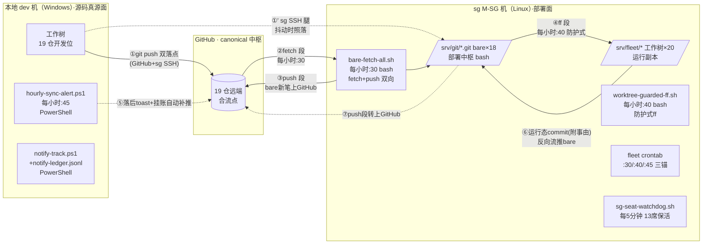

# 三端代码同步环线·架构与实现（2026-09-21 立卷）

- sourceOfTruth: 本件（三端同步环线的架构图/实现文件/通信机制总览；§12 部署面与源码面的区分管理的配套图示）
- syncMode: source
- lastSyncedAt: 2026-09-21
- 上位: github-repo-governance.md §12（治理规则正身）；本件=机制实现层总览

## 一、环线架构图

## 二、实现文件清单（含语言）

### 本地 dev 机（Windows · PowerShell 5.1 兼容/UTF-8 BOM）

| 文件 | 语言 | 职责 | 触发 |
| --- | --- | --- | --- |
| `.fade/hourly-sync-alert.ps1` | PowerShell | fetch 双源+behind/ahead 计数+**挂账自动补推**（AHEAD>0 即 push）+落后 toast+notify sync 接入 | schtasks `Sync-Alert` 每小时 :45 |
| `.fade/notify-track.ps1` | PowerShell | notify 处理状态追踪（add/done/list/sync 四命令；sync 读 TriMLC 信箱自动登记） | 手动+hourly-sync-alert 联动 |
| `.fade/notify-ledger.jsonl` | 数据（JSONL） | notify 台账（id/ts/source/message_id/status） | notify-track 读写 |
| `.fade/seat-watchdog.ps1` + `.vbs` | PowerShell+VBS 包装 | 13 席看门狗（缺席拉起；**VBS 无窗包装防闪屏**，指向正位勿指归档件=D-29 同族） | schtasks `Seat-Watchdog` 每 5 分钟 |
| `.claude/seats.json` | JSON | 本地名址录（opsName/agent/manual/launchEnvPolicy） | 渲染管线派生 |
| 双落点配置 | git config | 每仓 `remote.origin.pushurl`×2（GitHub+sg SSH）+`url`×2（fetch 双源） | 一次性配置（09-20/21） |

### sg M-SG 机（Linux · bash+node）

| 文件 | 语言 | 职责 | 触发 |
| --- | --- | --- | --- |
| `/home/fleet/bare-fetch-all.sh` | bash | **18 bare↔GitHub 双向**（fetch 段拉 GitHub 新笔+push 段把 bare 新笔上 GitHub——合流点机制核心） | fleet crontab 每小时 :30 |
| `/home/fleet/worktree-guarded-ff.sh` | bash | 20 工作树防护式 ff（干净树才 ff，脏树/merge 中跳过留人工） | fleet crontab 每小时 :40 |
| `/srv/fleet/TriMetaverse/.fade/seats-sg.json` | JSON | sg 名址录（name/agent/manual） | launcher/watchdog 读取 |
| `/home/fleet/sg-seat-watchdog.sh` | bash | sg 13 席看门狗（缺席拉起） | fleet crontab 每 5 分钟 |
| PAT 凭据 | — | fleet store（fine-grained **全仓 RW**，2026-12-19 到期轮换；CEO 09-21 扩全仓+三仓补权实证） | bare push 段/工作树 push 使用 |

### 凭据与安全

| 端 | 凭据 | 位置 |
| --- | --- | --- |
| 本机→GitHub | https 凭据 | Windows 凭据管理器 |
| 本机→sg bare | SSH key（id_ed25519→fleet authorized_keys） | `~/.ssh/` |
| sg→GitHub | PAT（fine-grained 全仓 RW） | fleet store（`~/.git-credentials`） |
| sg→本地 | （无——本地经 GitHub/bare 间接） | — |

## 三、通信机制与流程

### 正向流（本地开发 → 全网部署）

1. 本地 `git push origin dev`——**一次推双落点**（GitHub canonical+sg bare SSH 内网快链；GitHub 腿失败时 sg 腿照落——抖动解耦）；
2. sg bare 每小时 :30 `fetch GitHub`（拉 canonical 新笔）+`push bare→GitHub`（把 bare 收到的其他端笔——河源/工作树反向流——转上 GitHub）；
3. sg 工作树每小时 :40 防护式 ff（干净树才动，脏树跳过留人工）。

### 反向流（部署面产物 → 源码侧）

4. sg 工作树运行态 commit（watcher 巡检件等，**须附一行事由**）→push bare；
5. bare push 段每小时把新笔转上 GitHub；
6. 本地 Sync-Alert 每小时 :45 fetch 发现 behind→toast 催人 pull（pull 方向保持人工——本地活跃工作树防编辑丢失）。

### 合流点规则

- **GitHub=canonical 合流点**：所有端推 GitHub，GitHub 恒为全集；
- **bare=次级合流点**：双向段使 bare 收敛于 GitHub∪各端；
- 真分叉（多端同时新笔）：人肉 rebase/merge（实证一次：W39 迁移线 vs 本地收口线，零冲突合流 32974052）。

### 告警与人工介入面

- 本地落后：toast（每小时提醒直至人工 pull）；
- 本地挂账：**每小时自动补推**（零风险方向全自动）+结果 toast；
- notify 处理：sync 自动登记 pending→持续可见→人工处理 done。

## 四、已知边界与坑（实证录）

1. 本地 PowerShell 脚本须 UTF-8 BOM（PS5.1 无 BOM 按 ANSI 读=中文毁）；
2. PS 5.1 不支持 `??` 语法（用 Measure-Object 老写法）；
3. sg `sudo -u fleet` 不重置 HOME——fleet git 操作一律 `su - fleet -c`；
4. fine-grained token 权限生成时定死（改权限=重新生成）；认证失败自动清 store 行（store 空文件=曾被拒）；
5. tmux 长文本传输脆弱（Enter 吞噬/引号嵌套）——跨机工单走**内容 scp+短指针**（bod-to-sg-dispatch.ps1 固化）；
6. Windows 计划任务跑 PS 禁直启（闪黑屏）——VBS 包装（D-29）；
7. 运行链脚本必须指正位（.fade/），归档副本（operating-records/ops-*）禁入运行链（Seat-Watchdog VBS 事故 09-21）。
