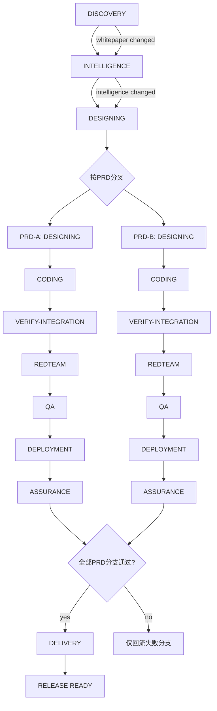

# TMV Workflow-Driven SDD v1.0

## 文档同步元信息

- sourceOfTruth: TriMetaverse/docs/workflow/wsdd-v1.md
- publishedFrom: 当前文件（central summary）
- syncMode: central-summary
- publishTier: central-summary
- lastSyncedAt: 2026-06-04

目标：提供一套可执行的“规格驱动 + 工作流门禁”方法，用于 `TriMC` 统一运行面协调“主线 + PRD 分叉”交付。

## 1) 最小术语定义

- WSDD：Workflow-Driven Specification Development，指“先规格、后执行、以门禁控制阶段流转”。
- 研发工作流：`TriMC` 统一运行面中的研发执行切片，负责阶段状态机、门禁判定、回流控制；当前由 `copilot chat` 试运行，正式切换通过 `TriHost` 配置完成。
- Phase Agent：阶段执行 Agent，负责当前阶段主任务。
- Subagent：阶段内并行子执行体，不得跨阶段推进。
- PhaseResult：阶段标准结果对象（产物、分数、错误、摘要）。
- Quality Gate：质量门禁，决定 pass/block/skip。
- 回流（Rollback Flow）：阶段失败后按规则返回上游阶段修复。
- PRD 分支（PRDBranch）：按每个 PRD 创建的独立执行链路，仅由 INTELLIGENCE 判定触发。

## 2) 一张流程图（主线 + PRD 分叉）

## 3) 一页执行清单（Run Checklist）

### 3.1 运行前

- 已确认白皮书、PRD、架构、计划文档顺序正确。
- 已准备 workflow 配置与门禁阈值。
- 已定义本轮 run-id 与产物目录。

### 3.2 阶段执行

- 每阶段必须输出 PhaseResult。
- 每个 PRD 分支阶段也必须输出 PhaseResult（携带 `branchId`/`prdId`）。
- DISCOVERY/INTELLIGENCE 的 PhaseResult 必须记录 `prdDelta`。
- 每阶段必须校验必需产物是否存在。
- CODING/VERIFY-INTEGRATION/REDTEAM/QA/ASSURANCE 必须执行门禁判定。
- 触发阻断后禁止进入下一阶段。

### 3.3 回流策略

- CODING 阻断：仅回流该 PRD 分支的 DESIGNING。
- VERIFY-INTEGRATION 阻断：仅回流该 PRD 分支的 CODING。
- REDTEAM 阻断：仅回流该 PRD 分支的 CODING 或 VERIFY-INTEGRATION。
- QA 阻断：仅回流该 PRD 分支的 CODING / VERIFY-INTEGRATION / REDTEAM。
- DEPLOYMENT 阻断：仅回流该 PRD 分支的 CODING 或 QA。
- ASSURANCE 阻断：仅回流该 PRD 分支的 QA / DEPLOYMENT。
- DELIVERY 阻断：定位失败分支并回流，其他通过分支保持不变。

### 3.4 发布前

- delivery-manifest、delivery-report、release.zip 齐全。
- 专项测试（漏洞/压力/安全）全部通过。
- 形成 workflow-summary 与可追溯证据。

### 3.5 渐进式 PRD 规则（简化）

- DISCOVERY 更新白皮书时，仅向下刷新 INTELLIGENCE 内容，不决定是否产出 PRD。
- INTELLIGENCE 根据需求变化决定是否新增 PRD；新增后立即创建新分支并从 DESIGNING 启动。

## 4) 与现有资产映射

- 流程规范：workflow-engine-spec.md
- 流程配置：workflow-engine-config.example.yaml
- 阶段结果 schema：phase-result.schema.json
- 门禁 schema：quality-gates.schema.json
- 操作手册：workflow-runbook.md

本文件定位：方法论总览（给人看）。
其余文件定位：执行规范（给研发工作流和自动化流程用）。
