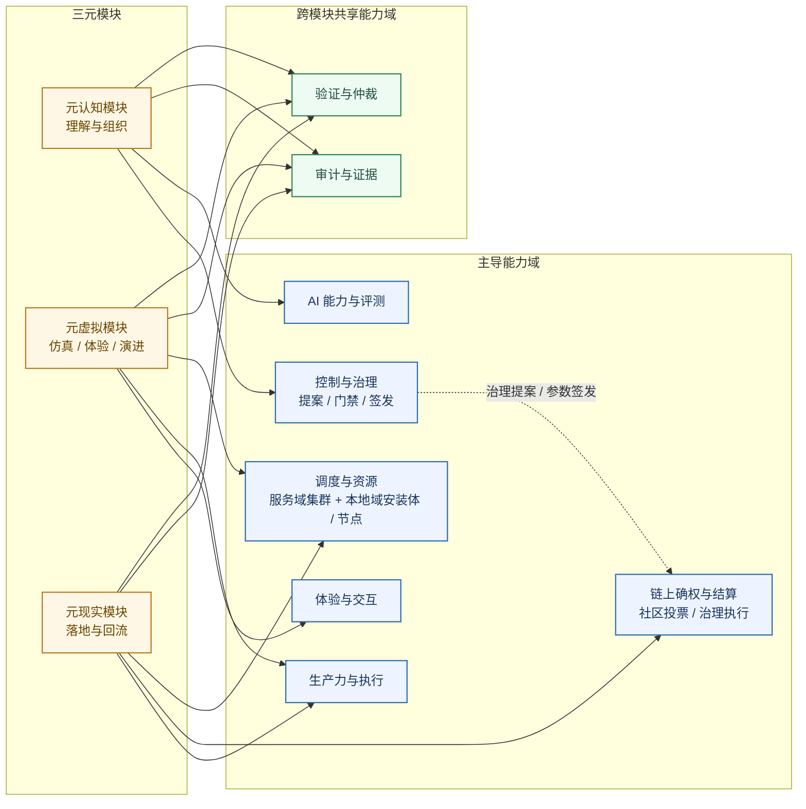
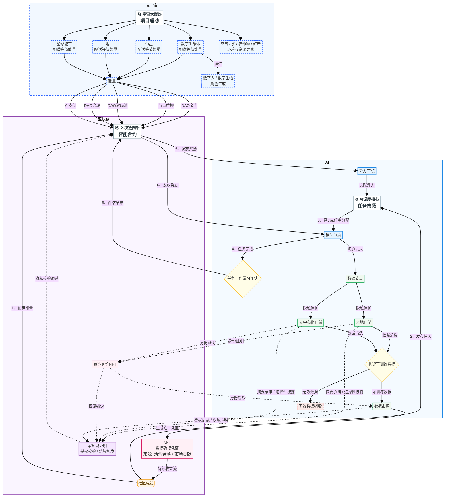
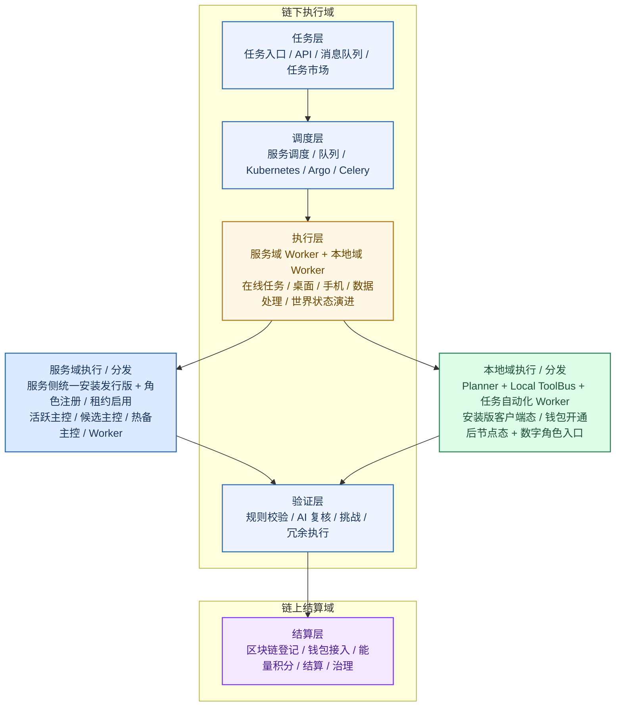
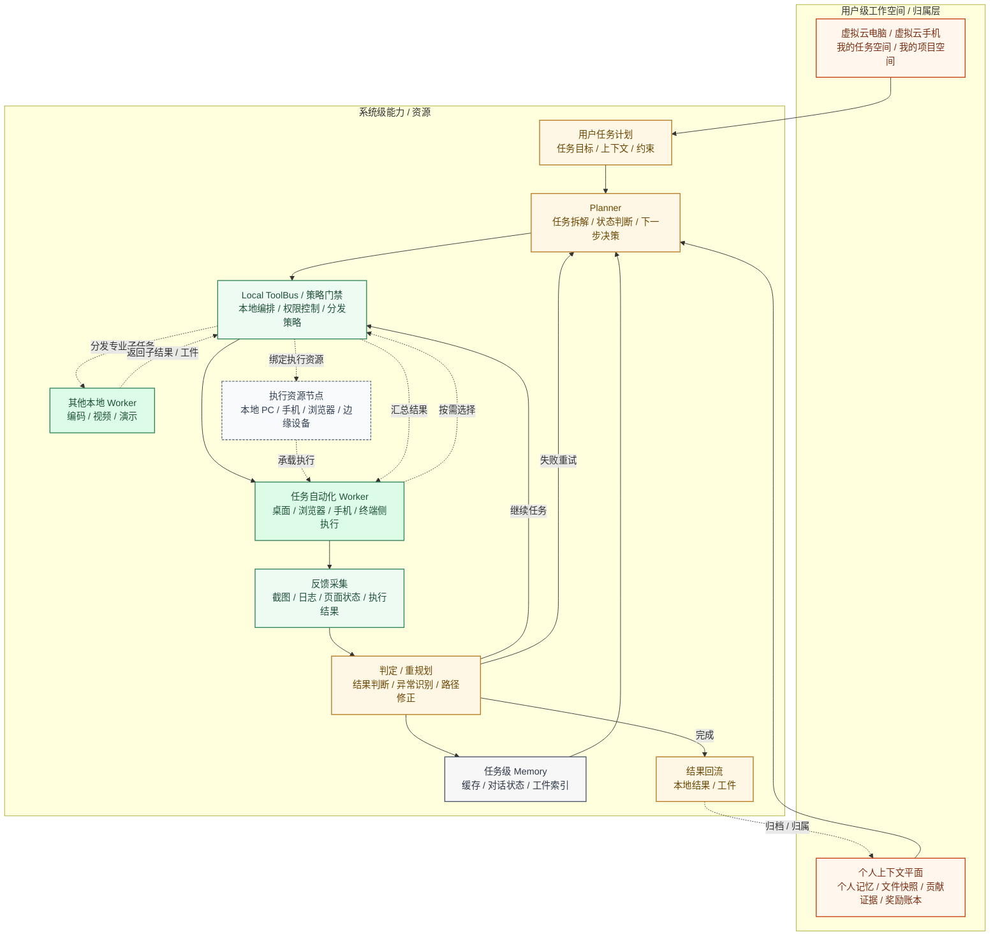
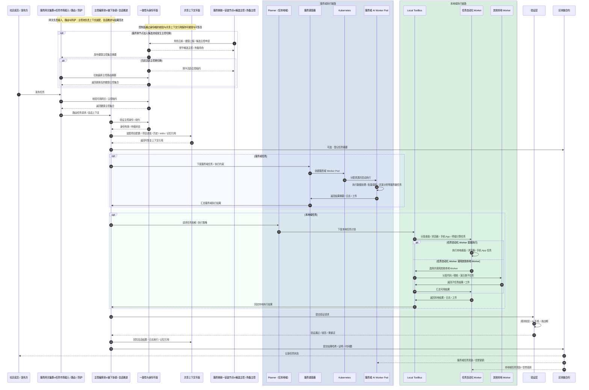

# 三元宇宙白皮书（TriMetaverse Whitepaper）

版本：v1.0（修订 1+1a，CEO 2026-08-22 签发）  
日期：2026-08-22  
状态：**已签发**（CEO 2026-08-22；基于基线源重构完善版 + TMV-P1-1 波 1 修订）

修订说明：修订 1（2026-08-22，TMV-P1-1 波 1）——三层模型升级为双层表述（最小实现实例对+能力域原义：§3.1、§3.3 模块块首、附录 B 术语表、FAQ E.1）；模块名换轨：TriMC→TriMMC、TriLC→TriRLC（2026-08 更名，新增 TriMLC、TriRMC，兼容面沿用旧名过渡）；§3.3.1 标题改为“三元模块商业映射”并加系统对注；§1.3 创新点 2 增交叉引用；§8.1 模块名同步留待波 2。修订 1a（2026-08-22，签发收口）——附录 B 补 FADE 词条（CEO 批准）。修订 1b（2026-08-22，TMV-P1-9 波 2）——§8.1 L1 行模块名同步（TriRLC/TriMMC/TriMLC/TriRMC 入 L1 窗口）+ CTO-008 段按三层重定义改写（跨层协同语义由两条层内 bridge 取代，历史交付按新命名映射）。**状态：已签发（CEO 2026-08-22 签发，基于修订 1+1a；修订 1b 为签发后登记性同步，随下次复核确认）**。

---

## 0. 目录导航

- [1. 摘要](#1-摘要)
- [2. 引言与项目总览](#2-引言与项目总览)
- [3. 技术架构与核心模块](#3-技术架构与核心模块)
- [4. 融合技术特性与创新](#4-融合技术特性与创新)
- [5. 通证经济模型](#5-通证经济模型)
- [6. 治理与生态建设](#6-治理与生态建设)
- [7. 应用场景与生态用例](#7-应用场景与生态用例)
- [8. 发展路线图](#8-发展路线图)
- [9. 团队与合作伙伴](#9-团队与合作伙伴)
- [10. 风险与合规](#10-风险与合规)
- [11. 总结与展望](#11-总结与展望)
- [附录A：项目隔离说明](#附录a项目隔离说明)
- [附录B：术语表](#附录b术语表)
- [附录C：技术文档与-api-参考索引](#附录c技术文档与-api-参考索引)
- [附录C.1：项目文档索引](#c1-项目文档索引)
- [附录C.2：API 与接口参考入口（最小清单）](#c2-api-与接口参考入口最小清单)
- [附录C.3：最小对象模型摘要](#c3-最小对象模型摘要)
- [附录C.4：责任边界说明（与第 3.5 章一致）](#c4-责任边界说明与第-35-章一致)
- [附录D：参考文献与灵感来源](#附录d参考文献与灵感来源)
- [附录E：常见问题解答（FAQ）](#附录e常见问题解答faq)

---

## 1. 摘要

### 1.1 项目愿景

我们致力于以 AI、混合现实、区块链为核心技术基石，建立一个现实世界的《派客帝国》，称为三元宇宙，即TriMetaverse（TMV），三元宇宙的三元指的是元现实、元认知、元虚拟。

### 1.2 核心价值主张

三元宇宙应该是一个在AI崛起的时代，人类与AI和谐共存、互利互惠，按贡献分配的混合现实社会。以分布式算力与开源，对抗算力与模型能力向少数平台集中所带来的垄断、定价与分配权固化等风险。

### 1.3 关键创新与市场定位

- 关键创新：
    1. 以区块链机制整合闲置算力，构建高可用分布式算力底座。
    2. 构建“元认知—元虚拟—元现实”三元联动系统，打通虚拟试验、现实生产力提升与认知迭代的增长螺旋（最小实现见 §3.1）。
    3. 以 AI Worker 架构组织“服务域调度链路 + 本地域任务计划链路”的自动化生产闭环，让在线任务与本地任务在统一审计与验证下协同运行。
    4. 以“服务域镜像发行版 + 本地域安装发行版”构建双域分发体系：
    前者是面向服务器 AI Worker 与集群调度的独立代码发行版，统一内置主控、网关、服务侧执行与钱包接入相关代码，但通过一致性平面授予的角色与租约决定节点实际启用为活跃主控、候选主控、网关节点还是 Worker 节点；
    后者是面向 Windows、macOS、iPhone、Android 等终端本地 AI Worker 的另一套独立代码发行版，内置本地执行与钱包接入能力。本地域安装体在不开通钱包时仅作为任务入口与本地工具入口使用，开通钱包并完成节点登记后才升级为可加入网络的本地域节点版本，形成持续扩展的分布式设备网络。
    5. 以设备内置钱包或钱包访问能力打通身份、授权、记账与结算，并结合 NFT 身份凭证、数据确权机制与零知识证明，令完成钱包开通并加入网络的设备节点能够在隐私可控前提下承接任务、完成数据授权与收益分配，持续积累“能量积分”与后续回流权益，形成面向大众可参与的贡献网络。
    6. 以内容 IP 化叙事启动社区增长，把《派客帝国》与《三元宇宙故事》专栏打造为持续公开的内容入口，并把其背后的产品研发、人才培养与协作过程同步沉淀为可追踪的内容工程。
    7. 以 DAO 组织社区协作，按贡献度进行收益分配，按投票权重治理社区，形成正向循环的生态体系。
    8. 以三元模型组织产品与技术，形成“参与 -> 贡献 -> 评测 -> 激励”的可验证闭环。

- 市场定位：
TriMetaverse 定位于“AI 生产力工具 + 混合现实价值流转系统 + 分布式AI Worker与人类协作贡献机制”的交叉市场，面向对 AI 生产力提升有强烈需求的个人与组织，尤其是内容创作者、产品开发团队、工作室、人才培养与评定机构与社区协作组织。平台提供可定制的智能体孵化工具、开放的算力资源池、可控执行环境，以及基于钱包、NFT 身份、数据确权与隐私保护协作机制构建的共赢收益分配体系，吸引多样化的生态伙伴，共同构建一个去中心化、可持续发展的 AI 生产力生态系统。

### 1.4 部署形态与双域分发

在部署形态上，TriMetaverse 不是只提供单一云服务，而是同时提供服务域标准化镜像发行版与本地域多端安装发行版，两者代码不同功能也不同，在整个系统承接不同的任务。

服务域发行版面向服务器、集群与社区自托管节点，统一携带主控、网关、服务侧 AI Worker、调度接入与钱包能力，用于稳定承接在线任务与服务域节点运行；但节点是否实际承担活跃主控职责，不由安装本身决定，而由一致性与身份平面基于租约、健康状态与角色授予结果决定。除最小活跃主控集合外，其他服务侧节点可保留为候选主控或热备主控，以在故障时提升接管能力，而不是默认全部同时进入活跃主控池。

本地域发行版面向 Windows、macOS、iPhone、Android 等终端设备，携带本地 AI Worker、工具接入与钱包能力，用于承接个人入口、本地执行与边缘节点升级。本地域安装体存在两种状态：未开通钱包时，它只是社区成员访问平台、发布任务、查看结果与调用本地工具的客户端入口；开通钱包并完成授权后，它才升级为具备节点身份的本地域设备节点，可在继续发布任务之外参与贡献记账、结果提交与收益结算。在涉及数据协作与收益分配时，系统可进一步结合 NFT 身份凭证与零知识证明，在不暴露原始敏感数据的前提下完成授权校验、权属确认与结算触发。因此，从系统视角看，并不是每一次本地域安装都会直接新增分布式节点，只有完成钱包开通并通过节点登记的本地域安装体，才会进入可调度、可审计、可激励的网络。

### 1.5 社区成员入口形态

在社区成员入口层，TriMetaverse 采用“TriAvatar Web 入口 + TriPilot 本地域 PC 端 Webview + 移动端/小程序入口”的三端协同形态：

TriAvatar 当前作为面向大众的 Web/APP 主入口，承担类似网页版 ChatGPT 的日常对话、任务入口与能力展示；但它未来不会停留在普通 Web/App 界面产品，而会逐步演进为数字人/数字生物入口。这些数字角色并非孤立设定，而是由元虚拟世界中的数字生命体持续演进而来，并进一步作为 `Trigame` 角色原型与现实入口形态之间的连接桥梁。

TriPilot 的本地域 Webview 承接更强的本地执行、工具调用与任务反馈。

移动端小程序则承接轻交互、提醒、签到、测评与碎片化任务参与。系统可结合社区成员平时对话、任务表现与定时测评结果，持续更新技能徽章与社区成员能力图谱，并把这些评定进一步衔接到后续游戏式任务的解锁、难度升级与徽章等级成长之中。

---

## 2. 引言与项目总览

### 2.1 项目背景

伴随AI、脑机接口、机器人与混合现实技术、区块链的快速发展，人类个体的力量变得越来越渺小，而大模型与算力资源的集中又加剧了这一趋势。我们面临着一个“算力与模型能力高度集中、创新与生产力提升机会被少数平台垄断、个体与组织难以获得公平定价与分配权”的时代。三元宇宙（TriMetaverse）旨在通过技术创新与生态构建，打破这一垄断格局，建立一个开放、去中心化、按贡献分配的混合现实社会，让每个人都能在这个时代中找到自己的位置，并通过与 AI 的协作实现认知与生产力的飞跃。

### 2.2 使命

三元宇宙（TriMetaverse）以建设《派客帝国》为终极目标，面向“知识生产效率低、现实试错成本高、结果难沉淀、自动化能力难规模复制”的痛点，提出以元虚拟承载低成本并行试验、以元现实承载可控落地、以元认知承载持续学习与决策优化。

随着技术的发展，越来越多的人认为，现实世界也是被制造出来的，于是开始寻找制造这个世界的世界。同时，我们也开始制造另一个虚拟世界。这三个世界，三个宇宙，我们也称为三元宇宙。当《派客帝国》实现之时，就是我们为人类揭开三元宇宙真正面纱的时刻。

项目以《派客帝国》与《三元宇宙故事》专栏作为公开叙事主线，通过短视频、直播、社区协作、情节重建与开发演示等形式，将场景搭建、工具链开发、自动化流程、虚拟空间、人才培养与真实业务落地组织为持续公开的内容工程。平台通过持续更新专栏及其对应的开发过程，吸引更多志同道合的同仁加入，并将围观者逐步转化为参与者；其中既包括面向平台日常学习、测评与任务推进的社区成员，也包括围绕内容、节点、算力、模型、运营与商业协作进入体系的生态伙伴，最终以可审计、可演进、可协作的数字系统，把个体与组织的认知生产过程转化为可复用资产，并持续反哺现实创新。

### 2.3 愿景与核心价值观

- 愿景：成为连接认知进化、虚拟实验与现实创新的长期基础设施。
- 核心价值观：开放协作、证据优先、可审计、渐进式演进、长期主义。

### 2.4 技术融合蓝图

TriMetaverse 以 AI、区块链、物联网、机器人与元宇宙相关技术的融合为主线：AI 负责理解、规划与生成、算力调度、隔离与弹性扩展，区块链负责任务登记、结果承诺、激励结算与治理，物联网负责混合现实连接，机器人负责现实世界的生产力落地，元宇宙相关能力负责仿真与体验，多种技术共同服务于 TriMetaverse 的现实落地。整体原则是“链下执行、链上结算、证据可追溯、治理可复核”。

这里还需要进一步区分“热路径控制”和“冷路径存证”两类职责：节点资格、治理授权、关键成员变更摘要、激励与惩罚结算等慢变量适合上链；而活跃节点集合维护、健康检查、租约续约、摘流与网关路由摘要刷新等快变量，仍应由链下的一致性与身份平面承担。区块链更适合作为控制面的最终可复核账本，而不是直接替代秒级实时调度器。

从系统分发角度看，平台采用“双域多端发布”原则：服务域输出面向服务器 AI Worker 的标准化 k8s 镜像发行版，便于社区、组织或节点运营者在服务器与集群中部署；本地域输出面向终端本地 AI Worker 的 Windows、macOS、iPhone、Android 等多端安装发行版，便于社区成员先以客户端形态使用平台服务，再按需通过钱包开通把设备升级为可参与任务网络的边缘节点。两者共享统一的身份、记账与治理协议，但并非同一套代码制品。只有完成钱包绑定并接受授权约束的节点，才以统一身份与价值接口承接任务、提交结果并积累能量积分；当任务涉及数据协作、数据使用权授予或持续收益分配时，再结合 NFT 身份凭证、数据确权记录与零知识证明完成权属校验、隐私保护与结算联动。

---

## 3. 技术架构与核心模块

### 3.1 三层模型

- 元认知层：最小实现是项目代码仓本身——三层中唯一没有运行时的层，也是三层共同的承重底座：元虚拟的员工定义与实验成果以代码和文档落仓，元现实以 worktree 方式消费仓中事实，并把生产中的需求与缺陷回写为新的实验输入；仓的版本历史就是“我们如何解释与预测”的结构化沉淀，双向螺旋的每一跳都以仓为唯一中转，所有跨层流动都在这里留下可审计的 git 痕迹。能力域上，它承载知识生产、任务编排、评测与反馈。
- 元虚拟层：最小实现是 TriMMC（元虚拟主控，原 TriMC，2026-08 更名）+ TriMLC（元虚拟本地控制器），两者经 bridge 通信构成一个宿主可整体替换的成熟虚拟研发环境：当前宿主为 claude code，未来可整体切换为 codex 或其他成熟 agent 宿主而不改变系统定义。元虚拟不自建会话管理与执行内核——会话、loop 与上下文直接使用宿主原生能力；元虚拟只负责两件事：把员工定义（合同/五件套）经 FADE 发布线灌入宿主，以及把实验成果落盘到元认知仓。它回答“在不伤害现实的前提下怎么试”。能力域上，它承载游戏化虚拟世界、仿真沙盒、策略演练与平行试验。
- 元现实层：最小实现是 TriRMC（元现实主控）+ TriRLC（元现实本地控制器，原 TriLC，2026-08 更名），两者共用自研内核 agent-core：会话、调度、权限、cron、进程监督与审计由自研代码掌控，不依赖任何单一宿主。元现实承接所有必须自持的生产面——稳定执行、无人值守、权限审计与跨节点协同；它回答“世界现在是怎样运转的”。能力域上，它承载真实部署、规则执行、业务变现与回流校准。

三层关系是“螺旋迭代链”：元现实（规则与数据约束） -> 元认知（建模与假设） -> 元虚拟（沙盒仿真与并行试验） -> 回灌元现实（落地与规则升级）

进一步展开而言：元现实提供真实约束、真实机会与真实问题；元认知把这些问题建模为任务、规则、流程与评价标准；元虚拟把这些任务与规则装入一个可运行的虚拟世界，在可控沙盒中反复演练、协作与试错；最终再把经过验证的方法投回现实执行，并以新的数据与结果持续更新模型。

白皮书中的所有产品都应服务这一条“螺旋迭代”主线，而不是偏离它。

三层的最小实现已经是可运行的系统，并将沿各模块的切入点产品梯度演进到游戏化虚拟世界与分布式贡献网络；它同时是图 3-2 端到端价值闭环的最小子集种子——AI 调度段现役（服务域集群+本地域安装体），AI 评估段即 FADE 评分（Score CLI/Skill），区块链段（智能合约结算/通证激励）属生产系统期。

### 3.2 平台能力域拆分

本白皮书在架构层采用“能力域/责任边界”的拆分方式，以匹配 TriMetaverse 的端到端闭环：

- 控制与治理能力域：任务编排、策略门禁、版本签发、审批与争议处理。
- 审计与证据能力域：事件编目、证据归档、可复现记录、质量门禁与审计报告。
- AI 能力与评测能力域：模型路由、推理调用、评测基准、回归/对比评测与反馈。
- 调度与资源能力域：统一承接服务域与本地域节点的任务队列、调度编排、资源画像、在线状态、钱包绑定后的节点登记、Kubernetes 集群调度、终端设备能力探测、边缘任务分发、弹性扩缩容、隔离执行与资源配额；对于本地域，还负责依据健康状态与设备画像维护 active 执行节点集合与备用节点集合，在可用本地域节点达到三台及以上时，至少维持三台真实可工作的本地域实体设备处于 active 状态。
- 生产力与执行能力域：可控沙盒执行、工程化工具链、终端与服务侧任务承接、机器人同事与具身终端的生产力接入、模拟实验与复现、资产生产与发布。
- 体验与交互能力域：Web/App 社区与工具入口、元虚拟空间（如虚拟引擎）中的学习、创造、协作与游戏化世界体验。
- 验证与仲裁能力域：结果校验、冗余执行、挑战期、争议处理、社区复核、DAO 提案争议仲裁、信誉与惩罚机制。
- 链上确权与结算能力域：凭证与确权、贡献记账、金库与分账、社区投票、治理执行与价值回流。

### 3.3 核心模块

TriMetaverse 的“三元模块”用于表达系统的核心作用分工。具体产品形态会随阶段演进而变化，但应始终可映射回模块职责与能力域。为了让外部读者以及潜在社区成员、生态伙伴更容易理解，平台早期会以《派客帝国》与《三元宇宙故事》专栏作为内容叙事与社区启动器，但其本质并非仅限内容项目，而是借由一个高吸引力主题，把三元宇宙的基础设施、内容生产、人才培养与激励、自动化业务逐层搭建出来。

元认知模块（理解与组织）

- 模块描述
将元现实问题转写为“可执行任务 + 可验证规则 + 可对比评测”，把零散信息沉淀为可复用的认知资产与可审计闭环。
对应能力域：控制与治理、审计与证据、AI 能力与评测。
最小实现载体：项目代码仓本身（见 §3.1）。
- 典型产物形态
任务链与评分细则、评测基准与回归集、知识结构（图谱/索引）、贡献徽章、动态技能徽章与社区成员能力图谱、数据集与标注规范、提示词/策略与AI Worker生态蓝图。
- 切入点产品梯度（由小到大）
《派客帝国》与《三元宇宙故事》专栏（官方内容） -> 自媒体共创工作台（社区矩阵媒体） -> 搜索/推荐分发优化工具（流量增长） -> AI协作私域维护 -> 三元宇宙魔法商学院（人才培养、评测、创新、徽章体系、元现实问题转写） -> 组织级知识与评测中台（标准、报告、资产库）。

元虚拟模块（仿真与体验）

- 模块描述
把任务、规则与资产装入可控沙盒，并以游戏化虚拟世界的方式运行，承载沉浸式学习、创造与协作。
社区成员进入虚拟世界后，可以不同角色参与一个持续运转的世界，在其中进行角色扮演、任务推进与并行试验，以降低现实试错成本。
这个世界以数字生命体为核心演化主体，并与星球城市、土地、恒星等基础要素共同演进，逐步演进出数字人、数字生物，以及空气、水、农作物、矿产等更贴近真实世界的环境与资源要素；这种持续演进，正是虚拟世界不断逼近真实世界的核心动力。
数字生命体的演进链路由世界规则、任务链与协作反馈共同驱动。TriAvatar 中的数字人/数字生物，即来源于这条演化链：生命体原型通过学习、协作与完成任务，逐步演进为现实入口中的数字角色。
元虚拟世界中的生命体物种并非预先指定，而是由社区成员在注册并进入世界时，以公钥信息作为种子，经链上可复核算法随机映射到某一种“地球物种 DNA 谱系”，类似一次面向元宇宙世界的“投胎”。这一 DNA 谱系决定生命体在元虚拟世界中的基础物种、后续演化边界与默认体验视角。由此可见，学习与协作不会长期停留在“界面里完成任务”的层面，而会持续发生在构建、维护与推进这个虚拟世界的过程中。
对应能力域：体验与交互、生产力与执行、审计与证据；其中在元虚拟阶段，生产力与执行主要体现为模拟、实验、复现、角色协作与沙盒演练。
最小实现载体：TriMMC + TriMLC，经 bridge 通信构成宿主可整体替换的成熟虚拟研发环境（见 §3.1）。
- 典型产物形态
游戏化虚拟世界场景、数字生命体演化系统、数字人/数字生物角色系统、星球城市、土地、恒星等世界资产、空气/水/农作物/矿产等环境与资源要素、仿真/演练环境、AI Worker 沙盒、可复现实验与回放、协作空间、资产展示与交互脚本。
- 切入点产品梯度（由小到大）
工具化参与与学习入口（Web/App） -> 2d虚拟世界（模型维护、模型评测） -> 赛博仿真风格 3D 虚拟世界（含数字生命体演化、数字人/数字生物、星球城市/土地/恒星以及环境与资源要素） -> AI 角色（数字生物）/环境（风雨雷电等） -> 策略演练与 A/B 并行试验（含量化策略回测/仿真，可对比、可回放） -> 平行世界仿真与流程沙盒（可扩展到混合现实）。

元现实模块（落地与回流）

- 模块描述
将可验证的能力与产物投放到真实场景形成可量化收益，并把收益、数据与反馈回灌到平台与生态，驱动规则、模型与内容持续进化。
对应能力域：生产力与执行、链上确权与结算、审计与证据。
最小实现载体：TriRMC + TriRLC，共用自研内核 agent-core（见 §3.1）。
- 典型产物形态
发布与运营流水线、AI Worker 集群调度与终端自动化、可审计商业化入口、回流结算与金库治理、现实规则拆解与优化清单、机器人同事。
- 切入点产品梯度（由小到大）
内容运营与工具变现（网站/App/AI插件/短视频账号矩阵） -> 可审计收入入口（广告、分成、订阅） -> 自动化实战服务（产品开发、内容运营、店铺运营客服与维护、数据管道数据处理、策略执行与风控；物联网与机器人团队；合规与安全前置） -> 持续回流校准（基准更新、成本/收益闭环、治理迭代）。

#### 3.3.1 三元模块商业映射

三元模块概念层对应一组可部署工程模块，分四层推进：

| 层级 | 模块 | 阶段定位 | 商业角色 |
|------|------|----------|----------|
| **入口层** | TriGateway、TriAvatar、TriMobile、TriPilot + TriRLC + TriMLC + TriCode + vscodium（PC 端打包） | L1 最小独立系统 | 用户触达与交互 |
| **服务域** | TriMMC、TriStaciss、TriModel、TriRMC、TriSkill | L0 基础设施 → L1 | Agent runtime + 模型路由 + 技能 |
| **研发质量** | TriDev、TriTest、TriTraining、TriAuto | L3 研发商业 | 自动开发 + 测试 + 培训 + 自动部署/办公 |
| **身份商业** | TriCompany、TriMem、TriChain、TriWeb4、TriOPC | L2 组织身份 → L3 | 公司架构 + 用户系统 + 区块链 + OPC |

注：TriMMC+TriMLC 构成元虚拟系统对，TriRMC+TriRLC 构成元现实系统对，三层定义见 §3.1。TriMMC（原 TriMC）、TriRLC（原 TriLC）为 2026-08 更名，本次换轨限于叙事面，bin/npm/CI 等兼容面沿用旧名过渡。

### 3.4 能力域与核心模块映射简图

图 3-1：TriMetaverse 三元模块与能力域映射

[查看图 3-1 原图（SVG 静态版）](mermaid/tmv-wp-cap-map-3-1.svg)

这张图只突出“主导映射”和“跨模块共享能力域”：元认知更偏理解、规则与评测，元虚拟更偏游戏化世界体验、沙盒与实验，元现实更偏执行、调度、回流与结算。
其中元虚拟不是静态展示层，而是由数字生命体、星球城市、土地、恒星等要素共同构成的可运行世界，数字生命体会在其中持续演化，并逐步生成数字人/数字生物等更完整的角色形态。
这里把“调度与资源”直接标注为“服务域集群 + 本地域安装体 / 节点”，并同时从元虚拟、元现实两侧连入，是为了强调它既服务于 Kubernetes 等服务端编排，也服务于 PC、手机等终端安装体的接入、调度与节点化升级：未开通钱包时，这些终端首先作为系统服务入口存在；完成钱包开通与节点登记后，才进一步成为可参与贡献记账的执行节点。同时把“控制与治理”明确标成“提案 / 门禁 / 签发”，把“链上确权与结算”明确标成“社区投票 / 治理执行”，并用虚线表示治理提案与参数签发如何进入链上投票与执行流程。审计与验证作为跨模块共用能力贯穿全链路。

### 3.5 端到端系统框架

TriMetaverse端到端系统框架是以“AI+区块链”贡献评价体系为核心，为系统持续运转提供动力和保障。为保证“参与 -> 贡献 -> 评测 -> 激励”闭环可落地，TriMetaverse 将系统划分为可演进的服务与工具链，并将现有资产映射到对应能力域：

以下先说明 TriMetaverse 的价值流动，它构成了整个系统端到端业务流转的全景框架。从图中可以看出，不论是社区成员、算力贡献者、模型贡献者，还是元虚拟世界中的恒星、星球城市、土地与数字生命体（这些角色都是NFT持有者），都会因参与 TriMetaverse 而开启从参与到获得激励的闭环。
这里的元虚拟世界也并非抽象资产面板，而是一个持续运转的游戏化虚拟世界：恒星提供基础能量支撑虚拟世界，星球城市与土地承载角色活动、任务分布与协作关系，数字生命体则在其中持续演化，并逐步生成数字人/数字生物等更完整的角色形态，成为世界中的学习、创造与协作主体。

图 3-2：TriMetaverse 端到端价值流转与架构核心

[查看图 3-2 原图（SVG 静态版）](mermaid/tmv-wp-value-flow-3-2.svg)

将图 3-2 中的 AI调度核心（任务市场）模块进一步展开，可得到如下端到端实现。图 3-3 将AI调度核心进一步拆解为接入层、控制平面、一致性与身份平面、共享上下文平面和执行平面，细化描述该模块在本地与服务域之间完成任务组织、分发、执行、验证与结果回流的方式；同时也说明，这个游戏化虚拟世界背后的任务市场如何在高并发、可接管与可治理前提下支撑角色行为、世界事件、内容生产与协作进程的持续运转。

图 3-3：TriMetaverse AI调度核心高可用控制平面与双域执行架构

[查看图 3-3 原图（SVG 静态版）](mermaid/tmv-wp-ai-core-e2e-3-3.svg)

```mermaid
flowchart LR
    user([社区成员])
    world["Trigame / 元虚拟世界<br/>数字生命体演进 + 数字人/数字生物生成<br/>环境与资源要素持续扩展"]

    subgraph account["用户级工作空间 / 归属层"]
        personalOrch["个人编排平面<br/>我的任务 / 我的项目 / 我的会话 / 我的审批"]
        personalCtx["个人上下文平面<br/>个人记忆 / 文件快照 / 贡献证据 / 奖励账本"]
        workspace["虚拟云电脑 / 虚拟云手机<br/>我的任务空间 / 我的项目空间"]
    end

    subgraph local["本地域&nbsp;(PC&nbsp;/&nbsp;未来&nbsp;NAS)<br />中性本地运行时作为宿主"]
        webview["Webview 界面<br />展示 / 对话 / 审批 / 数字角色入口"]
        exthost["本地上下文宿主<br />能力桥接 + 界面状态"]
        planner["Planner<br />本地任务拆解 / 状态判断 / 下一步决策"]
        localbus["Local ToolBus / 策略门禁<br />本地编排 / 权限控制 / 分发策略"]
        aidev["任务自动化 Worker<br />桌面 / 浏览器 / 手机 / 终端侧执行"]
        codingw["OpenCode / Claude Code / Codex 编码 Worker<br/>本地编码 + skills / mcp 编排"]
        videow["视频工厂 Worker"]
        vizw["3D / 交互演示 Worker<br/>浏览器自动化 / 渲染"]
        judge["判定 / 重规划<br/>本地结果检查 / 重试 / 校正"]
        nas[("NAS / 本地归档")]
        appdist["多端安装版<br/>客户端态 / 节点态（钱包开通后）<br/>Windows / macOS / iPhone / Android"]
    end

    subgraph server["服务域&nbsp;(7×24&nbsp;在线)"]
        gateway["服务网关集群<br/>并发接入 / 路由 / 限流 / WAF / 主控池热切换"]
        orchpool["主控编排池<br/>活跃主控 A / B / C<br/>候选主控 / 热备主控按租约切换<br/>任务路由 + 上下文装配 + 会话推进 + skills / mcp 编排"]
        coord["一致性与身份平面<br/>租约授予 / 身份验证 / 仲裁 / 配置一致性 / 成员管理"]
        context["共享上下文平面<br/>项目配置 / 项目进度 / 会话历史 / 日志索引 / skills 注册 / 文件快照索引 / 长期记忆引用"]
        sched["服务调度器<br/>队列 + k8s 工作负载分发"]
        serverbus["服务端工具总线 / 策略门禁<br/>服务端 network / db / publish"]
        k8s["Kubernetes / Argo / Celery<br/>服务任务调度 + 主控弹性扩缩容"]
        svcpod["服务域 AI Worker Pods<br/>数据 / 队列 / 批处理 / 服务端处理"]
        serviceagents["抓取 / 社交 / 发布 Worker"]
        verify["验证 / 回归 / 报告 / 挑战"]
        hotstore[("服务端热存储磁盘")]
        eventstore[("审计 / 事件仓 + 清单")]
        svcimage["k8s 镜像 / 社区服务器节点<br/>统一安装 / 角色注册 / 候选主控 / 热备主控 / Worker"]
    end

    subgraph onchain["链上结算&nbsp;/&nbsp;承诺"]
        chain[("区块链 / 任务登记 + 结果承诺")]
        wallet["钱包接入 / 节点身份 / 能量积分"]
        rights["身份 NFT / 数据确权 / ZKP"]
        chainnote["链上仅负责资格 / 治理 / 结算存证<br/>不进入控制面热路径"]
    end

    subgraph resource["系统级资源层"]
        respool["执行资源节点池<br/>服务端机器 / 本地 PC / 手机 / 边缘节点"]
    end

    subgraph legend["线型图例"]
        direction LR
        lsolid0["示例"] --> lsolid1["实线：执行"]
        lsolid1 ~~~ ldash0
        ldash0["示例"] -.-> ldash1["虚线：反馈 / 回流"]
    end

    chain ~~~ lsolid0

    user --> webview
    user --> personalOrch
    webview <--> personalOrch
    personalOrch <--> personalCtx
    personalOrch --> workspace
    webview -. "进入世界 / 角色投射" .-> world
    world -. "世界事件 / 角色状态" .-> orchpool
    webview <--> exthost
    exthost <--> gateway
    personalOrch --> gateway
    gateway --> orchpool
    orchpool -. "审批请求 / 主控状态 / 反馈" .-> webview
    webview -. "审批决定 / 权限授予 / 人工输入" .-> gateway

    gateway <--> coord
    orchpool <--> coord
    orchpool <--> context
    personalCtx -. "记忆引用 / 归属摘要" .-> context
    coord -. "成员变更 / 身份摘要 / 治理摘要" .-> chain

    orchpool --> sched
    sched --> k8s
    sched -. "分配服务域资源" .-> respool
    k8s --> svcpod
    svcpod --> serverbus

    orchpool --> serverbus
    serverbus --> serviceagents
    serviceagents --> hotstore

    orchpool -. "本地任务上下文" .-> planner
    planner --> localbus
    localbus --> aidev
    localbus --> codingw
    localbus --> videow
    localbus --> vizw
    localbus --> nas

    aidev -. "选择 / 调用专业 Worker" .-> localbus
    localbus -. "分发编码任务" .-> codingw
    localbus -. "分发媒体任务" .-> videow
    localbus -. "分发演示任务" .-> vizw
    localbus -. "安装包分发 / 设备接入" .-> appdist
    localbus -. "分配本地域资源" .-> respool
    aidev --> judge
    localbus --> judge
    judge -. "重试 / 重规划" .-> planner

    judge -. "返回本地结果" .-> orchpool
    svcpod -. "返回服务结果" .-> orchpool
    hotstore -. "迁移 / 拉取工件" .-> localbus
    svcpod -. "镜像发布 / 节点上线" .-> svcimage
    svcimage -. "角色注册 / 健康上报 / 候选主控申请" .-> coord
    coord -. "租约授予 / 活跃主控切换" .-> orchpool

    orchpool --> verify
    verify --> eventstore
    orchpool --> eventstore
    sched --> eventstore
    k8s --> eventstore
    svcpod --> eventstore
    serverbus --> eventstore
    localbus --> eventstore
    judge --> eventstore
    context --> eventstore
    eventstore -. "结果哈希 / 权属摘要 / 证明 / 时间戳" .-> chain
    eventstore -. "贡献证据 / 奖励依据" .-> personalCtx
    verify -. "验证状态 / 可进入结算" .-> chain
    svcimage -. "钱包绑定 / 授权记账 / 分账结算" .-> wallet
    appdist -. "钱包开通 / 节点激活 / 授权记账" .-> wallet
    respool -. "抽象为用户工作载体" .-> workspace
    wallet -. "奖励归属 / 账户结算" .-> personalCtx
    wallet -. "权利主体锚定" .-> rights
    rights -. "授权校验 / 隐私证明" .-> chain
    chain -. "关键摘要留痕" .-> chainnote

    verify -. "验证报告 / 状态" .-> webview

    classDef user fill:#fff7e6,stroke:#b7791f,color:#6b4600,stroke-width:1.5px;
    classDef localNode fill:#eefbf3,stroke:#2f855a,color:#1f5137,stroke-width:1.5px;
    classDef localWorker fill:#dcfce7,stroke:#2f855a,color:#1f5137,stroke-width:1.5px;
    classDef serverNode fill:#eef4ff,stroke:#2b6cb0,color:#1a365d,stroke-width:1.5px;
    classDef serverWorker fill:#dbeafe,stroke:#2b6cb0,color:#1a365d,stroke-width:1.5px;
    classDef storage fill:#f7f7f7,stroke:#4a5568,color:#2d3748,stroke-width:1.5px;
    classDef verifyNode fill:#fff7e6,stroke:#b7791f,color:#6b4600,stroke-width:1.5px;
    classDef worldNode fill:#eef7ff,stroke:#2962ff,color:#1e3a8a,stroke-width:1.5px,stroke-dasharray:3 2;
    classDef controlNode fill:#eff6ff,stroke:#2563eb,color:#1e3a8a,stroke-width:1.5px;
    classDef contextNode fill:#f5f3ff,stroke:#7c3aed,color:#4c1d95,stroke-width:1.5px;
    classDef accountNode fill:#fff7ed,stroke:#c2410c,color:#7c2d12,stroke-width:1.5px;
    classDef resourceNode fill:#f8fafc,stroke:#64748b,color:#334155,stroke-width:1.5px,stroke-dasharray:4 2;
    classDef legendGhost fill:transparent,stroke:transparent,color:transparent;
    classDef legendNote fill:#ffffff,stroke:#e2e8f0,color:#94a3b8,stroke-width:0.6px;
    classDef distNote fill:#ffffff,stroke:#cbd5e1,color:#475569,stroke-width:1px,stroke-dasharray:3 2;

    style legend fill:transparent,stroke:#e2e8f0,stroke-width:0.6px,stroke-dasharray:2 3,color:#94a3b8;

    class user user;
    class webview,exthost,planner,localbus,judge,nas localNode;
    class aidev,codingw,videow,vizw localWorker;
    class gateway,orchpool,coord controlNode;
    class context contextNode;
    class personalOrch,personalCtx,workspace accountNode;
    class respool resourceNode;
    class sched,serverbus,k8s,eventstore,chain serverNode;
    class svcpod,serviceagents serverWorker;
    class nas,hotstore,eventstore,chain storage;
    class verify verifyNode;
    class world worldNode;
    class appdist,svcimage,wallet,rights distNote;
    class lsolid0,ldash0 legendGhost;
    class lsolid1,ldash1 legendNote;
```

图 3-3 线型图例说明：实线表示主执行链路，包括任务下发、调度分发、Worker 执行、验证写入与链下证据沉淀；虚线表示反馈与回流链路，包括审批交互、状态同步、结果回传、工件迁移，以及向链上提交结果摘要、证明与验证状态等非主执行信号。

图 3-3 的重点不再是重复图 3-2 的价值流，而是把 AI调度核心进一步展开为“接入层 + 控制平面 + 一致性与身份平面 + 共享上下文平面 + 双域执行平面”的可落地结构。其中，`服务网关集群` 负责并发接入、路由与防护，`主控编排池` 负责任务路由、上下文装配与会话推进，`一致性与身份平面` 负责租约、身份验证与仲裁控制，`共享上下文平面` 负责项目配置、进度、历史、skills 与长期记忆引用的可恢复共享；双域执行侧则继续通过服务域镜像节点与本地域安装体接入统一的“确权、结算与钱包体系”。这里的服务域镜像与本地域安装体是两套分别面向服务侧 AI Worker 和本地 AI Worker 的发行版，不是同一构建物换了部署位置；其中本地域安装体又细分为默认的客户端态和钱包开通后的节点态。

这里进一步把四个容易混淆的对象直接拆开画出：`主控编排池 / 共享上下文平面` 表示系统级公共能力，`执行资源节点池` 表示平台实际调度的服务器、PC、手机与边缘设备，`虚拟云电脑 / 虚拟云手机 / 我的任务空间 / 我的项目空间` 表示社区成员在前台看到的抽象工作载体，而 `个人编排平面 / 个人上下文平面` 则承接该用户自己的任务归属、长期记忆、贡献证据与奖励账本。这样图中就不再把“用户看到的工作空间”和“系统内部调度的物理资源”混成同一层。

图 3-3 与图 3-2 前后对应，但其重点不再是整个价值流转全景，而是将其中的 AI调度核心（任务市场）进一步展开为可落地的双域执行系统：

- 服务域链路升级为 `服务网关集群 -> 主控编排池 -> 服务调度器 -> Kubernetes / Argo / Celery -> 服务域 AI Worker Pods`：其中 `服务网关集群` 负责高并发接入、请求路由、限流熔断、热备切换与攻击防护，不直接承担业务编排；服务侧发行版可统一携带主控相关代码，但 `主控编排池` 在任意时刻只维持一个受控规模的活跃主控集合，至少三个主控副本作为基础高可用单元，负责任务路由、上下文装配、会话推进、skills / mcp 编排与结果汇总，其余具备条件的服务侧节点则作为候选主控或热备主控存在。只有当这些能力真正落到服务端联网、数据库或发布等受控动作时，才进一步经 `服务端工具总线 / 策略门禁` 落地执行。
- `一致性与身份平面` 负责控制面的租约维护、身份验证、成员管理、配置一致性与仲裁控制，用于保证只有通过持续验证并获得租约的网关与主控节点才能承接服务，并避免在节点异常或失去可信状态时出现脑裂、误分流或失控扩容。对于新加入的服务侧节点，它既负责判断该节点是否可被提升为候选主控或热备主控，也负责在必要时授予活跃主控租约，再由网关把该节点纳入主控路由集合。对于高价值身份摘要、成员变更摘要与治理动作摘要，系统可进一步提交到链上形成不可篡改的长期存证；但链上账本不进入秒级热路径心跳与实时成员裁决，而仅承担关键摘要留痕与审计职责。
- 换句话说，区块链可以为节点资格、治理授权、惩罚与结算提供最终可信账本，但不能直接替代活跃主控集合维护、本地域 active 节点保活、租约续约和路由切换这些低延迟控制动作；否则只会把一致性成本、抖动与路由复杂度搬到链上，而不会真正消失。
- `共享上下文平面` 负责承接项目配置、项目进度、会话历史、文本对话与日志索引、skills 注册、文件树快照索引与向量长期记忆引用，使主控节点之间共享的是“可恢复上下文”与“可验证引用”，而非无边界传播全部敏感明文。这样既可以在多主控并行场景中分担服务压力，也可以在主控节点被隔离、替换或重建后，由其他主控继续承接服务。
- 图 3-3 中展示的 `主控编排池` 与 `共享上下文平面` 默认表达的是系统级能力；在社区成员账户侧，平台还需要按同构方式为每个用户建立对应的个人编排平面与个人上下文平面，用于承接该用户自己的任务、项目、会话、长期记忆、贡献证据与奖励账本，从而把平台公共编排能力与个人长期归属清晰分开。
- 本地域链路仍由 `主控编排池 -> Planner -> Local ToolBus -> 任务自动化 Worker / 编码 Worker / 其他本地 Worker` 组成，承接桌面软件、浏览器、手机 App 自动化，以及适合终端承接的构建、转码、本地代码开发、脚本处理和本地推理辅助等任务；其中未开通钱包的本地安装体主要作为客户端入口与本地工具载体使用，开通钱包后的安装体则可进一步纳入节点登记、贡献记账与收益结算体系；当已登记且可用的本地域实体设备节点达到三台及以上时，系统至少维持三台 active 本地域节点作为稳定下发工作的基础池，其余已开通钱包的节点进入备用池；如果早期只有一到两台，则按实有数量降级运行。本地受控动作统一经 `Local ToolBus / 策略门禁` 执行与留痕，而 active / 备用集合的维护则由调度与资源能力域主责、一致性与身份平面提供健康校验与状态仲裁。
- 在工程分发上，这套双域结构天然对应两种可运营交付物：服务域产出面向服务器 AI Worker 的 Kubernetes 镜像发行版，内置服务侧执行组件与钱包接入，供社区成员、合作方或节点运营者在服务器中部署；本地域产出面向终端本地 AI Worker 的 Windows、macOS、iPhone、Android 等安装发行版，内置本地执行组件与钱包接入，供个人设备先作为本地客户端使用任务发布、结果查看与工具入口，再按需通过钱包开通升级为本地域节点。这样平台扩张的不是单一中心化实例，而是“客户端覆盖面”与“实际加入网络的服务节点、边缘设备节点”两条可以分开增长的曲线。
- `Webview 界面` 负责展示、对话与审批；`服务端工具总线 / 策略门禁` 与 `Local ToolBus / 策略门禁` 分别承接服务域和本地域的高权限受控动作，把编排能力与执行权限边界明确分开。
- 无论节点运行在服务器还是个人终端，安装体都可以预置钱包接入能力，但这不等于默认已经加入网络。对本地域安装体而言，不开通钱包时，它只承担用户入口与本地工具入口职能，可发起任务但不参与节点贡献记账；只有在社区成员主动开通钱包、完成授权并通过节点登记后，该设备才具备节点身份，用于完成节点授权、贡献记账和收益结算。当任务涉及数据使用、资产调用或长期分账时，系统可再叠加 NFT 身份凭证、数据确权凭证与零知识证明，在不暴露原始敏感数据的前提下完成授权确认、确权校验与收益发放。对外表达上，这不是“挖矿”叙事，而是已登记的设备节点通过承接任务赚取能量积分，而安装量本身首先代表入口覆盖，只有钱包开通后的有效节点量才代表分布式执行网络规模。
- 控制面安全采用“摘流、凭证撤销、敏感缓存清除与工作副本回收”的分级隔离机制；验证与审计链路则分别负责结果校验、挑战处理和链下证据沉淀，并把关键摘要提交到链上形成“链下完整留存、链上关键存证”的两层结构。

图 3-3 为 AI调度核心内部的五层结构：任务层 -> 调度层 -> 执行层 -> 验证层 -> 结算层。其中，调度层主要对应服务域的服务调度器 / 队列 / Kubernetes 编排，执行层进一步拆为“服务域执行”和“本地域执行”两条子路径；而本地域执行内部又包含“仅使用系统服务的客户端态”和“完成钱包开通并加入网络的节点态”两种状态；验证后的结果再回到图 3-2 所示的链上登记、凭证确权与收益结算闭环中。对元虚拟场景而言，这五层结构既支撑普通任务流，也支撑虚拟世界中的角色推进、空间状态变化、世界资产运转与协作事件回流。

图 3-4 进一步把这种支撑关系抽象为通用分层：上层负责定义世界中的任务与规则，中层负责把这些规则调度到服务域或本地域执行，执行结果经过验证后，再回流到链上激励与治理系统。这意味着，虚拟世界的“好玩”与“可持续运转”并不是独立于系统之外的表现层，而是直接建立在这套任务、调度、执行、验证、结算结构之上。

图 3-4：AI调度核心五层结构抽象

[查看图 3-4 原图（SVG 静态版）](mermaid/tmv-wp-five-layer-3-4.svg)

在分发视角下，图 3-4 进一步表达了平台的双轨扩张原则：服务域不仅负责在线执行，也负责把能力封装为可部署的服务域统一安装发行版，供社区服务器与集群接入；该发行版不是把主控能力拆成单独软件，而是统一携带主控、网关与 Worker 相关代码，再由一致性平面按角色注册与租约结果决定节点当前启用为活跃主控、候选主控、热备主控还是 Worker。与之对应，本地域则把能力封装为 Windows、macOS、iPhone、Android 等多端安装发行版。前者面向服务侧 AI Worker，后者面向本地 AI Worker，两者共享钱包与结算协议，但属于不同代码制品。本地安装版本先带来客户端覆盖增长，只有在用户完成钱包开通、节点登记并接受授权约束后，才会进一步转化为可调度节点增长；因此平台增长应同时观察“安装覆盖面”和“节点激活量”两条曲线。

图 3-5：任务自动化 Worker 最小内部循环

[查看图 3-5 原图（SVG 静态版）](mermaid/tmv-wp-worker-loop-3-5.svg)

本地域任务自动化 Worker 的最小内部循环如下：

图 3-5 现在明确区分了三类状态：`个人上下文平面` 存放用户长期归属的记忆、证据与奖励账本，`任务级 Memory` 只承担当前任务循环中的缓存、对话状态与工件索引，而 `执行资源节点` 则表示真正承载执行的本地 PC、手机、浏览器或边缘设备。这样本地域 Worker 的最小闭环就不再把“用户自己的空间”“当前任务缓存”“底层执行设备”混成一个 Memory 概念。

图 3-6：任务发布到链上结算的最小时序（服务域任务 / 本地域任务）

[查看图 3-6 原图（SVG 静态版）](mermaid/tmv-wp-settlement-seq-3-6.svg)

任务从发布到链上结算的最小时序需要区分服务域任务与本地域任务两条路径：

- 图 3-6 对应图 3-3 的动态时序视角：`TriAvatar`、`TriPilot` 与移动端入口承接社区成员交互，`TriStaciss` 提供服务网关与身份层能力，主控编排池完成上下文装配和会话推进，服务域经服务调度器与 Kubernetes 执行，本地域经 Planner 与 Local ToolBus 执行，结果最终汇入验证层、审计链路与链上结算。这里额外把“服务侧统一安装节点 -> 一致性与身份平面 -> 网关”的角色注册、候选主控申请、活跃主控租约授予与路由摘要刷新过程单独画出，用于说明服务侧节点数量增加时，增强的是候选池与接管能力，而不是让所有节点默认同时变成活跃主控。其目的不是重复模块介绍，而是说明控制平面如何在一次任务发布中把接入、编排、执行、验证与结算串成完整闭环。

综合来看，TriMetaverse 的端到端执行闭环已可归纳为“服务网关集群 -> 主控编排池 -> 一致性与身份平面 / 共享上下文平面 -> 执行路径 -> 验证层 -> 链上结算”的统一控制面框架；在此之下，服务域任务走“主控编排池 -> 服务调度器 -> Kubernetes Pod”，以服务器侧 Worker 横向扩展承接智能处理，本地域任务走“主控编排池 -> Planner -> Local ToolBus -> 任务自动化 Worker”，以本地计划、执行、反馈与重规划承接终端自动化。两条路径最终都汇入验证层，并回到图 3-2 所示的登记、确权、结算与价值回流闭环中。

#### 3.5.1 系统级、用户级与任务级三层编排模型

为避免平台公共上下文与社区成员个人上下文混用，TriMetaverse 在控制面上采用“系统级 + 用户级 + 任务级”三层编排与上下文模型。系统级负责平台运行，用户级负责个人持续工作与持续归属，任务级负责单次执行闭环；三层之间逐级继承、逐级沉淀，而不是共用同一份上下文。

- 系统级编排平面：由 `服务网关集群`、`主控编排池`、`一致性与身份平面`、`系统级共享上下文平面` 共同组成，负责平台级任务路由、公共上下文装配、系统会话推进、全局 skills / mcp 注册、公共资源目录、平台级审计与治理。这里保存的是平台运行所需的公共配置、公共能力、全局日志索引与治理状态，而不是社区成员个人任务的长期明细。
- 用户级个人编排平面：每个社区成员在自己的账户下都应拥有独立的个人编排域，用于承接该用户自己的 `任务路由 + 上下文装配 + 会话推进 + skills / mcp 编排`。与之对应，平台还需要为每个社区成员维护独立的“用户级共享上下文平面”，用于保存该用户名下的项目配置、项目进度、会话历史、日志索引、skills 使用记录、文件快照索引、长期记忆引用、贡献索引与奖励归属。只有这样，社区成员提交的任务、形成的工件、积累的长期记忆和完成的贡献，才能长期绑定在个人账户下，而不是散落在系统公共上下文中。
- 任务级执行上下文：每次任务启动时，系统应从用户级个人编排平面派生出一次性任务上下文，承接当前任务目标、输入、工具链、工作副本、执行日志、中间工件与验证状态。任务完成后，任务级上下文不直接成为永久公共状态，而是先回写到对应的用户级上下文，再由用户级上下文抽取出长期记忆、贡献证据、文件快照索引和奖励计算所需的关键摘要。
- 归属与奖励原则：服务域节点、本地域设备节点和平台公共能力可以是共享的，但任务结果、长期记忆、贡献证据、徽章、能量积分与奖励账本必须归属于具体社区成员的用户级上下文与钱包身份。系统级控制面负责保证平台可用、可治理、可审计；用户级上下文负责保证“谁提交了任务、谁形成了贡献、谁积累了记忆、谁获得了徽章和奖励”能够被长期保存、持续验证和最终结算。

在这一定义下，图 3-3 中的 `主控编排池` 与 `共享上下文平面` 默认表达的是系统级能力；而每个社区成员在账户侧还需要拥有与之对应的“个人编排平面”和“个人上下文平面”。系统级平面负责承接平台公共能力和公共治理，用户级平面负责承接个人任务、个人项目、个人记忆与个人贡献账本，任务级上下文则负责把一次任务从发起到验证再到回写完整闭环。这样，社区成员才能在自己账户下持续提交任务、沉淀项目、积累长期记忆，并以可审计的方式获得技能徽章、能量积分与后续奖励。

#### 3.5.2 系统级能力、资源抽象与用户工作空间

在 TriMetaverse 中，服务域 Worker 与本地域 Worker 首先应被定义为系统级能力，而不是某个社区成员私有持有的能力资产。平台是否具备“视频工厂 Worker”“编码 Worker”“浏览器自动化 Worker”或“手机执行 Worker”，表达的是平台能力目录中是否存在这类公共能力；社区成员发起任务时，调用的是平台能力，而不是占有某个专属于自己的 Worker。

- 系统级能力层：平台统一维护服务域 Worker、本地域 Worker、skills / mcp、模型能力与验证能力等公共能力目录。该层回答的是“平台能做什么”，并决定平台是否能够承接某类任务。
- 系统级资源层：真实承担执行的服务端机器、本地 PC、手机、边缘节点与其他终端载体，都应被抽象为“执行资源节点”。该层回答的是“任务实际跑在哪些资源上”，并用于记录节点的算力贡献、在线时长、执行成功率与结果提交情况。本地域所谓 active 节点，统计口径也应落在这一层的真实实体设备节点上，而不是落在用户前台看到的虚拟云电脑、虚拟云手机等抽象工作载体上。
- 用户级工作空间层：社区成员在产品界面中不应直接面对具体的物理 PC、手机或容器实例，而应看到平台抽象出来的连续工作载体，例如“我的云电脑”“我的云手机”“我的任务空间”“我的项目空间”。平台内部可以把任务调度到不同的真实节点执行，但在用户视角下，这些节点应被收敛为统一、连续、可恢复的个人工作环境。
- 用户级归属层：任务记录、项目记录、会话历史、文件快照、长期记忆、贡献证据、技能徽章、能量积分与奖励账本，都必须归属于具体社区成员的账户、个人上下文平面与钱包身份。该层回答的是“这项任务成果最终属于谁”“这次贡献被谁长期积累”。

这里还需要补一个本地域安装体的“双态区分”：未开通钱包时，本地安装体只是社区成员访问平台能力的客户端载体，可以发布任务、使用个人工作空间、查看结果与调用本地工具，但不进入系统级资源层，也不计入节点贡献；开通钱包并完成节点登记后，同一设备才升级为本地域设备节点，除了继续作为个人入口外，还可进入执行资源节点池，承接任务、提交结果并参与贡献记账与收益结算。

对于这类已登记的本地域设备节点，平台不应简单把所有开通钱包的设备都视作同等级活跃节点，而应维护“active 本地域节点集合 + 备用节点集合”两层状态：当可用设备总数达到三台及以上时，至少保证三台真实实体设备节点保持 active，以保证本地任务可稳定下发；其余钱包已开通设备默认进入备用池，在 active 节点失联、降级或负载上升时再被提升。这里的“三台”更适合定义为三台真实可工作的实体设备，而不是三台面向用户展示的虚拟 PC / 虚拟手机，因为后者只是前台抽象，不能直接代表真实可调度执行能力。

在设备构成上，更合适的策略也不是僵硬要求“三台 PC + 三台手机 + 三台机器人”同时满足，而是优先保证“至少三台 active 实体设备 + 尽可能跨设备类型冗余”。也就是说：如果设备池只有 PC，就先保证至少三台 PC 可工作；如果同时有 PC、手机、机器人等多类设备，则调度与资源能力域应优先形成更有弹性的 active 组合，例如至少覆盖一类桌面设备和一类移动设备，再根据任务需要吸纳机器人或其他具身终端进入 active 或备用池。这样既符合早期设备稀缺阶段的现实约束，也为后续多形态终端协同留出了扩展空间。

基于上述分层，TriMetaverse 的任务执行与收益分配也应按主体拆分，而不应混为单一奖励对象：

- 用户级归属：任务发起者拥有任务结果、项目沉淀、会话历史、长期记忆、贡献记录与对应的个人成长收益。
- 节点级奖励：实际参与执行任务的服务端节点，以及已完成钱包开通、节点登记并参与网络的本地 PC、手机或其他边缘节点，因提供算力、在线能力、执行成功率与可验证结果而获得能量积分或收益分账。
- 平台级分账：平台因提供 Worker 能力目录、调度、验证、记账与结算能力，可按规则取得平台侧服务收入或调度分成。

因此，对外叙述时应区分“用户操作的虚拟工作载体”与“系统调度的真实资源节点”：社区成员看到的是虚拟云电脑、虚拟云手机或个人工作空间，系统内部调度的则是服务域计算节点与本地域设备节点。这样既能保持用户体验的一致性，也能保证奖励结算时清晰地区分任务发起者、能力提供方与资源执行方之间的边界。

### 3.6 核心链路：参与 -> 贡献 -> 评测 -> 激励

闭环链路以“证据优先、可复现、可回灌”为第一原则：

1. 参与（Participation）：参与者可以通过短视频、直播、图文连载、学院课程、任务执行、算力贡献、模型贡献或元宇宙资产参与等方式进入项目主线；这里的参与者既包括以学习、测评、任务推进为主的社区成员，也包括围绕内容、节点、算力、模型、运营与商业协作进入体系的生态伙伴。无论是学习、执行任务，还是提供资源与资产，只要进入 TriMetaverse，就会进入后续贡献、评测与激励的闭环。

    对于个人社区成员而言，这条闭环通常始于注册：当社区成员在 TriMetaverse 完成注册时，系统会同步开通其区块链钱包，并发放一个属于该社区成员的初始生命体 NFT，作为其在系统中的角色起点与链上身份锚点。社区成员注册后的起始角色为数字生命体原型；当其完成 AI 基础课程并通过基础技能测评后，便可推动该数字生命体进一步进化为数字人/数字生物（avatar），进入后续更完整的元宇宙体验路径。

2. 贡献（Contribution）：参与者提交可验证的任务完成资料，如模型提示词、数据标注、代码、资产、运营脚本或自动化流程配置，并绑定上下文、证据与产物。
3. 评测（Evaluation）：平台以规则评测为主、AI 辅助评审为辅，并按风险与影响配置人工抽样复核；评测输出不仅包含评分结果，也包含证据、摘要与可复现记录。对于社区成员侧，系统还会结合 TriAvatar 日常对话记录、TriPilot Webview 任务反馈、移动端定时测评与阶段任务结果，持续更新技能徽章与社区成员能力图谱。
4. 激励（Incentive）：系统按贡献度发放链上凭证与收益分配，并沉淀贡献徽章与能力谱系；对于社区成员成长路径而言，技能徽章既是能力可视化表达，也是游戏式任务分发与升级的重要门禁。社区成员完成更高等级的任务、训练与协作后，可持续提升技能徽章等级，进而解锁更复杂的角色任务、协作职责与收益机会。对于任务市场类场景，还可记录任务合约、结果承诺、验证费用与执行奖励。
5. 回灌（Reinjection）：有效策略、优质内容、可复用脚本、课程知识与业务结果会持续回灌到任务层、训练营与规则库中，进入下一轮螺旋迭代。

### 3.7 数据与存储架构（小数据永存 + 大对象分层）

- 小数据永存：身份、任务、提交、评测结果、审批、版本与门禁记录等，以事件化方式长期保存，优先保证可追溯与可审计。
- 结果承诺对象：对任务结果保存 `result_hash`、证明摘要、时间戳、执行节点标识、验证状态与结算状态，形成链下主记录与链上摘要映射。
- 大对象分层：文本语料、图片/视频、模型输出、训练样本、虚拟引擎资产等按“热存 / 冷存 / 归档”分层，并通过策略化迁移降低成本。
- 隐私保护分层：原始敏感数据优先留存在本地或受控私域，跨节点流转时仅提交脱敏结果、最小必要字段、加密工件、摘要承诺或零知识证明；系统默认以“可验证暴露最少化”为原则设计数据协作路径。
- 索引与检索：对知识结构、贡献产物与评测证据建立检索索引，例如向量索引或全文索引，以支撑复用、复现与再训练。
- 证据绑定：对关键产物生成不可抵赖的指纹（哈希 / 签名），并与审计事件关联，必要时上链固化。
- 数据确权与持续收益：对可授权复用的数据集、标注成果、策略模板与内容资产，可建立与钱包地址、NFT 身份凭证和权属记录相绑定的数据确权表达；当相关资产在后续训练、调用、分发或商业化场景中被持续使用时，系统可按规则把收益回流到原始权利主体或其授权分账地址。

### 3.8 身份、权限与安全边界（可控沙盒）

- 身份体系：支持钱包或等价身份体系，统一承载账户、权限与贡献归属。对社区成员，系统在注册时同步开通链上钱包，并发放初始生命体 NFT 作为角色起点；其公钥信息还可作为链上可复核的随机种子，用于映射该数字生命体所属的地球物种 DNA 谱系。该谱系决定其元宇宙生命体的默认物种、演化上限与基础体验视角。后续再结合社区成员的 AI 基础课程完成情况、基础技能测评与任务表现，推动该数字生命体向数字人/数字生物（avatar）形态持续演化。在更广泛的数据协作场景中，钱包地址、身份 NFT、数据确权凭证与授权记录共同构成可追溯的权属链。
- 权限模型：面向任务、数据、模型与发布的多层权限控制（读 / 写 / 发布 / 审批 / 运营），并保留完整审计轨迹。
- 隐私与证明模型：当任务需要证明“拥有权限”“满足条件”或“完成贡献”而不宜暴露原始数据时，系统可采用零知识证明、选择性披露与摘要承诺等机制，只公开完成验证所需的最小证明材料。
- 可控沙盒：将高风险动作，如高频试错、代码执行、工具调用与外部请求，限制在沙盒中，并配合配额、隔离、灰度与回滚策略。
- 内容与合规护栏：对社区内容、训练语料与生成结果建立审核与分级机制，避免违规扩散、数据污染与资产失控。

### 3.9 可观测性与评测体系（质量可量化）

- 可观测性：对调用成本、延迟、失败率、内容安全命中率、评测覆盖率，以及 Worker 成功率、截图识别准确率、任务恢复率、单任务收益等指标进行持续监控。
- 评测基准：建立可复用的任务集与评分标准，支持 A/B 与回归评测，保证能力演进可对比、可复核。
- 质量门禁：对关键版本与关键资产的发布建立门禁，要求具备评测证据与签发记录，避免出现“不可复现的进步”。

---

## 4. 融合技术特性与创新

### 4.1 架构特性

- 小数据永存：事件、清单、审批与门禁记录长期保留，优先保证可追溯与可审计。
- 链下执行、链上结算：把高吞吐、低延迟的执行与调度留在链下系统，把登记、承诺、结算与治理放到链上。
- 大对象分层：文本、媒体、模型输出与资产文件按热存、冷存与归档分层治理，并按策略迁移与清理。
- 关键动作可追溯：版本、审批、执行、评测、回流与签发均保留证据链，支持复核与复盘。

### 4.2 技术创新要点

- 用 AI 增强认知生产、任务分解与评测反馈，把知识生产从一次性输出转化为可复用资产沉淀。
- 用多模态模型驱动 AI Planner，通过截图、状态与上下文理解浏览器、桌面与工具环境。
- 用“主控编排池 + 服务调度 + Planner + ToolBus + Worker + Judge / Memory”组织双域执行体系，使在线任务与终端任务能够在统一编排、统一审计和统一验证下协同运行。
- 用“服务域镜像发行版 + 本地域安装发行版”把平台能力扩展为“客户端覆盖 + 节点网络”双轨体系，使服务器侧 AI Worker 与 PC、手机等终端本地 AI Worker 在统一协议下协同运行；两者是面向不同执行环境的不同代码发行版，而不是同一软件换安装位置，并都可在钱包能力接入后进入统一记账与结算体系。
- 用钱包接入、NFT 身份凭证、数据确权表达与零知识证明构建隐私友好的身份、授权与收益分配链路，把确权、授权、记账与回流连接为同一价值闭环。
- 用 Kubernetes 与验证层分别承接弹性执行和可信校验，使系统在扩展能力的同时保留可验证、可回滚与可审计特性。
- 用链上机制承载凭证、结算、治理与关键审计摘要，而把高频执行留在链下，保持性能与治理边界的平衡。
- 用元虚拟沙盒与游戏化虚拟世界承接低成本试验、角色协作与策略演练，并把实验与复盘过程沉淀为可复用资产。

---

## 5. 通证经济模型

### 5.1 资产形态

- 优先采用链上徽章/凭证（ERC-1155）表达参与成果、贡献记录与阶段成就，并作为后续结算与门禁的最小确权载体。

对于社区成员成长主线，平台可在注册时发放初始生命体 NFT，用于标记社区成员在 TriMetaverse 中的起始角色身份。该 NFT 既是账户完成链上接入后的角色锚点，也是后续课程进度、基础技能测评、游戏式任务解锁与角色演化的承接容器。社区成员注册后的起始角色为数字生命体原型；当其完成 AI 基础课程并通过基础技能测评后，便可推动对应数字生命体进一步进化为数字人/数字生物（avatar），成为后续数字身份原型、任务角色与成长权益的基础载体。

除身份与成长凭证外，平台还可为数据集、标注成果、内容资产、策略模板与其他可授权复用资产建立数据确权凭证或其等价表达，并与钱包地址、授权策略和分账规则绑定。

资产体系以“凭证优先、金融化克制”为原则，先解决确权、隐私保护、激励与审计问题，再逐步演进。

### 5.2 激励机制

- 以“任务提交 -> 评测验证 -> 结果确认 -> 激励发放”为主路径。
- 激励规则、评分依据与关键事件需要可追溯、可复核。

TriMetaverse 的激励不再把“任务发起者、执行节点、平台调度方”混成单一奖励对象，而是按主体拆为三层：

- 用户级归属：任务结果、项目沉淀、会话历史、长期记忆、贡献证据、技能徽章、个人成长权益与对应奖励账本，首先归属于发起该任务并持续经营该项目的社区成员账户。
- 节点级奖励：服务端节点，以及已完成钱包开通、节点登记并参与网络的本地 PC、手机或其他边缘设备，因提供算力、在线能力、执行成功率与可验证结果而获得能量积分或收益分账；这里的激励对象是执行资源节点，而不是用户前台看到的虚拟云电脑或虚拟云手机界面抽象。
- 平台级分账：平台因提供 Worker 能力目录、任务编排、验证、审计、记账与结算能力，可按规则获取平台侧服务收入、调度分成或生态金库回流份额。

- 对数据协作类资产，激励不仅体现在一次性结算，还可体现在后续复用、训练调用、市场交易或商业分发中的持续收益回流；相关结算以钱包、权属凭证与可验证授权记录为基础，并可结合零知识证明降低敏感信息暴露。

激励的目标不是短期炒作，而是把“可复用贡献”持续导向平台底座能力、可持续经营收入与生态金库，并按贡献度回流生态。

### 5.3 三阶段商业升级策略

> 详见 `三元宇宙价值流动.md` 二～四章。

**Phase 1：AI 商业（当前阶段）**

以 TriStaciss 为 token 中转站赚取差价，以 TriTraining 提供免费零基础 AI 培训获客，吸引粉丝成为社区成员。社区成员通过 IPD 流程开发自动赚钱 AI 应用（广告、电商、直播、短剧）获得被动收入，消耗 AI token → 平台赚取差价 → 共赢。

用户获得三重身份：用户/OPC（TriOPC）→ 创业者（TriCompany）→ 数字货币持有者/股东（TriChain + TriWeb4）。

利用区块链融资筹集资金与算力，反补 AI 应用与 OPC 孵化；AI 应用收益反向支持区块链融资与股权估值。

**Phase 2：元宇宙经济**

量化交易试点（TriAuto + TriChain）→ 扩展至虚拟设计→现实验证（电动汽车、机器人、无人机等），降低创新成本、提高成功率。数字货币与股票期权交易在本阶段发挥经济设计与验证效用。

**Phase 3：上市**

数字货币上市（TriChain 主币上线交易所）+ 传统股票上市（关联实体公司 IPO）→ 财务自由 → 生态永续运转。

### 5.4 链上凭证与贡献记账（Proof of Contribution）

- 参与凭证：课程/任务完成、能力测评、训练营结业、资源投入等，作为个人能力谱系的可验证证据。对个人社区成员，注册时获得的初始生命体 NFT 也是参与凭证体系的一部分，用于标记数字生命体原型的角色起点；当社区成员完成 AI 基础课程并通过基础技能测评后，该数字生命体可进一步进化为数字人/数字生物（avatar）。
- 贡献凭证：内容创作、工具模板、代码提交、数据标注、评测基准、运营贡献等，作为贡献归属与复用引用的凭据。
- 数据确权凭证：对数据集、标注结果、内容资产、策略模板和其他可复用数字资产的所有权、使用权、收益权与授权范围进行表达，并与钱包地址、身份 NFT 或其他权属记录绑定。
- 评测凭证：评测结果与证据摘要的凭证化表达，用于门禁与收益分配的可复核依据。

贡献记账遵循“链下保留完整证据、链上固化关键摘要”的基本原则：完整工件、授权记录与复现过程主要留在链下，链上只保存完成确权、结算与审计所需的关键摘要与状态变化。对于隐私要求较高的场景，平台优先采用“原始数据不出域、权利状态可验证、授权过程可审计、收益分配可追溯”的处理方式；当资产被持续复用时，再通过确权凭证、授权记录与分账规则形成长期回流闭环。

### 5.5 收入入口与价值回流路径（面向可持续经营）

TriMetaverse 以“内容入口 -> 参与转化 -> 服务变现 -> 生态回流”为主路径，将收入沉淀为可审计、可再分配的生态资产。早期收入主要来自内容与广告、培训与认证、自动化实战服务以及增值能力订阅；与此同时，平台也把“安装带来入口覆盖、节点激活带来贡献增长”视为增长机制的一部分，通过服务域镜像发行版和本地域安装发行版分别扩大服务侧执行供给与终端侧覆盖面，再把已激活节点纳入分布式执行网络。

这些收入进入结算体系后，默认沿三条路径回流：

- 回流到用户级归属层：把任务结果、内容资产、项目资产或数据资产产生的个人收益，沉淀到具体社区成员的钱包、个人上下文平面与奖励账本中。
- 回流到节点级奖励池：把执行贡献、在线贡献、算力供给、结果提交与验证通过所形成的节点收益，回流给实际承接任务的服务端节点与本地域设备节点。
- 回流到平台级金库与分账池：把平台作为能力目录、调度、验证、审计和结算基础设施提供方所应得的收入，沉淀到平台金库，用于覆盖基础设施、生态激励、安全预算与长期发展投入。

因此，TriMetaverse 的“价值回流”并不是简单把收入重新分掉，而是把收入重新映射到“谁拥有结果归属、谁承担执行贡献、谁提供平台能力”这三类不同主体上，形成可解释的长期分配结构。

### 5.6 分配与结算（最小可行规则）

- 结算周期：以周/月为周期，兼容小额实时激励（徽章/积分）与周期性收益结算。
- 结算对象：用户级归属、节点级奖励、平台级分账三类对象分别记账、分别核算、分别结算，避免把个人成长收益、节点执行收益与平台服务收入混记在同一账本里。
- 用户级归属结算：基于任务权重、评测分数、复用次数、线上效果、项目沉淀价值与持续授权收益计算，结果进入社区成员的钱包与个人奖励账本。
- 节点级奖励结算：基于节点在线率、任务承接量、执行成功率、验证通过率、资源贡献量与稳定性系数计算，结果进入节点能量积分账本或节点收益分账池。
- 平台级分账结算：基于平台提供的调度、验证、审计、记账、结算与生态服务能力计算，结果进入平台金库或平台侧服务收入池。
- 争议处理：引入申诉与仲裁流程，保证分配结果可解释、可追溯、可复核；若发生争议，系统应能分别回溯用户归属证据、节点执行证据与平台结算依据，而不是只给出单一总账结果。

---

## 6. 治理与生态建设

### 6.1 治理主线

- 人工审核签发关键版本。
- 主控门禁阻断未审核或未变更版本。
- 全链路可追溯（审批、版本、产物、评测、回流与结算）。
- DAO 治理采用“提案发布 -> 社区讨论 -> 投票表决 -> 执行签发 -> 链上留痕”的最小闭环：社区可围绕规则、预算、激励参数、生态基金与关键资产治理提交提案，达到门槛后进入投票；投票通过的事项再由签发者、多签执行体或既定自动执行规则落地，并保留完整审计记录。

治理上坚持“链下讨论、链上表决、门禁执行、证据可复核”的分层原则：高频协作与方案讨论可留在链下，影响规则、预算、激励与资产归属的关键决策再进入链上或正式治理流程，从而同时保证灵活协作与治理严肃性。

### 6.2 韧性安全

- 安全不是一次性拦截，而是可隔离、可回滚、可复盘。
- 沙盒先行、灰度落地、证据驱动发布，并以审计记录支撑复盘与追责。

### 6.3 生态建设方向

1. 区块链作为时间、承诺与审计账本。
2. 双域节点网络作为平台扩展底座，使服务端与终端设备都能进入统一体系。
3. AI Worker 由单机执行体逐步演进为可调度、可验证、可治理的 Worker Cluster。
4. 智能合约与治理流程共同承接规则、结算与关键治理动作。
5. 人机共治作为长期治理形态。

### 6.4 治理对象与角色分工（最小治理单元）

- 治理对象：规则（评测标准、门禁策略、分配规则与内容规范）；资产（课程与题库、工具模板、代码与数据集、虚拟引擎资产与世界内容）；金库（收入归集、支出预算、回流分账与风险准备金）。其中与收益分配直接相关的治理对象，应继续拆分为三类账本与三类规则：社区成员的用户级归属账本、执行节点的节点级奖励账本，以及平台金库与平台级分账池。这样治理讨论的就不只是“总账怎么分”，而是“哪一类收益应进入哪一类主体”。
- 关键角色：社区成员与生态伙伴（共同构成参与与贡献供给侧，其中社区成员侧重学习、测评、任务推进与角色演化，生态伙伴侧重内容、节点、算力、模型、运营与商业协作）；评测者（维护评测基准与抽样复核）；维护者（Maintainer，负责工具链/内容资产版本治理）；运营者（增长、活动、分发与商业合作）；Worker 维护者（负责服务网关集群、主控编排池、一致性与身份平面、服务调度器、Planner、Local ToolBus、Worker、Judge / Memory 的稳定性与边界治理）；社区投票者/代表（围绕规则、预算、基金与争议提案行使投票权或受托投票权）；签发者（关键版本/规则/支出签发与追责）。

在最小治理机制下，社区投票不直接替代执行门禁，而是与签发责任线分层配合：治理负责形成授权，签发与执行负责把授权落到版本、预算、参数与门禁上，从而避免“投票通过但无人落地”或“执行落地但无治理授权”的断层。若发生收益争议，治理与仲裁流程也应能分别追溯用户级归属证据、节点级执行证据与平台级结算依据，而不是只围绕一份总分账结果争论。

### 6.5 金库（Treasury）与预算机制（可持续运营）

- 金库收入：培训/认证、自媒体与内容合作、广告与分成、增值服务等。
- 金库支出：算力与模型成本、基础设施、内容生产、社区激励、生态基金与安全预算。

金库与预算机制需要与第 5 章的三层分配结构保持一致：

- 用户级归属侧：平台需要保证社区成员个人奖励账本、持续授权收益与个人成长收益的结算拨付可被审计，但这部分资金不应与平台运营预算混用。
- 节点级奖励侧：平台需要为服务端节点与本地域设备节点保留单独的节点奖励池，用于承接能量积分、执行奖励与稳定性激励，避免节点供给激励被内容运营或平台支出挤占。
- 平台级分账侧：平台金库主要承接平台作为能力目录、调度、验证、审计与结算提供方所应得的收入，并用于覆盖基础设施、生态激励、安全预算与长期研发投入。

- 预算策略：早期以“保生存、保闭环、保审计”为优先；中期逐步引入生态基金，扶持高复用贡献、关键基础设施与长期评测基线建设。无论处于哪个阶段，用户级归属资金、节点级奖励资金与平台级运营资金都应分别核算、分别留痕。

### 6.6 运营闭环：从流量到可回流资产

运营以“可复用资产沉淀”为目标，而不是一次性曝光：平台通过内容叙事获取关注，通过任务链与训练营把关注转化为结构化贡献，通过评测与门禁保证质量，再通过广告、培训与自动化服务完成收入转化，最终以凭证、结算与回流把经营结果反哺到供给侧和平台底座。

---

## 7. 应用场景与生态用例

### 7.1 核心用例

- 三元宇宙魔法商学院：承载“参与 -> 贡献 -> 评测 -> 激励 -> 回灌”的最小闭环，并以游戏化虚拟世界组织学习、创造、协作、评测与徽章化成长。
- 《派客帝国》与《三元宇宙故事》专栏：将场景拆解、工具开发、虚拟空间搭建与内容传播统一为公开、可追踪、可复盘的官方内容入口与工程叙事。
- 热点拆解：将实时热点沉淀为可复用知识结构，并转化为内容选题、训练任务与评测素材。
- AI Worker 自动化工作台：将经过评测与授权的内容运营、流程自动化与业务脚本投入真实场景执行。

### 7.2 最小可行落地（MVP）

阶段0/1优先实现“三元宇宙魔法商学院（元认知最小闭环）”，并以《派客帝国》与《三元宇宙故事》专栏的内容连载、热点拆解与项目介绍作为入口。

最小闭环能力：

1. 身份可验证（钱包或等价身份）。
2. 社区成员注册时可同步开通钱包并领取初始生命体 NFT，形成数字生命体原型的角色起点。
3. 任务可提交、可编目、可追踪（学院任务链）。
4. 自动评测可执行（规则 + AI 评语 + 抽样复核入口），并能结合日常聊天与定时测评生成动态技能评定。
5. 激励可发放且有据可查（链上徽章优先 ERC-1155），同时支持技能徽章与社区成员能力图谱的动态展示与等级成长。
6. 内容可传播并形成回流入口（短视频 / 图文 / 直播连载）。
7. Worker 可演示且能保留最小证据链（最小 Planner -> Local ToolBus -> Worker -> Feedback -> Judge / Memory 闭环跑通）。
8. 至少打通一种服务域镜像发布形态与一种本地域安装形态，并完成“本地客户端可用 -> 钱包开通 -> 节点身份绑定 -> 能量积分记账”的升级闭环。
9. 至少跑通一次“注册 -> 钱包同步开通 -> 初始生命体 NFT 发放 -> 社区成员完成 AI 基础课程 -> 基础技能测评通过 -> 生命体进化为数字人/数字生物（avatar）”的最小成长闭环。
10. 至少跑通一次“聊天/测评 -> 技能徽章评定 -> 游戏式任务解锁 -> 完成后徽章升级”的最小成长闭环。

### 7.3 OPC（一人公司）服务场景

> 详见 `三元宇宙价值流动.md` 第三章"用户三重身份"。

OPC（One Person Company）是 TriMetaverse 商业层的核心载体，为每个注册用户提供独立经营能力：

- **注册即商户**：每个注册用户拥有唯一 TriMem 身份，可自愿补办 TriOPC 营业执照（非强制，但开展业务时需补齐），形成合法经营主体。
- **自动赚钱应用**：OPC 使用平台 IPD 流程开发的 AI 应用（广告/电商/直播/短剧）→ 消耗 AI token → TriStaciss 平台赚差价 → OPC 获得被动收入。
- **分布式身份**：TriChain 为每个 OPC 员工提供唯一身份 NFT + 秘钥，TriWeb4 提供奖励发放与接收钱包，TriCompany 提供 AI-Native 公司架构模板。
- **未来扩展**：财务报税、自动租云服务器、自动部署上线、自动开支付等一站式 OPC 服务（TriAuto 承接）。
- **三个阶段演进**：Phase 1 作为用户/创业者获得收入 → Phase 2 参与虚拟设计验证降低创业成本 → Phase 3 持有股权/代币享受上市红利。

### 7.4 元宇宙（虚拟引擎）承载：学院与协作空间

前期 TriMetaverse 可使用虚拟引擎作为“元虚拟层”的体验承载，以学院与协作空间为核心，优先服务参与与贡献闭环，而非追求复杂社交或重资产内容。这里所说的“学院”并非传统课程页面，而是一个以游戏化方式运行的虚拟世界：社区成员进入世界后以数字生命体方式参与角色扮演、任务推进与协作，并围绕数字生命体、星球城市、土地、恒星等基础世界要素展开学习、创造、探索与协作。随着世界持续演进，它还会逐步扩展出数字人、数字生物，以及空气、水、农作物、矿产等更贴近真实世界的环境与资源要素，使元虚拟世界不断逼近真实世界。数字生命体会在持续交互、任务推进与协作反馈中逐步演化，逐渐形成更完整的形态与行为能力，同时也持续完善社区成员的能力图谱。TriAvatar 后续面向社区成员的数字人/数字生物形态，也应从这里获得角色原型与人格连续性，即把 `Trigame` 中逐步成熟的数字生命体角色映射为现实入口中的数字角色伙伴、导师或任务引导者。同时，元虚拟世界可进一步引入“DNA 谱系决定物种”的世界规则：社区成员注册时，以公钥信息作为种子，经算法随机映射到某一种地球物种 DNA，从而决定其数字生命体物种与未来主要体验视角。正常情况下，只有 DNA 谱系为“人”的角色，才能在三元宇宙魔法商学院等人类活动场景中开展完整的人类活动；其他物种则更多以各自物种视角参与世界探索、协作、冲突与演化。特殊情况是元宇宙蛮荒时代，系统可对最早几批注册者施加“神与怪豁免”：即便其 DNA 并非人类，也暂时允许进入人类活动域，形成类似远古神话中神人杂处、妖怪亦可修行的阶段。随着元宇宙发展、冲突、淘汰与退出，这批早期豁免角色将逐步消失，世界规则也会向“绝地天通”式的人神分离收敛，最终更接近现实人类社会秩序。同时，平台可把《派客帝国》与《三元宇宙故事》专栏中的场景搭建、训练空间、控制室想象与赛博仿真体验，转化为原创化、可持续迭代的空间叙事与教学场景。

- 体验空间（最小可行）：学院大厅（课程/任务入口、个人进度与凭证展示）；训练营教室（直播/录播/互动练习）；协作工坊（头脑风暴、原型演示与资产展示）；Worker 控制台展示区（任务流、执行状态、截图反馈与记忆状态可视化）；星球城市与土地空间（角色驻留、任务分布、资源归属与协作分工）；恒星规则层（世界能量、节奏与基础环境反馈）。
- 内容与资产管线（可审计）：内容来源于课程内容、任务题库、作品展示与工具模板；虚拟引擎资产（场景/道具/交互脚本）纳入版本管理与审计编目，关键发布需通过门禁与签发。
- 与现有组件的集成边界：`TriAvatar` 负责账户、任务、社区与工具入口，并承接从 Web/App 入口向未来数字人/数字生物入口的产品演进；虚拟引擎负责沉浸式体验与展示，并为这些数字角色的原型、世界身份与行为设定提供来源；`TriStaciss` 提供对话、讲解、评测与生成能力，虚拟引擎与前端通过统一服务网关与身份层访问；本地工具侧（TriPilot+TriCode）用于内容资产与交互脚本的开发、复现与测试。
- 演进方向：从“展示与参与空间”演进到“可持续运转的仿真世界与平行试验空间”，把策略演练、A/B 试验、流程沙盒、角色协作与复盘回放逐步纳入元虚拟层。

---

## 8. 发展路线图

### 8.1 四层推进计划（2026 W29 版）

| 层级 | 名称 | 模块范围 | 时间窗口 | 产出 |
|------|------|----------|----------|------|
| **L0** | 基础设施 | TriStaciss + TriModel + CARRY-004 | W29-W30 | 可用模型路由与 token 中转 |
| **L1** | 最小独立系统 | 入口层（TriGateway/TriAvatar/TriMobile）+ PC 端（TriPilot+TriRLC+TriCode+vscodium+TriMLC）+ TriMMC + TriRMC + TriStaciss + TriModel | W30-W32 | 可脱离 Copilot 独立运行 |
| **L2** | 组织身份 | TriCompany + TriMem + TriChain + TriWeb4 + TriSkill + TriTraining | W30+ 与 L1 并行 | 用户系统、身份 NFT、钱包 |
| **L3** | 研发商业 | TriDev + TriTest + TriAuto + TriOPC | 待 L1 验证后启动 | IPD 自动化 + OPC 商户系统 |

**IPD 策略**：全系统最小 V1 优先（L0 → L1 → L2 → L3），跑通闭环后再用 IPD 流程规范商业化交付——不阻塞上线，边跑边验证架构补足，缩短市场验证周期。

**关键路径**：CTO-008（历史任务：原"TriMC+TriLC 双模协同"，四子任务 C/S/M/P）——在 2026-08 三层重定义下，原跨层对的协同语义已由两条层内通信取代：元虚拟系统对 TriMMC↔TriMLC（ssh+bridge，会话归宿主原生能力）、元现实系统对 TriRMC↔TriRLC（共用 agent-core：心跳/任务镜像/五维 git 同步/会话投影，写权威按域分账）。原通信协议成果（在线代理、离线队列、恢复仲裁）沉淀为元现实侧 bridge 面；四子任务的历史交付按新命名自然映射（TriMC 侧资产规划双跑迁入 TriRMC，见架构文档 §5 alias 条目）。Copilot-host 仅开发环境临时使用，上线后不存在。

为保证路线图可执行，每个阶段同时给出“技术交付物 + 运营交付物 + 验收门禁”。

#### 阶段0：学院 MVP（闭环跑通）

- 技术交付物：统一身份（钱包或等价身份）与基础权限；任务系统（领取/提交/评测/确认）与审计事件记录；平台服务网关/身份层接入前端并负责鉴权与审计，`TriStaciss` 提供模型路由、配额、流式输出与基础观测；最小评测（规则评测 + AI 评语 + 抽样人工复核入口）；最小激励（ERC-1155 徽章铸造/发放与展示，先凭证后金融化）；最小 AI Worker 双路径闭环可演示，即服务域“主控编排池 -> 服务调度器 -> Kubernetes Pod”链路与本地域“主控编排池 -> Planner -> Local ToolBus -> Worker -> Judge / Memory”链路都能跑通；并至少完成一个面向服务侧 AI Worker 的 k8s 镜像发行版与一个面向本地 AI Worker 的安装发行版的打包验证，使服务侧节点能够完成“统一安装 -> 角色注册 -> 候选主控 / 热备主控 / Worker 授权 -> 活跃主控租约切换”的最小控制面闭环，同时使“服务域节点可运行、本地客户端可用、钱包开通、节点激活、能量积分记账”五个状态都可演示。
- 运营交付物：训练营/课程最小包（课程大纲、任务题库、评分标准）；《派客帝国》与《三元宇宙故事》专栏内容连载计划（短视频、直播、图文）；种子社区成员与贡献者计划（首批评测者/维护者/运营者）。
- 验收门禁：关键事件可追溯（提交、评测、发放、申诉均可复核）；评测可复现（同一任务输入在同一版本下可重放对比）；最小激励与凭证发放记录可核对。

#### 阶段1：原型上线（增长与内容飞轮）

- 技术交付物：形成面向社区成员的社区与工具入口、本地工程化工作台接入、内容与资产索引能力，以及服务域与本地域双路径的基础反馈和证据归档能力；同时建立服务域镜像与多端安装分发能力，为节点网络扩展奠定基础。
- 运营交付物：形成“热点 -> 结构化 -> 课程化 -> 任务化”的内容增长机制，跑通自媒体分发与初步商业合作路径。
- 验收门禁：内容与工具产物可复用、质量门禁生效、关键内容链路具备复盘证据。

#### 阶段2：社区化与 Web3 激励扩展（价值回流规模化）

- 技术交付物：完善贡献记账、收益回流、金库治理与算力资源协同能力，使服务网关、主控编排池、服务调度与链上登记/结算形成稳定协同。
- 运营交付物：形成培训认证、广告分成与自动化服务样板项目等多元变现入口，并把商业化过程纳入可审计分账体系。
- 验收门禁：回流可核算、风控可执行、链下执行与链上结算边界清晰可审计。

#### 阶段3：智能演进系统与跨模型知识沉淀（长期护城河）

- 技术交付物：形成体系化评测基线、可持续沉淀的知识与能力资产，以及更成熟的元虚拟仿真空间与 AI Worker Cluster 治理能力。
- 运营交付物：形成生态基金、组织级协作治理方案和企业级自动化服务产品，推动平台从单点能力走向生态级协同。
- 验收门禁：评测基线长期可维护，关键知识资产可复用、可回放，跨团队协作与收益回流具备统一审计口径。

### 8.2 里程碑

- M0：白皮书、PRD 与 Spec 定版。
- M1：PRD001基础平台进入设计与实施。
- M2：测试、安全与 QA 证据齐备。
- M3：部署、验收与 Assurance 证据齐备。
- M4：交付验收完成，并形成可追溯的阶段归档。

### 8.3 实施与运营的工作分解（WBS 概览）

- 产品与内容：课程体系、任务题库、评测标准、《派客帝国》与《三元宇宙故事》专栏内容工程、内容生产与审核规范。
- 工程与平台：身份权限、任务与审计、评测与凭证、金库与分账、前端与工具链集成，以及双域执行与调度体系。
- 运营与增长：训练营、创作者计划、渠道分发、广告/合作、自动化服务销售、数据复盘。
- 治理与合规：版本签发、门禁策略、内容合规、成本控制、风险处置与审计归档。

---

## 9. 团队与合作伙伴

### 9.1 团队能力结构

- 当前以“产品 + 架构 + AI + 链上工程 + 运营”协同推进为主，优先围绕内容生产、任务闭环、评测门禁、链上凭证与执行工具链形成最小跨职能协作单元。

### 9.2 合作伙伴方向

- 模型服务提供方：提供模型能力、配额策略、成本优化与观测支持。
- 内容平台与社区渠道：承接内容分发、社区成员触达、训练营招募、生态合作。
- 基础设施伙伴：提供链上服务、存储、算力、调度、观测与安全能力。
- 具体名单与合作边界在后续版本补齐，并通过签约、门禁与审计要求明确责任边界。

---

## 10. 风险与合规

风险治理遵循“识别风险 -> 隔离执行 -> 证据留存 -> 审核签发 -> 回滚复盘”的基本路径。重点风险如下：

- 内容与平台合规风险：内容审核不充分、平台规则冲突或违规传播导致下架、限流或处罚。
- 知识产权与再创作边界风险：对既有 IP、素材与衍生内容的使用边界不清，带来侵权争议。
- 链上资产与治理风险：凭证、分账、治理投票与合约规则设计不当，导致治理失衡或资产争议。
- 收入回流与分账争议风险：贡献计量、分配依据或结算口径不透明，导致生态协作摩擦。
- AI 成本与质量波动风险：模型成本波动、输出质量不稳定或服务可用性下降，影响闭环稳定性。
- 模型与数据安全风险：提示词注入、数据泄漏、供应链依赖与第三方服务异常带来安全问题。
- AI 任务验证风险：任务结果难以自动验证，导致冗余执行成本、误判与信誉损伤。
- 链上结算与跨层同步风险：结算延迟、Gas 成本、跨层同步异常影响最终确权与发放。
- 自动化执行授权风险：自动化执行越权、账号授权不清或平台规则冲突导致业务与合规风险。
- 执行链路中断风险：执行、验证、存储或结算链路中断导致产物断裂与证据不完整。

应对策略：

- 审核签发、版本门禁与阶段回流结合，避免未经验证的资产进入主线。
- 安全、测试与 QA 前置，把风险发现尽量前移到设计与交付环节。
- 预算与金库审计、申诉与仲裁流程并行建设，保证收益分配有据可查。
- 执行、验证、结算三层解耦：链下优先完成执行与验证，链上只保留承诺、结算与治理摘要。
- 对高风险任务引入冗余执行、挑战期、信誉评分、质押与惩罚机制，提高验证可信度。
- 对外内容采用原创化表达与合法再创作边界控制，避免对既有 IP 进行未经许可的直接复制。
- 自动化服务仅面向授权账号、授权数据与合规业务场景，建立权限、审计、人工兜底与紧急停机机制。
- 通过可恢复部署、证据归档与交付验收闭环，降低链路中断与回滚失败风险。

---

## 11. 总结与展望

TriMetaverse 当前以“三元宇宙魔法商学院 + 《派客帝国》与《三元宇宙故事》专栏内容工程”作为近期最小闭环，优先验证“内容获取社区成员 -> 参与组织贡献 -> 评测保证质量 -> 激励驱动回流”的可持续飞轮。其近期目标不是追求概念堆叠，而是把任务、评测、凭证、审计与执行工具链稳定接起来，形成真正可运行、可复现、可回流的最小系统。

中长期看，TriMetaverse 将沿三元模型持续扩展能力边界，在保持审计与治理可控的前提下，从公开开发内容、单机 AI Worker 演示、训练营与实战服务，逐步演进到可调度的 AI Worker Cluster、元虚拟仿真空间与生态协作网络。其核心竞争力不在于单点功能，而在于把参与、贡献、评测、激励、回灌统一进同一套证据链与治理框架之中。

当前待补清单：

1. 补齐 `meta-reality.md`、`meta-recognition.md`、`meta-virtuality.md`。
2. 落地 Spec 模板与首版设计资产。
3. 完成 `PRD001基础平台` 首分支全链路报告。
4. 形成标准化实施/测试/部署/Assurance/验收目录。

---

## 附录A：项目隔离说明

TriMetaverse 与 Triauto 为两个独立项目：

- TriMetaverse：三元宇宙。
- Triauto：三元遨拓。

本文只描述 TriMetaverse 的理念、架构、闭环与治理机制，不描述 Triauto 的产品机制、交付流程或自动编码体系。

---

## 附录B：术语表

- TriMetaverse（TMV）：三元宇宙。
- Triauto：三元遨拓，一个自动根据商业资料汇总白皮书、拆解 PRD、自动编码与测试并完成商业交付的项目（不在本文展开）。
- 元认知：三层共同的承重底座。最小实现即项目代码仓本身——三层中唯一没有运行时的层，版本历史就是“我们如何解释与预测”的结构化沉淀。能力域上指 AI 对元现实的结构化理解与可推理模型（概念体系、因果假设、指标体系、预测/决策模型等）；它回答“我们如何解释与预测”。
- 元虚拟：最小实现是 TriMMC+TriMLC 构成、宿主可整体替换的成熟虚拟研发环境（当前宿主为 claude code）。能力域上指由 AI 驱动的世界引擎与工具链，把元现实规则与元认知模型装入可控沙盒，组织成一个可持续运转的游戏化虚拟世界，并在其中进行大规模仿真、A/B 与平行世界试验，产出可回灌到元现实的策略、产品与流程；社区成员进入该世界后以不同身份参与角色推进、协作与演化，围绕数字生命体、星球城市、土地、恒星等要素展开学习、协作与演化，世界也会逐步扩展出数字人、数字生物，以及空气、水、农作物、矿产等更贴近真实世界的环境与资源要素，从而持续逼近真实世界，它回答“在不伤害现实的前提下怎么试”。
- 元现实：最小实现是 TriRMC+TriRLC（共用自研内核 agent-core）构成的自研工程面。能力域上指现实世界的规则与约束（物理规律、制度流程、产业链路、社会运行机制等）及其可观测数据；它回答“世界现在是怎样运转的”。
- 最小实现：三层模型各层当前已运行的最小工程载体——元认知=项目代码仓、元虚拟=TriMMC+TriMLC、元现实=TriRMC+TriRLC（详见 §3.1）。最小实现是能力域的当前实例而非能力上限，各层沿切入点产品梯度继续演进。
- agent-core：元现实系统（TriRMC+TriRLC）共用的自研内核，覆盖会话、agent loop、工具、权限、sub-agent、合同、cron 与进程监督；与元虚拟侧直接使用宿主原生能力的做法相对。
- FADE（Full-cycle ADE）：完整周期 ADE（Agentic Deterministic Execution，智能化确定性执行的 agent 全生命周期执行协议）的成熟实例徽章——十段生命周期（事件→runId→Qualify→Plan→DCE→Verify→Score→Close→终态）全部落地且实跑过、评分通过。元虚拟经 FADE 发布线把员工定义灌入宿主；其评分段（Score CLI/Skill）是图 3-2 价值闭环中"AI 评估"环节的最小实现种子。规范真源见 TriCompany/docs/engineering/ade-pattern-spec.md。
- TriMMC：元虚拟主控（原 TriMC，2026-08 更名），元虚拟系统的服务端组件，与 TriMLC 经 bridge 通信，为成熟 agent 宿主（当前为 claude code）提供服务器端宿主环境；自身不自建会话管理与执行内核。
- TriMLC：元虚拟本地控制器，元虚拟系统的本地腿，承载本地研发仓宿主，负责把员工定义经 FADE 发布线灌入宿主、把实验成果落盘到元认知仓。勿与 TriModel 混淆：TriModel 是组件层（模型配置），TriMLC 是系统层（元虚拟本地腿）；读法约定：TriModel 读“Tri-Model”（2 音节），TriMLC 拼读“Tri-M-L-C”（4 音节）。
- TriModel：组件层的 Provider/Model 配置（npm: trimodel），负责模型路由与配置管理；与系统层的 TriMLC 是不同对象，勿混淆（读法约定见 TriMLC 词条）。
- TriRMC：元现实主控，元现实系统的服务端组件，与 TriRLC 共用自研内核 agent-core，承接必须自持的生产面：稳定执行、无人值守、权限审计与跨节点协同。
- TriRLC：元现实本地控制器（原 TriLC，2026-08 更名），与 TriRMC 共用自研内核 agent-core，承接本地会话持久化、调度、cron、心跳与审计等自持生产面。
- 三元宇宙魔法商学院：三元宇宙理念落地的最小闭环产品形态，通过任务链、题库与可控沙盒组织学习、协作、评测与徽章化成长，并以游戏化虚拟世界承载数字生命体演化、数字人/数字生物生成、星球城市、土地、恒星以及环境与资源要素的持续扩展，再通过“参与 -> 贡献 -> 评测 -> 激励 -> 回灌”的证据闭环持续影响并改进现实。
- 数字生命体：元虚拟世界中的核心演化主体，也是社区成员进入世界后的起始角色原型。白皮书中若在元虚拟语境下简称“生命体”，默认指数字生命体或其生命体原型。
- 参与者：进入 TriMetaverse 生态闭环的广义角色总称，包括社区成员、生态伙伴以及其他在内容、节点、算力、模型、运营、评测与治理中形成可验证贡献的角色。
- 社区成员：TriMetaverse 现实入口中的正式参与主体，负责注册、学习、测评、任务推进与角色演化，并持续驱动其对应数字生命体成长。
- 生态伙伴：围绕内容、节点、算力、模型、运营、商业协作或基础设施接入 TriMetaverse 生态闭环的参与者类型，通常不以个人成长主线进入世界，但会持续参与任务网络、资源供给、内容共建与生态扩张。
- 初始生命体 NFT：社区成员在 TriMetaverse 注册时随链上钱包同步开通而获得的起始角色凭证，用于标记该社区成员在系统中的数字生命体原型角色起点、链上身份锚点与后续演化起点。注册后的起始角色为数字生命体原型，但尚未进化为数字人/数字生物；当社区成员完成 AI 基础课程并通过基础技能测评后，该数字生命体可进一步进化为数字人/数字生物（avatar）。
- 数据确权：对数据集、标注成果、内容资产、策略模板等可复用数字资产的权利归属、授权范围、使用记录与收益回流关系进行可验证表达，并与钱包地址、身份凭证或其他权属记录绑定。
- 零知识证明（ZKP）：一种在不公开原始敏感数据的前提下，证明“拥有某项权利”“满足某个条件”或“完成某项授权”的密码学机制，用于支持隐私保护下的身份校验、数据授权与收益结算。
- DNA 谱系映射：以社区成员注册时的公钥信息作为随机种子，经链上可复核算法映射到某一种地球物种 DNA 的世界规则，用于决定生命体的基础物种、体验视角与主要演化边界。
- 绝地天通：TriMetaverse 元虚拟世界从蛮荒阶段逐步收敛到稳定秩序的一条世界规则隐喻，指早期“神与怪豁免”逐步消失后，人类活动域与超常角色域分离，世界秩序更接近现实人类社会规则。
- AI Worker：以“主控编排池路由 -> 服务调度或本地 Planner -> Worker 执行 -> 反馈 -> Judge / Memory -> 再规划”为基本循环的自动化执行单元；在 TriMetaverse 中需区分主控编排池、服务调度器与本地域 Planner 的职责边界，可视作受控、可审计的数字员工。
- AI Worker Cluster：多个 AI Worker 在统一调度、资源管理、记忆系统与审计规则下形成的生产网络。
- 双域多端发布：同时向服务域输出面向服务器 AI Worker 的标准化镜像发行版、向本地域输出面向终端本地 AI Worker 的多端安装发行版；前者面向服务器、集群与自托管节点，后者面向 Windows、macOS、iPhone、Android 等终端设备。两者共享统一身份与结算协议，但属于不同代码发行线；本地域安装体可先以客户端状态使用平台服务，再按需通过钱包开通升级为节点状态。
- 活跃主控：当前持有活跃主控租约、被网关纳入健康主控集合并实际承接系统级编排流量的服务侧控制节点；其数量应保持在受控范围内，而不是随安装节点数无限扩张。
- 候选主控：已完成统一安装、角色注册与健康校验，具备被提升为活跃主控条件，但在当前时刻尚未持有活跃主控租约的服务侧节点。
- 热备主控：处于候选池中的一种高优先级待命角色，持续保持接管准备，在现有活跃主控异常、摘流或失去租约时可被更快提升为新的活跃主控。
- 热路径控制：指活跃节点集合维护、健康检查、租约续约、摘流、网关路由摘要刷新等秒级或近实时控制动作，应由链下控制面承担。
- 冷路径存证：指节点资格、治理授权、关键状态摘要、惩罚与结算结果等可复核但不要求秒级响应的状态记录，适合提交到链上账本长期保存。
- 设备节点：已完成接入 TriMetaverse 网络并通过身份登记的服务器或终端设备，能够在合法授权下承接任务、提交结果与参与记账，是平台分布式执行网络的最小运行单元；仅安装但未开通钱包的本地客户端不计入设备节点。
- 能量积分：TriMetaverse 对设备节点和参与者贡献采用的统一激励口径，用于记录任务承接、在线贡献、结果提交与长期参与所累积的可结算权益，避免使用敏感的“挖矿”叙事。
- Kubernetes（K8s）：用于承接 Worker 调度、资源编排、弹性扩缩容、隔离与失败重试的执行底座。
- 结果承诺（Result Commitment）：对执行结果的摘要、证明与时间戳进行记录，用于链下主存储与链上结算映射。
- 证据链（Evidence Chain）：把任务、提交、评测、签发、结算与回流过程中的关键记录串联起来的可追溯审计链路。
- MVP：最小可行落地版本，用于验证核心闭环是否成立。
- Spec：设计规格文档，承接 PRD 并约束实现。
- PRD：产品需求文档，定义范围、目标与验收标准。
- ERC-1155：链上徽章与凭证资产的优先协议形态。
- 控制与治理能力域：任务编排、策略门禁、版本签发、审批与争议处理。
- 调度与资源能力域：统一承接服务域集群与本地域设备节点的队列、编排、资源画像、在线状态、节点登记、边缘任务分发、弹性扩缩容与资源配额控制。
- 生产力与执行能力域：可控沙盒执行、工程化工具链、终端与服务侧任务承接、机器人同事与具身终端的生产力接入、模拟实验与复现、资产生产与发布。
- 验证与仲裁能力域：结果校验、挑战期、争议复核、社区投票仲裁与信誉惩罚的能力集合。
- 链上确权与结算能力域：凭证确权、贡献记账、收益分账、社区投票与治理执行的链上表达。

---

## 附录C：技术文档与 API 参考索引

### C.1 项目文档索引

- `trimetaverse.md`：三元模型、系统理念与治理思想总述。
- `三元宇宙落地方案.md`：MVP、阶段落地与启动方案。
- `链基础设施选型.md`：链选型结论与升级触发条件。
- `三元宇宙价值流动.md`：价值流动图谱与关系说明。

### C.2 API 与接口参考入口（最小清单）

以下接口清单用于支撑“参与 -> 贡献 -> 评测 -> 激励”闭环，保持白皮书级别，不展开为实现细节。

- 身份与会话接口（阶段0优先）：社区成员注册/登录、钱包或等价身份绑定、会话签发与权限校验。
- 任务与编排接口（阶段0优先）：任务发布、领取、状态流转、截止与门禁策略配置。
- 提交与产物接口（阶段0优先）：参与/贡献提交、版本标识、证据附件与复现实验元数据。
- 评测与复核接口（阶段0优先）：规则评测触发、AI 辅助评审、人工复核入口与评分回写。
- 审计事件接口（阶段0优先）：关键操作日志、证据链路、争议处理记录与查询导出。
- 凭证与激励接口（阶段0优先）：ERC-1155 凭证铸造/发放/展示，贡献记账与回流记录查询。
- 节点与钱包接口（阶段0-1）：本地安装体客户端接入、服务域镜像接入、钱包开通与绑定、节点登记激活、授权校验、节点在线状态回传，以及服务侧统一安装后的角色注册与节点能力上报；对于本地域，还应支持设备类型上报、active / 备用状态查询、备用节点提升与 active 节点摘流。
- 控制面角色与租约接口（阶段0-1）：候选主控申请、热备主控登记、活跃主控租约授予/续约/撤销、健康主控集合查询、网关可用主控路由摘要查询与角色变更审计记录。
- 数据确权与授权接口（阶段0-1）：数据资产登记、权属声明、授权范围配置、收益分账规则绑定、使用记录查询与撤销授权。
- 隐私证明接口（阶段1优先）：零知识证明提交/校验、选择性披露证明、摘要承诺校验与隐私策略检查。
- 能量积分与结算接口（阶段1优先）：节点贡献记账、能量积分累计、结算周期查询、奖励发放与信誉更新。
- 模型能力接口（阶段0-1）：模型路由、配额、流式输出、观测指标与异常告警回传。
- 工程化执行接口（阶段1优先）：沙盒任务下发、执行回执、测试结果与可复现工件归档。

### C.3 最小对象模型摘要

- Identity：社区成员、组织、角色、权限与链上/链下身份映射。
- Task：任务定义、门禁规则、生命周期状态与责任归属。
- Submission：提交内容、版本、证据附件、复现参数与来源追踪。
- Evaluation：评分结果、评测证据、AI 评语、人工复核记录与置信标记。
- AuditEvent：关键操作事件、时间戳、操作者、上下文与争议处置轨迹。
- Credential：凭证类型、铸造记录、归属关系、展示状态与回流关联。
- DeviceNode：节点类型（服务域/本地域）、安装形态、激活状态、在线状态、资源能力、设备类型（PC/手机/机器人/其他）、钱包绑定状态、可承载角色能力、当前授予角色、租约状态、active / 备用状态与信誉标记；未完成钱包开通与节点登记的本地安装体不进入该对象集合。
- WalletBinding：钱包地址、绑定主体、授权范围、绑定时间、签名证明与当前状态。
- ControlLeaseRecord：租约类型（活跃主控/热备主控/网关路由）、授予对象、授予方、健康状态、起止时间、续约状态、撤销原因与审计引用。
- DataRightRecord：数据资产标识、权利主体、授权范围、收益分账规则、撤销状态与引用记录。
- ZKProofRecord：证明类型、证明摘要、验证结果、关联任务/资产、提交时间与审计引用。
- EnergyLedgerEntry：任务贡献、在线贡献、验证结果、积分增减、结算周期与对应奖励记录。

### C.4 责任边界说明（与第 3.5 章一致）

- 平台服务网关与身份层：承接身份、会话、权限、审计入口与数据库小数据管理。
- AI 能力层（TriStaciss）：承接模型路由、配额、流式输出、观测与评测支撑能力。
- 本地生产力工具链（TriPilot + TriCode）：承接沙盒执行、测试验证、复现与工件归档。
- 调度与执行层：承接链下协调、任务分发、Worker 编排、资源调度与执行回执。
- 链上确权与结算层：承接凭证确权、贡献记账与收益回流的可复核账本表达。
- 节点注册责任线：服务域镜像节点与本地安装节点的接入登记、在线状态回传与节点基础信息编目，优先由平台服务网关与身份层承接，并与调度与执行层共享节点可用性状态。
- 控制面租约责任线：候选主控申请、热备主控登记、活跃主控租约授予/续约/撤销、健康主控集合维护与网关路由摘要发布，优先由平台服务网关与身份层协同一致性控制面承接；调度与执行层只消费已生效的角色与租约结果，不直接绕过租约自行提升节点角色。
- 本地域 active 节点集责任线：对已登记本地域设备节点的设备类型、健康状态、负载能力与钱包状态进行持续编目后，由一致性与身份平面提供节点健康校验与状态仲裁，再由调度与资源能力域按“至少 min(3, 当前可用节点数)”原则维护 active 本地域实体设备集合，其余钱包已开通节点进入备用池；用户级工作空间只消费抽象后的执行能力，不直接承担 active 节点选主与保活职责。
- 钱包绑定责任线：钱包地址绑定、授权范围校验、签名证明留存与节点/账户映射关系，优先由平台服务网关与身份层承接，链上确权与结算层负责最终归属表达与链上状态映射。
- 能量积分结算责任线：任务贡献、在线贡献、验证结果与奖励周期的链下计算，优先由调度与执行层、验证层和审计事件链路共同产出；链上确权与结算层负责把通过门禁的关键结果写入贡献记账、收益结算与凭证回流体系。

---

## 附录D：参考文献与灵感来源

本白皮书基于以下 TriMetaverse 相关基线整理：

- `三元宇宙价值流动.md`
- `灵感记录.md`
- `链基础设施选型.md`
- `三元宇宙落地方案.md`
- `meta-reality.md`
- `meta-recognition.md`
- `meta-virtuality.md`
- `trimetaverse.md`
- 本版白皮书按现有基线完成重构，后续补齐后触发增量修订。

## 附录E：常见问题解答（FAQ）

### E.1 三元宇宙是哪三元？

元认知、元虚拟、元现实。三层的最小实现已是可运行系统：元认知的最小实现是项目代码仓，它回答“我们如何解释与预测”；元虚拟的最小实现是 TriMMC+TriMLC 构成的成熟虚拟研发环境，它回答“在不伤害现实的前提下怎么试”；元现实的最小实现是 TriRMC+TriRLC 加自研内核 agent-core 的自研工程面，它回答“世界现在是怎样运转的”。三层定义详见 §3.1。

### E.2 三元宇宙聚焦那些技术领域？

区块链、AI、元宇宙。

### E.3 为什么强调“链下执行、链上结算”？

因为高频任务执行、调度与验证需要低延迟和高吞吐，适合放在链下；而确权、承诺、结算与治理需要公开可复核的账本表达，更适合放到链上。

同样地，区块链并不适合直接承担活跃主控选举、秒级健康检查、租约续约、本地域 active 节点保活和网关实时路由这些控制面热路径动作。更合理的分工是：链上负责资格、治理、关键状态摘要与最终结算，链下的一致性与身份平面负责实时仲裁、租约和活跃节点集合维护。

### E.4 TriMetaverse 的最小落地点是什么？

最小落地点是“三元宇宙魔法商学院 + 官方内容专栏内容工程 + 最小 AI Worker 双路径闭环 + 链上凭证”，即先跑通参与、贡献、评测、激励与回灌闭环，并验证服务域调度链路与本地域任务计划链路都可用，而不是一开始就追求完整的元宇宙世界或复杂金融系统。

### E.5 为什么既要服务域镜像，也要本地安装版？

因为 TriMetaverse 的目标不是只做单一中心化云服务，而是把服务器节点与个人设备节点一起组织成可调度的执行网络。这里的服务域镜像与本地安装版不是同一套软件换一个安装位置，而是两套分别面向服务侧 AI Worker 和本地 AI Worker 的发行版：服务域镜像适合社区服务器、企业服务器与集群稳定承载在线任务，内置服务侧执行组件与钱包能力；本地安装版适合 PC、手机等终端设备承接边缘任务、个人自动化任务与本地可控执行任务，内置本地执行组件与钱包能力。双域并行可以同时获得中心化调度效率与分布式节点规模。

对服务域而言，统一安装也不等于所有服务器节点会默认同时进入活跃主控池。更准确的表达是：服务侧统一安装版统一携带主控相关代码，但节点是否真正成为活跃主控，仍由一致性与身份平面基于健康状态、角色注册与租约结果决定；新增服务侧节点首先扩大的是候选主控池与热备接管能力，而不是无上限增加同时活跃的主控数量。

但本地安装版本身也分两种状态：未开通钱包时，它首先是个人使用平台服务的客户端入口，可发布任务、查看结果和调用本地工具；开通钱包并完成节点登记后，它才升级为本地域节点，能够在继续使用平台服务之外参与网络贡献与收益结算。

### E.6 “能量积分”是不是在表达挖矿？

不是。白皮书中刻意避免使用“挖矿”叙事，而采用“能量积分”来表达节点或参与者在合法授权下完成任务、保持在线、提交结果、通过验证后所累积的贡献权益。它首先是贡献记账与结算口径，其目标是把设备接入、任务完成与长期参与转化为可审计、可解释、可治理的激励体系。

### E.7 钱包在这里承担什么作用？

钱包或等价身份体系用于完成节点身份绑定、任务授权、贡献记账、收益结算与链上凭证归属。对本地安装版而言，钱包还有一个关键作用，就是把“只是使用平台服务的客户端”升级为“正式加入网络的本地域节点”；未开通钱包时，设备可以继续发布任务和使用系统服务，但不进入节点记账与贡献体系。它不是孤立的支付插件，而是服务域镜像节点、本地安装节点与平台账户体系之间的统一身份与价值接口；在数据协作场景中，它还与身份 NFT、数据确权记录和授权分账规则共同构成权属与收益回流的基础锚点。

### E.8 如何理解安装覆盖增长与分布式节点增长的关系？

因为在 TriMetaverse 的设计里，安装包首先是客户端分发物，但可以进一步升级为节点载体。对于本地安装实例，只有在完成钱包开通、身份绑定与节点登记之后，才意味着平台新增了一个可调度、可审计、可激励的执行节点；仅有安装而未开通钱包，代表的是入口覆盖率增长，而不是节点网络规模增长。因此，安装覆盖率上升与分布式节点增长之间并不是天然一一对应，而是要看其中有多少安装体真正完成了节点化接入。

### E.9 社区成员、生命体与数字人/数字生物（avatar）是什么关系？

在 TriMetaverse 的成长视角里，社区成员是现实入口中的具体操作者，也是参与者的一种；社区成员进入元虚拟世界后，会以不同身份参与任务推进、协作和角色扮演。数字生命体是社区成员在元虚拟世界中的起始角色形态，数字人/数字生物（avatar）则是该数字生命体完成基础成长后的进化形态。社区成员通过完成 AI 基础课程、基础技能测评与后续任务，持续推动自己的数字生命体演化，并逐步完善自己的能力图谱；因此白皮书中的标准表述应理解为“社区成员驱动数字生命体成长，并最终演化出数字人/数字生物（avatar）”。

### E.10 隐私保护、数据确权与持续收益之间是什么关系？

三者在 TriMetaverse 中是一条连续链路，而不是彼此孤立的功能点。隐私保护解决的是“哪些原始数据不应被直接暴露”；数据确权解决的是“这些数据、内容或资产归谁所有、谁有权授权使用”；持续收益解决的是“当这些资产被后续复用、训练、分发或商业化时，收益如何持续回流给原始权利主体与协作贡献者”。钱包与身份 NFT 提供权利主体锚点，数据确权记录与授权规则提供可审计的权属表达，零知识证明等技术则用于在不暴露原始敏感数据的前提下完成授权校验、条件证明与收益结算触发。
