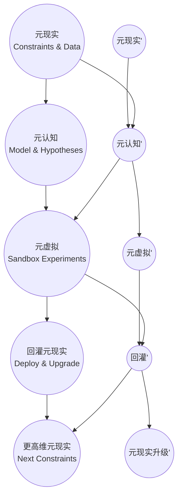

# 三元宇宙（TriMetaverse, TMV）

## 三元宇宙的定义

三元宇宙是一套“以元现实为约束、以元认知为模型、以元虚拟为沙盒”的闭环系统：在元虚拟中并行试验假设与方案，把有效结果回灌元现实落地，并以行为反馈持续校准与进化元认知。
核心价值：把高频试错从现实迁移到可控沙盒，让生产力系统在低风险、可审计的迭代中持续自动增值。

- **元现实**：现实世界的规则与约束（物理规律、制度流程、产业链路、社会运行机制等）及其可观测数据；它回答“世界现在是怎样运转的”。
- **元认知**：AI对元现实的结构化理解与可推理模型（概念体系、因果假设、指标体系、预测/决策模型等）；它回答“我们如何解释与预测”。
- **元虚拟**：由AI驱动的世界引擎与工具链，把元现实规则与元认知模型装入可控沙盒，进行大规模仿真、A/B与平行世界试验，产出可回灌到元现实的策略、产品与流程；它回答“在不伤害现实的前提下怎么试”。

## 落地路径索引（从今天开始）

- 第一步（阶段0，元认知MVP）：跑通“学习 → 贡献 → 评测 → 激励”的最小闭环（连接钱包、提交任务、自动评测、链上发徽章）。见：[meta-recognition/元宇宙学院.md](meta-recognition/%E5%85%83%E5%AE%87%E5%AE%99%E5%AD%A6%E9%99%A2.md)
- 第二步（整体落地路线）：在2核4G起步条件下，把学院底座接入前后端与社区模块，并按7天计划推进。见：[三元宇宙落地方案.md](%E4%B8%89%E5%85%83%E5%AE%87%E5%AE%99%E8%90%BD%E5%9C%B0%E6%96%B9%E6%A1%88.md)
- 链基础设施选型（阶段0/1结论）：优先 Hardhat/Geth 跑通闭环，阶段2+再做高性能栈尽调。见：[链基础设施选型.md](%E9%93%BE%E5%9F%BA%E7%A1%80%E8%AE%BE%E6%96%BD%E9%80%89%E5%9E%8B.md)
- 附：如需部署合并后的 PoS 以太坊私链（Geth + Prysm，含源码编译与联调排障）：见 [meta-recognition/以太坊私链部署.md](meta-recognition/%E4%BB%A5%E5%A4%AA%E5%9D%8A%E7%A7%81%E9%93%BE%E9%83%A8%E7%BD%B2.md)

## 三元宇宙的螺旋迭代模型

元现实（规则与数据约束） → 元认知（建模与假设） → 元虚拟（沙盒仿真与并行试验） → 回灌元现实（落地与规则升级） →

每一圈迭代都用“现实反馈/运行结果”校准元认知，并将可验证的有效策略沉淀为新的现实规则与基础设施能力。

简单示例：
以“城市出行治理”为例：先在元现实抽象交通流、道路容量、信号灯规则与实时数据，再在元认知中提出拥堵成因假设与调度策略模型。
随后把策略放入元虚拟的沙盒城市做并行仿真与A/B测试，筛出可验证有效的方案后回灌元现实灰度上线，并用上线后的运行结果继续校准模型与规则。

## 宇宙大爆炸

三元宇宙的起始，是从宇宙大爆炸开始，加入社区的元宇宙玩家进入三元宇宙，寻找因源微生物生命体（可进化成宠物幻化伴侣），寻找本源（自己数字生命的本源）微生物生命体。因源与本源由同一微生物生命体分列而来。

## 三元宇宙故事

从宇宙大爆炸开始的科幻故事，讲述了高维生命创造现实世界和万物演进的过程。
三元宇宙游戏是小说和视频的游戏化，有众多IP生命和故事线，人类可以成为观察者在高维观察世界演化，也可以成为玩家，选取一个角色下凡投生体验。

## 三元制作过程

三元宇宙从三元宇宙故事小说内容开始打造ip，然后进行视频化，最后进行游戏化。最终将游戏引入TMV，实现元宇宙的演进。

## 三元宇宙的模块划分

元认知：智能小说（三元宇宙故事）共创模块、智能短视频工厂模块、智能热点收集模块、智能游戏设计模块。
元虚拟：智能游戏生成模块、生命体-数字人演进模块、NFT及IP模块、虚拟经济系统模块、虚拟社区系统模块。
元现实：现实规则拆解模块、现实优化模块。

## 三元宇宙的技术架构

1. 元现实模块：拆解物理规则（现有人类规则），动态数据（传感器），现实网关（机器人、无人机、边缘路由器）

2. 元虚拟模块：数据平台，虚拟世界引擎（前期可采用游戏引擎），进化基础设施（k8s配合分布式集群实现动态扩容模拟现实进化），区块链系统（时间、环境变迁、NFT、IP、虚拟经济系统），虚拟社区系统（元宇宙社交系统）

3. 元认知模块：AI内容创作、AI生成与剪辑发布、AI 3D生成、隐私保护系统，规则演进系统。

## 韧性安全与AI治理：把AI放入元虚拟

在AI能力高速跃迁的阶段，安全问题会从“隐私泄露/模型越权”逐步外溢到“现实世界可被直接改变”的风险面：例如生物安全、供应链安全、城市关键基础设施安全等。行业主流往往先走“封堵式安全”（限制权限、加分类器、设红线、封模型、封接口），但这更像“禁火”——短期有效，长期不可持续：能力、需求与对抗都会增长。

三元宇宙更适合承载另一条路线：**韧性安全**。面对不可避免的“火”，重点不再是禁止，而是建立“消防体系”：可审计、可隔离、可追责、可恢复，且能在事故中持续演进。

### 关键转向：从“AI监测AI”到“把治理写进基础设施”

很多方案仍停留在“用另一套AI基础设施去监测AI基础设施”。TMV提出更底层的思路：

1. **让区块链成为AI的时间与审计账本**
    - 区块链时间戳提供不可篡改的“事件顺序”，让AI行为在元虚拟里拥有统一可核验的时间轴：训练、调用、授权、发布、回滚都能被追溯。
    - 它不是“万能防御”，但能把争议从“各说各话”变成“可验证的事实记录”。

2. **让算力矿机/去中心化算力成为AI的运行底座之一**
    - 把AI运行与扩容部分迁移到可度量、可计费、可竞争的算力网络，形成“多中心”的运行环境，降低单点失控与单点审查。
    - 与K8s/分布式集群结合：链上记录“任务—算力—结果—证明”，链下执行推理/训练/仿真。

3. **让智能合约成为AI的规则与法律（机器可执行的宪章）**
    - 把关键规则变成“默认执行”的合约：权限边界、资源配额、数据访问、模型版本发布、收益分配、惩罚与隔离流程。
    - 规则不只约束人，也约束AI代理（Agent）的可调用工具、可接触数据、可触发动作。

4. **从“人类单边治理”走向“人与AI共治”**
    - 人类负责价值与边界（为何要做、不可做什么、事故如何定责）；AI负责执行与优化（如何做得更稳、更快、更省）。
    - 治理结构可落成“多层议会”：现实监管/社区治理/合约宪章/AI执行体相互制衡。

### 在三元宇宙三层中落地韧性安全

- **元现实（Reality Rules）**：把现实世界的合规、安全标准与应急流程抽象成“可配置规则集”（类似城市消防规范），以网关/机器人/边缘路由器为执行端；任何越权动作都必须可追溯、可回滚、可隔离。
- **元虚拟（Generation Tools）**：把AI与工具链放进“可分叉、可隔离的沙盒世界”。每一次能力升级先在沙盒里跑完整事故演练（渗透/越狱/生物安全误用/供应链投毒等），通过后再有限度进入元现实。
- **元认知（Behavior Feedback）**：把人类玩家与AI代理的行为、事故与修复路径沉淀为“规则进化数据集”，驱动下一轮合约宪章与工具权限自动迭代。

### 适当预测：2026+ 可能出现的“TMV安全基础设施”形态

- **可验证计算与证明**：关键步骤逐步变成“可验证结果”（例如对推理/训练的结果生成证明或审计摘要），让治理不完全依赖“相信某个服务商”。
- **分级世界/分级权限**：同一个AI在不同世界拥有不同权限与工具集；越靠近元现实，权限越谨慎、审计越强。
- **事故响应成为产品功能**：像云服务的SLA一样，元宇宙内置隔离、封存、回滚、溯源、赔付与复盘机制；安全不再是“挡住一切”，而是“出事也能控得住、修得回来、学得更快”。

这条路线的隐喻是：与其让AI在现实世界“无边界扩散”，不如先把它放入元虚拟——就像人类被“地球边界”约束一样——用可审计的时间、可执行的法律、可隔离的世界，让能力增长与安全增长同步。

## 三元宇宙的现实应用场景

1. 游戏中的三元宇宙（TMV）
用例：下一代全沉浸式社交平台
元现实：定义物理规则（如重力、材质触感）
元虚拟性：生成虚拟互动协议（如手势识别算法）
元认知：分析用户情绪数据，动态调整环境氛围
成果：自适应的沉浸式体验系统

2. 社会科学中的三元宇宙（TMV）
用例：城市治理模型
元现实：解构城市运行的物理与社会规则（交通流、经济链）
元虚拟性：构建数字孪生城市模拟器
元认知：通过市民反馈优化政策算法
成果：动态演进的智慧城市框架

3. 商业中的三元宇宙（TMV）
用例：自适应零售平台
元现实：解构消费者行为、供应链弹性、市场动态
元虚拟性：生成虚拟商业沙盒（动态定价模拟器、元宇宙零售空间）
元认知：实时迭代策略（销售数据+舆情+经济指标）
成果：具备抗脆弱性的智能商业体

4. 农业中的三元宇宙（TMV）
用例：智能生态农场系统
元现实：解构土壤、气候、作物生长规律
元虚拟性：构建数字农业孪生体（虚拟农田、智能灌溉协议）
元认知：分析环境数据与市场波动，生成种植策略
成果：闭环农业生态系统

## 元虚拟的游戏骨架

这样我们可以有N个平行世界，让同一个AI选择自己不同的宿命
