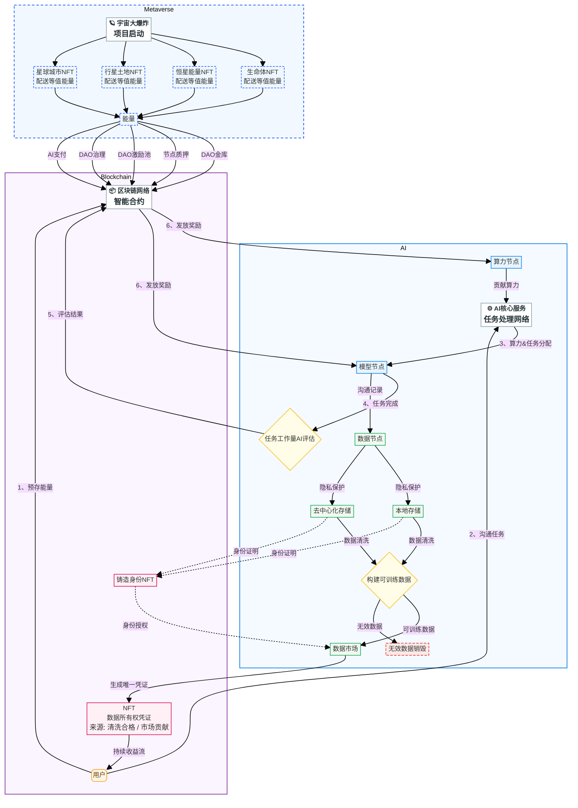

# 三元宇宙价值流动

版本：v2.0（商业模式整合版）  
日期：2026-07-15  
状态：草案  

---

## 一、商业模式概述

### 核心目标

打造**自动赚钱的智能体系统**，以 AI + 元宇宙 + 区块链三大板块的协同飞轮，实现从 AI 商业到元宇宙经济再到上市的三阶段逐次升级，最终达成被动收益与财务自由。

### 价值流动核心循环

```
AI 自动收益（token消耗/广告/电商/直播/短剧）
        │
        ▼ 收益流
区块链融资（筹钱+筹算力）→ 投资 AI OPC 发展
        │
        ▼ 创建更多元宇宙应用
元宇宙经济（虚拟设计→现实验证，降低成本提高成功率）
        │
        ▼ 经济回报
反补平台主币 + 关联实体公司股价/估值
        │
        └──→ 更多资金回到 AI 应用开发和 OPC 孵化 ←──┘
```

### 三大板块协同

| 板块 | 角色 | 核心价值 |
|------|------|----------|
| **AI** | 自动收益引擎 | token 消耗、广告、电商、直播、短剧等被动收入 |
| **元宇宙** | 任务设计+验证引擎 | 虚拟设计→现实验证，自动任务完成与奖励分配 |
| **区块链** | 融资+激励+估值引擎 | 发币融资、用户激励、平台主币支撑股价 |

**升华价值**：元认知（想象）→ 元虚拟（设计）→ 元现实（验证）→ 升级认知 → 螺旋迭代——一个全自动赚钱且持续提升人类生产力的可落地系统。

---

## 二、三阶段商业升级路径

### Phase 1：AI 商业（当前阶段）

**目标**：建立自动赚钱的 AI 应用矩阵，形成稳定的平台 token 消耗与差价收益。

```
获客层    TriGateway（社交通道）+ TriTraining（免费零基础AI培训）
         → 吸引粉丝 → 社区成员 → 转化用户
          │
变现层    TriStaciss（token 中转站，平台赚取差价）
          │
         IPD 流程 → TriDev 自动化开发 → 自动赚钱 AI 应用：
         ├ 广告收入  ├ 电商收入  ├ 直播收入  └ 短剧收入
          │
激励层    TriChain + TriWeb4 → 发行数字货币/股票期权
         → 用户分布式合作奖励
          │
         用户获得三重身份：
         ① 用户/OPC（TriOPC — One Person Company）
         ② 创业者（TriCompany AI-Native 公司架构）
         ③ 数字货币持有者/股东（TriChain + TriWeb4）
          │
反哺层    区块链融资 → 筹集算力 → 反补 AI 应用和 OPC 孵化
```

**关键模块**：TriStaciss、TriTraining、TriDev、TriChain、TriWeb4、TriOPC、TriCompany

---

### Phase 2：元宇宙经济

**目标**：从虚拟设计到现实验证，降低创新成本，提高成功率，形成新型被动收入。

```
试点      量化交易（TriAuto + TriChain）
          │
扩展      虚拟设计 → 现实验证（降低成本，提高成功率）
          ├ 电动汽车设计验证
          ├ 机器人设计验证
          ├ 无人机设计/生产
          └ 更多物理产品/系统的数字孪生
          │
金融化    数字货币 + 股票期权交易
         → 经济设计与验证效用
          │
         用户角色深化：从消费者 → 设计者 → 验证者 → 投资者
```

**关键模块**：TriAuto、TriChain、TriWeb4、TriAvatar、TriMC（虚拟世界仿真调度）

---

### Phase 3：上市

**目标**：数字货币上市 + 传统股票上市，实现财富自由。

```
数字货币上市（TriChain 主币上线交易所）
         +
传统股票上市（TriCompany 关联实体公司 IPO）
         ↓
    财务自由 + 生态永续运转
```

---

## 三、用户三重身份体系

| 身份 | 来源 | 载体 | 权益 |
|------|------|------|------|
| **用户 / OPC** | TriMem + TriOPC | 营业执照、钱包地址 | 使用平台服务、开展业务、获得收入 |
| **创业者** | TriCompany | AI-Native 公司架构 | 开发应用、孵化项目、获得分成 |
| **数字货币持有者 / 股东** | TriChain + TriWeb4 | 身份 NFT、秘钥、持股凭证 | 治理投票、分红、资产增值 |

三重身份随平台成长逐步解锁：注册即用户 → 开通钱包即创业者 → 持有代币即股东。

---

## 四、二十模块与三阶段映射

| 模块 | Phase 1 AI商业 | Phase 2 元宇宙经济 | Phase 3 上市 |
|------|:---:|:---:|:---:|
| **TriGateway** | 🟢 社交通道获客 | 🟢 社区运营 | 🟢 投资者关系 |
| **TriAvatar** | 🟢 Web 入口 | 🟢 虚拟世界入口 | 🟢 上市信息门户 |
| **TriMobile** | 🟡 移动端入口 | 🟢 移动端协作 | 🟢 移动端交易 |
| **TriPilot** | 🟢 PC 端交互 | 🟢 虚拟设计工具 | 🟡 数据分析面板 |
| **TriLC** | 🟢 本地 CLI 执行 | 🟢 离线顶替 TriMC | 🟡 边缘计算节点 |
| **TriCode** | 🟢 AI coding glue | 🟢 虚拟设计开发 | 🟡 审计工具 |
| **vscodium** | 🟢 IDE 底座 | 🟢 开发环境 | 🟡 开发环境 |
| **TriMC** | 🟢 Agent runtime | 🟢 虚拟世界调度 | 🟢 系统核心 |
| **TriStaciss** | 🟢 token 中转赚差价 | 🟢 模型路由 | 🟢 基础设施 |
| **TriModel** | 🟢 Provider 配置 | 🟢 模型管理 | 🟡 成本优化 |
| **TriSkill** | 🟢 智能体技能 | 🟢 虚拟角色技能 | 🟡 技能市场 |
| **TriDev** | 🟢 自动开发 | 🟢 虚拟设计工具链 | 🟡 CI/CD |
| **TriTest** | 🟢 全程测试 | 🟢 仿真测试 | 🟢 合规审计 |
| **TriTraining** | 🟢 免费 AI 培训获客 | 🟢 虚拟世界培训 | 🟡 投资者教育 |
| **TriAuto** | 🟡 自动部署 | 🟢 量化交易+自动办公 | 🟢 自动化运营 |
| **TriCompany** | 🟢 AI-Native 公司架构 | 🟢 组织治理 | 🟢 上市公司架构 |
| **TriMem** | 🟢 用户系统+DB规划 | 🟢 数据资产化 | 🟢 股东数据平台 |
| **TriChain** | 🟢 发币+身份 NFT | 🟢 数字资产交易 | 🟢 主币上市 |
| **TriWeb4** | 🟢 奖励钱包 | 🟢 收益分配 | 🟢 股权激励 |
| **TriOPC** | 🟢 OPC 商户系统 | 🟢 虚拟企业服务 | 🟢 上市主体储备 |

> 🟢 = 核心参与　　🟡 = 辅助/基础设施

---

## 五、价值流动图（技术层）




<style>
@media print {
  @page {
    margin: 5mm; 
    size: A4 portrait;
  }
  
  html, body {
    margin: 0 !important;
    padding: 0 !important;
  }

  /* 隐藏所有可能的 Markdown Preview Enhanced 默认标题/目录 */
  body > *:first-child:not(.mermaid),
  h1, h2, h3, h4, h5, h6 {
     margin-top: 0 !important;
  }
  
  /* 确保 mermaid 图不分页且紧贴顶部 */
  .mermaid {
    transform: scale(0.85); /* 进一步缩小以适应 A4 */
    transform-origin: top center;
    margin-top: -20px !important; /* 尝试负边距拉回 */
    margin-bottom: 0 !important;
    display: block !important;
    page-break-inside: auto !important;
  }
}
</style>
