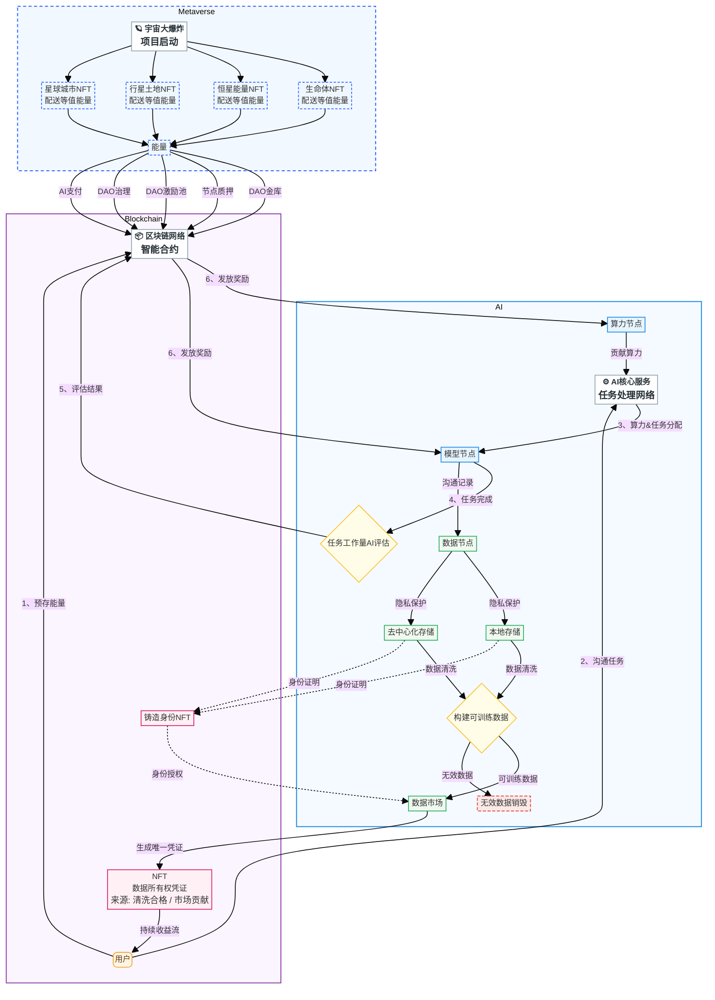

```mermaid
%%{init: {
  'flowchart': {
     'htmlLabels': true,
     'padding': 2,
     'rankSpacing': 40,
     'nodeSpacing': 40
  },
  'theme': 'base',
  'themeVariables': {
      'fontFamily': 'Segoe UI, PingFang SC, Helvetica, Arial, sans-serif',
      'fontSize': '10px'
  }
}}%%
flowchart TD
    classDef user fill:#fff5e6,stroke:#f39c12,stroke-width:1px,color:#5d3b00;
    classDef ai fill:#e6f4ff,stroke:#1e88e5,stroke-width:1px;
    classDef data fill:#f0f9f0,stroke:#27ae60,stroke-width:1px;
    classDef blockchain fill:#f5e6ff,stroke:#8e44ad,stroke-width:1px;
    classDef nft fill:#fff0f6,stroke:#d81b60,stroke-width:1px;
    classDef metaverse fill:#eef7ff,stroke:#2962ff,stroke-width:1px,stroke-dasharray:3 2;
    classDef decision fill:#fffde7,stroke:#fbc02d,stroke-width:1px;
    classDef invalid fill:#fbe9e7,stroke:#e53935,stroke-width:1px,stroke-dasharray:4 2;
    classDef gap fill:transparent,stroke:transparent,color:transparent;
    classDef entry fill:#ffffff,stroke:#90a4ae,stroke-width:1px,color:#263238,font-weight:600;


    %% Metaverse 子图标签简化
    subgraph Metaverse [Metaverse]
        MV_Entry[🪐 宇宙大爆炸<br /><span style='font-size:12px;color:#555;font-weight:500'>项目启动</span>]:::entry
        direction LR
        MV_Entry --> MV_Native[生命体NFT<br/>配送等值能量]:::metaverse --> TMV_Token[能量 ]:::metaverse
        MV_Entry --> MV_S_Energy[恒星能量NFT<br/>配送等值能量]:::metaverse --> TMV_Token
        MV_Entry --> MV_P_Land[行星土地NFT<br/>配送等值能量]:::metaverse --> TMV_Token
        MV_Entry --> MV_P_City[星球城市NFT<br/>配送等值能量]:::metaverse --> TMV_Token
    end

    TMV_Token -->|DAO金库| BC_Entry
    TMV_Token -->|节点质押| BC_Entry
    TMV_Token -->|DAO激励池| BC_Entry
    TMV_Token -->|DAO治理| BC_Entry
    TMV_Token -->|AI支付| BC_Entry
    

    U(用户):::user -->|2、沟通任务| AI_Entry[任务处理网络]:::ai
    U -->|1、预存能量| BC_Entry

    subgraph AI [AI]
        AI_Entry[⚙️ AI核心服务<br /><span style='font-size:12px;color:#555;font-weight:500'>任务处理网络</span>]:::entry
        direction LR
        AI_Model -->|4、任务完成| AI_Eval{任务工作量AI评估}:::decision
        AI_Compute[算力节点]:::ai -->|贡献算力| AI_Entry
        AI_Entry -->|3、算力&任务分配| AI_Model[模型节点]:::ai 
        AI_Model -->|沟通记录| Data_Hub[数据节点]:::data
        Data_Hub -->|隐私保护| Data_Local[本地存储]:::data
        Data_Hub -->|隐私保护| Data_IPFS[去中心化存储]:::data
        Data_Local -->|数据清洗| Data_Clean{构建可训练数据}:::decision
        Data_IPFS -->|数据清洗| Data_Clean
        Data_Clean -->|可训练数据| Mkt_Data[数据市场]:::data
        Data_Clean -->|无效数据| Data_Invalid[无效数据销毁]:::invalid
    end
    

    subgraph Blockchain [Blockchain]
        BC_Entry[📦 区块链网络<br /><span style='font-size:12px;color:#555;font-weight:500'>智能合约</span>]:::entry
        AI_Eval -->|5、评估结果| BC_Entry
        BC_Entry -->|6、发放奖励| AI_Compute
        BC_Entry -->|6、发放奖励| AI_Model
        NFT_Data -->|持续收益流| U
        Data_Local -.->|身份证明| NFT_Identity[铸造身份NFT]:::nft
        Data_IPFS  -.->|身份证明| NFT_Identity
        NFT_Identity -.->|身份授权| Mkt_Data
        Mkt_Data -->|生成唯一凭证| NFT_Data[NFT<br/>数据所有权凭证<br/><span style='font-size:11px'>来源: 清洗合格 / 市场贡献</span>]:::nft
    end

    
    
    style AI fill:#f4faff,stroke:#1e88e5,stroke-width:1.2px,corner-radius:6px
    style Blockchain fill:#faf5ff,stroke:#8e44ad,stroke-width:1.2px,corner-radius:6px
    style Metaverse fill:#f2f8ff,stroke:#2962ff,stroke-width:1.2px,stroke-dasharray:4 3,corner-radius:6px
```

```mermaid
%% Legend 独立图，避免主图布局干扰
flowchart TB
    classDef user fill:#fff5e6,stroke:#f39c12,stroke-width:1px,color:#5d3b00;
    classDef core fill:#e6f4ff,stroke:#1e88e5,stroke-width:1px;
    classDef data fill:#f0f9f0,stroke:#27ae60,stroke-width:1px;
    classDef chain fill:#f5e6ff,stroke:#8e44ad,stroke-width:1px;
    classDef nft fill:#fff0f6,stroke:#d81b60,stroke-width:1px;
    classDef gamefi fill:#eef7ff,stroke:#2962ff,stroke-width:1px,stroke-dasharray:3 2;
    classDef decision fill:#fffde7,stroke:#fbc02d,stroke-width:1px;
    classDef invalid fill:#fbe9e7,stroke:#e53935,stroke-width:1px,stroke-dasharray:4 2;

    L_User[用户]:::user
    L_AI[算力 & 模型处理]:::ai
    L_Data[数据采集 / 存储]:::data
    L_Decision[判定/评估节点]:::decision
    L_Chain[链上结算]:::blockchain
    L_NFT[NFT/资产凭证]:::nft
    L_Invalid[无效或终止]:::invalid
    L_Metaverse[Metaverse 发行/经济]:::metaverse

    %% 说明：此 Legend 独立，不参与主价值流布局
```

