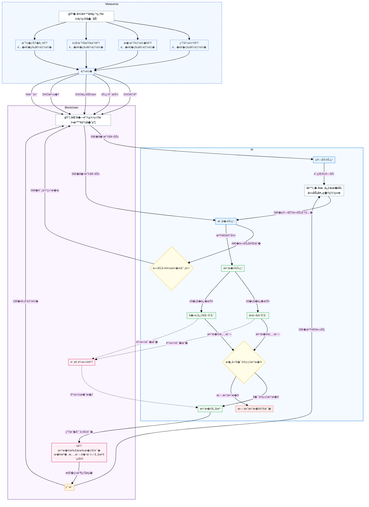

---
puppeteer:
  displayHeaderFooter: false
  printBackground: true
  margin:
    top: "10mm"
    bottom: "10mm"
    left: "10mm"
    right: "10mm"
---

<!-- 强制调整打�样�，防止首页空�-->

```mermaid
%%{init: {
  'flowchart': {
     'htmlLabels': true,
     'padding': 4,
     'rankSpacing': 70,
     'nodeSpacing': 52
  },
  'theme': 'base',
  'themeVariables': {
      'fontFamily': 'Segoe UI, PingFang SC, Helvetica, Arial, sans-serif',
      'fontSize': '11px'
  }
}}%%
flowchart TD
    classDef user fill:#fff5e6,stroke:#f39c12,stroke-width:1px,color:#5d3b00;
    classDef ai fill:#e6f4ff,stroke:#1e88e5,stroke-width:1px;
    classDef data fill:#f0f9f0,stroke:#27ae60,stroke-width:1px;
    classDef blockchain fill:#f5e6ff,stroke:#8e44ad,stroke-width:1px;
    classDef nft fill:#fff0f6,stroke:#d81b60,stroke-width:1px;
    classDef metaverse fill:#eef7ff,stroke:#2962ff,stroke-width:1px,stroke-dasharray:3 2;
    classDef decision fill:#fffde7,stroke:#fbc02d,stroke-width:1px;
    classDef invalid fill:#fbe9e7,stroke:#e53935,stroke-width:1px,stroke-dasharray:4 2;
    classDef gap fill:transparent,stroke:transparent,color:transparent;
    classDef entry fill:#ffffff,stroke:#90a4ae,stroke-width:1px,color:#263238,font-weight:600;


    %% Metaverse �图标签简�
    subgraph Metaverse [Metaverse]
        MV_Entry[� 宇宙大爆�br /><span style='font-size:12px;color:#555;font-weight:500'>项目�动</span>]:::entry
        direction LR
        MV_Entry --> MV_Native[生命体NFT<br/>��等值能�]:::metaverse --> TMV_Token[能� ]:::metaverse
        MV_Entry --> MV_S_Energy[�星能�NFT<br/>��等值能�]:::metaverse --> TMV_Token
        MV_Entry --> MV_P_Land[行星土地NFT<br/>��等值能�]:::metaverse --> TMV_Token
        MV_Entry --> MV_P_City[星��市NFT<br/>��等值能�]:::metaverse --> TMV_Token
    end

    TMV_Token -->|DAO金库| BC_Entry
    TMV_Token -->|节点质押| BC_Entry
    TMV_Token -->|DAO激励池| BC_Entry
    TMV_Token -->|DAO治�| BC_Entry
    TMV_Token -->|AI支付| BC_Entry
    

    U(用户):::user -->|2�沟通任务| AI_Entry[任务处�网络]:::ai
    U -->|1�预存能�| BC_Entry

    subgraph AI [AI]
        AI_Entry[⚙� AI核心�务<br /><span style='font-size:12px;color:#555;font-weight:500'>任务处�网络</span>]:::entry
        direction LR
        AI_Model -->|4�任务完�| AI_Eval{任务工作�AI评估}:::decision
        AI_Compute[算力节点]:::ai -->|贡献算力| AI_Entry
        AI_Entry -->|3�算�任务分�| AI_Model[模�节点]:::ai 
        AI_Model -->|沟通记录| Data_Hub[数�节点]:::data
        Data_Hub -->|���护| Data_Local[本地存储]:::data
        Data_Hub -->|���护| Data_IPFS[�中心化存储]:::data
        Data_Local -->|数�清洗| Data_Clean{�建�训练数�}:::decision
        Data_IPFS -->|数�清洗| Data_Clean
        Data_Clean -->|�训练数�| Mkt_Data[数�市场]:::data
        Data_Clean -->|无效数�| Data_Invalid[无效数�销�]:::invalid
    end
    

    subgraph Blockchain [Blockchain]
        BC_Entry[📦 区�链网�br /><span style='font-size:12px;color:#555;font-weight:500'>智能�约</span>]:::entry
        AI_Eval -->|5�评估结�| BC_Entry
        BC_Entry -->|6��放奖励| AI_Compute
        BC_Entry -->|6��放奖励| AI_Model
        NFT_Data -->|�续收益�| U
        Data_Local -.->|身份��| NFT_Identity[铸造身份NFT]:::nft
        Data_IPFS  -.->|身份��| NFT_Identity
        NFT_Identity -.->|身份��| Mkt_Data
        Mkt_Data -->|生�唯一凭�| NFT_Data[NFT<br/>数�所有�凭�<br/><span style='font-size:11px'>��: 清洗�格 / 市场贡献</span>]:::nft
    end

    
    
    style AI fill:#f4faff,stroke:#1e88e5,stroke-width:1.2px,corner-radius:6px
    style Blockchain fill:#faf5ff,stroke:#8e44ad,stroke-width:1.2px,corner-radius:6px
    style Metaverse fill:#f2f8ff,stroke:#2962ff,stroke-width:1.2px,stroke-dasharray:4 3,corner-radius:6px
```

```mermaid
%% Legend 独立图，��主图布局干扰
flowchart TB
    classDef user fill:#fff5e6,stroke:#f39c12,stroke-width:1px,color:#5d3b00;
    classDef core fill:#e6f4ff,stroke:#1e88e5,stroke-width:1px;
    classDef data fill:#f0f9f0,stroke:#27ae60,stroke-width:1px;
    classDef chain fill:#f5e6ff,stroke:#8e44ad,stroke-width:1px;
    classDef nft fill:#fff0f6,stroke:#d81b60,stroke-width:1px;
    classDef gamefi fill:#eef7ff,stroke:#2962ff,stroke-width:1px,stroke-dasharray:3 2;
    classDef decision fill:#fffde7,stroke:#fbc02d,stroke-width:1px;
    classDef invalid fill:#fbe9e7,stroke:#e53935,stroke-width:1px,stroke-dasharray:4 2;

    L_User[用户]:::user
    L_AI[算力 & 模�处�]:::ai
    L_Data[数�采集 / 存储]:::data
    L_Decision[判定/评估节点]:::decision
    L_Chain[链上结算]:::blockchain
    L_NFT[NFT/资产凭�]:::nft
    L_Invalid[无效或终止]:::invalid
    L_Metaverse[Metaverse �行/��]:::metaverse

    %% 说�：此 Legend 独立，���主价值�布局
```

